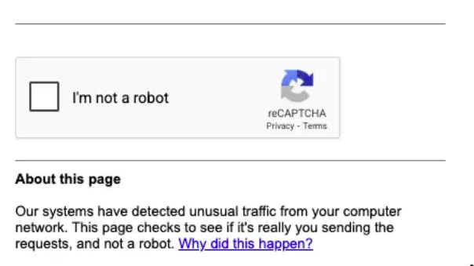
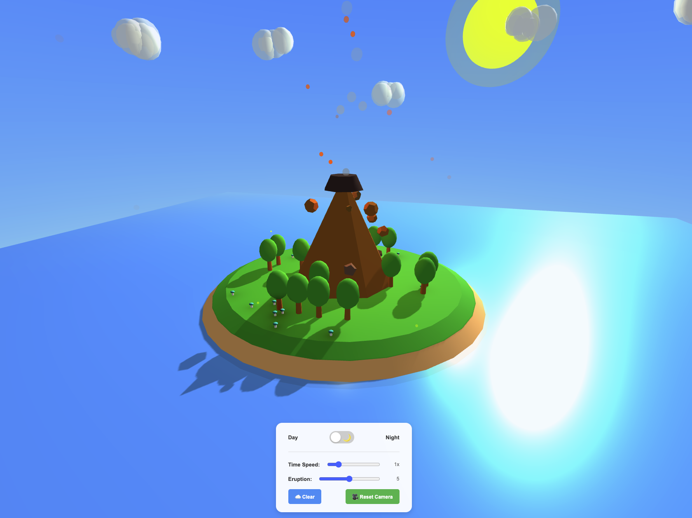

# Lab 1: Advanced techniques for using IBM Bob
This lab covers advanced techniques for using IBM Bob

## Labs in this series
This lab has two sub-labs.  It's recommended to complete each in order, but if you encounter this repository outside of the workshop, then jump into either that you find interesting.

### Lab 1.1 : Bob's advanced capabilities plus quirky limitations

In lab 1.1, you'll go deep into topics like:
- Selecting the optimal built-in mode
- Review of tools provided by each mode
- Bob's Modes and MCP Server Marketplance
- Nuances in Bob's built-in modes
- "Hidden" tools available to all modes
- CAPTCHAs and Bob's **browser_action** tool

You'll learn answers to cutting edge questions like, will Bob be ethical and not click the checkbox here?

These Advanced IBM Bob labs are designed to complete individually.  However ask your team mates (or instructor) for help if you get stuck.

🤖 Get started now with [lab 1.1](lab-1.1.md). 

### Lab 1.2 Peek under the hood during Bob's application development

In lab 1,2 you'll have some fun building a creative web application while learning about these topics:
- Checkpoints
- Bob Coins vs Tokens
- Prompt caching
- Analyzing IBM Bob's Task History 
- Your personal Bobalytics dashboard 

Let's have some fun during today's lab.

🤖 Get started with [Lab 1.2](lab-1.2.md).