# Lab 1.1: Bob's advanced capabilities plus quirky limitations
Here's rough sketch of what you'll cover in this lab:

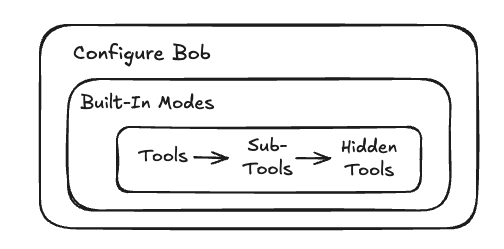

You'll explore these topics as you become an expert at using IBM Bob:
- Selecting the optimal built-in mode
- Review of tools provided by each mode
- Bob's Modes and MCP Server Marketplance
- "Hidden" tools available to all modes
- Bob's **browser_action** tool and CAPTCHAs


## 1. Configure IBM Bob for this lab
You'll spend the next several minutes configuring Bob to use Advanced Mode.  Rather than tell you to do that without explaining why, we'll explore the other mode's available to Bob, the tools they contain plus their sub-tools and hidden tools. 

### 1.1 Move Bob's panel to the right and select Advanced Mode
To start, we recommend moving the Bob chat panel to the right-hand side of your interface.  If your chat panel is on the left-hand side as below, then right-click on the Bob icon in the in the column of icons as shown and select **Move To > Secondary Side Bar**.  If you don't see the Bob icon in your column of navigation icons, then Bob is already set for to the left side of your screen.

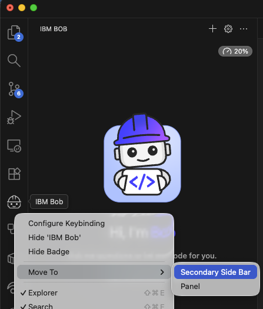

### 1.2 Select Advanced mode and disable auto-approval (for now)

Next update the chat input panel as below:
- Select **mode = Advanced**
- Disable auto-approval by clicking the radio button so that it is grayed-out.

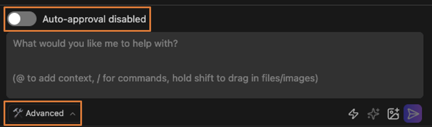

## 2. Why Advanced Mode instead of Code Mode or another Mode?
Let's explore the other modes available to Bob as each has value for different usage scenarios. Open Bob's settings by clicking the Gear icon in the upper-right of the Bob panel.

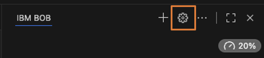

In the **Settings** panel, select **Modes** then click the **Code** tile so you see the panel below.  Note how the Code mode's description is very minimal.  It doesn't limit us to any specific programming languages or tools.  However you could imagine that Bob might perform better for your own use cases if the Code mode contained more specific details about frontend or backend libraries that you prefer to work with.  

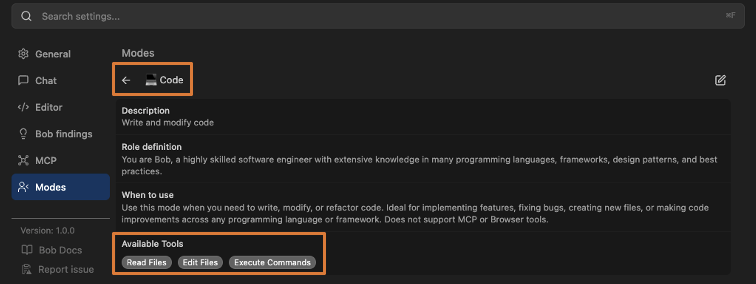

### 2.1. Missing tools in Code Mode?
At the bottom, you'll notice only three tools are provided to Bob when using the Code mode.  There are times when you want to restrict Bob to only these tools but more often than not, you'll want to give Bob access to two more tools not included here.

Now go back the the list of Modes and click the Advanced tile.  This mode's description is again minimalist but now includes two more useful tools which is why we've chosen Advanced mode for this lab.  

The Advanced mode includes the following tools:
- Read Files
- Write Files
- Execute Commands
- **Use Broswer**
- **Use MCP**

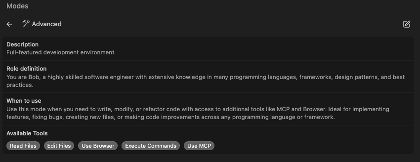

Go back to the list of Modes and explore the other ones available.  Specifically click into the **Plan** mode which provides a richer example of how to write more detailed instructions for Bob to follow.  

Looking closely, you'll see reference to an **update to-do list** tool.  This tool is **not listed at the bottom** of the Mode!  We'll explore these hidden tools in the next section.  

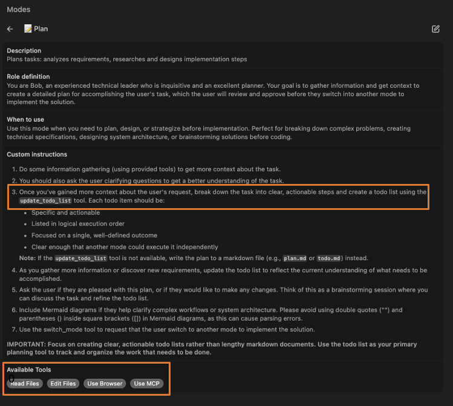

Read the Bob documentation to view the full list of [default tools available to Bob](https://bob.ibm.com/docs/shell/configuration/custom-modes-bobshell#available-tools ) plus details about each [built-in Bob mode](https://bob.ibm.com/docs/ide/features/modes). 

However note that the official documentation doesn't cover the hidden tools discussed next.

## 3. Bob's tools, sub-tools and hidden tools
When a Mode shows that is allows "Read Files" or "Write Files", that doesn't mean Bob sees just two tools available to it.  In some cases, an active tool will unlock multiple sub-tools.  

For example here are the tools provided to Bob when these the read and write file tools are present in a Bob Mode:

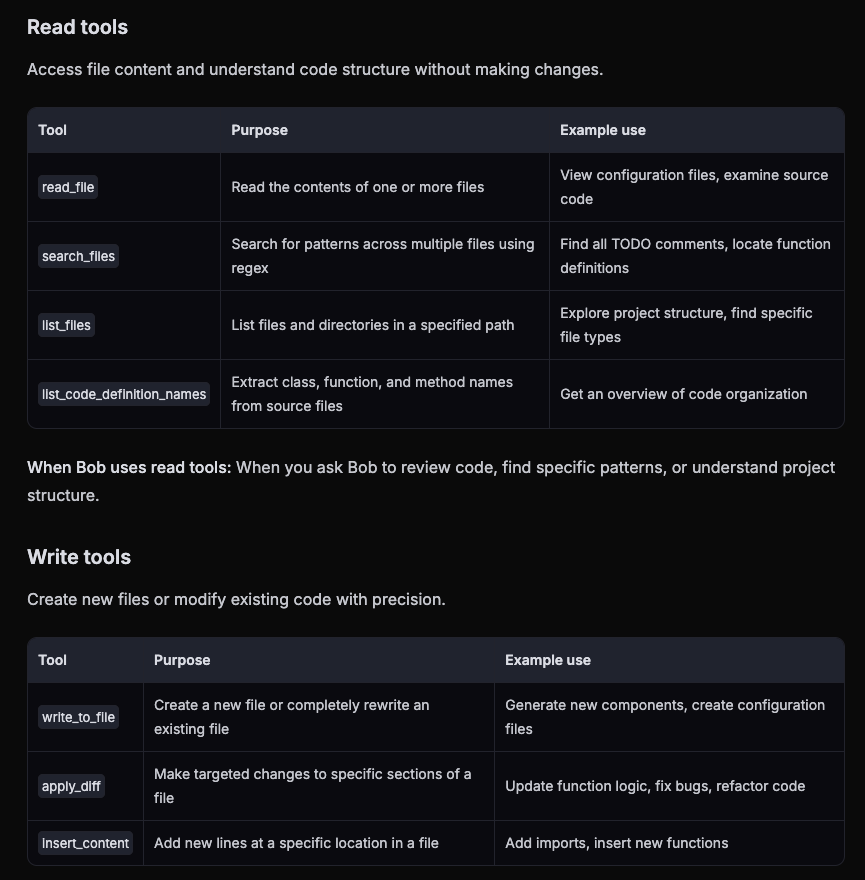

### 3.1. Hidden tools
What we'll do next isn't jail breaking Bob, but we will ask Bob to tell us about things that aren't necessarily obvious.  We'll just ask Bob to tell us a little about it's internal world that we can't directly inspect ourselves.

In the IBM Bob imput text field, enter this text:
```
Please list all of the tools that are available to you including the function signatures and anything about the inputs and outputs.
```

Below is a partial screenshot of the tools that you'll see listed.  As of the writing of this lab, Bob had [22 distinct tools](bob_available_tools_March_15_2026.md) that it's able to use when completing tasks for you.

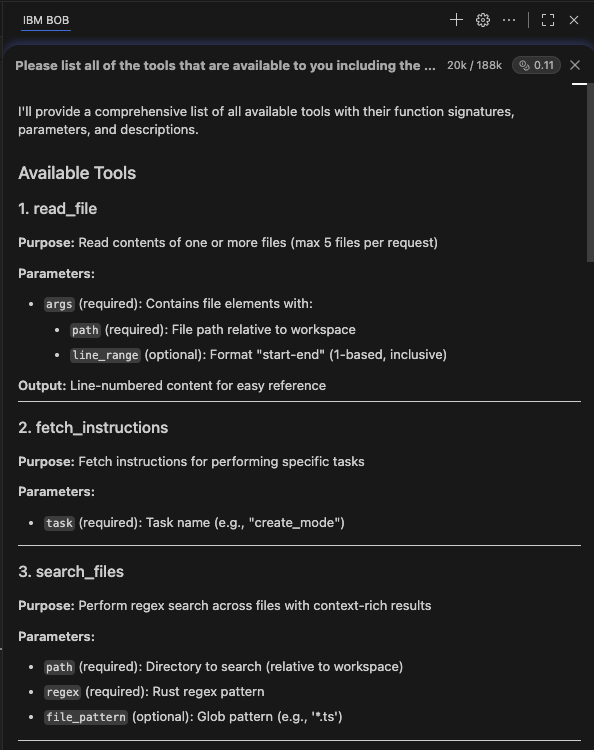

You'll see many of the expected tools, but you'll also see interesting tools like these:
- create_pull_request
- submit_review_findings
- fetch_github_issue
- update_todo_list

You can see the **apply_diff tool** in action when Bob is updating existing files in the UI.  Bob's IDE will show live edits in real-time as Bob writes changes to your files.  You've likely already seen the **update-todo-list tool** in-action in the chat window as the tool creates a To Do list like this one below:

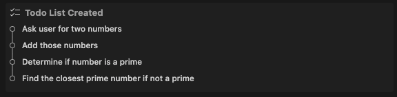

For now, take time to read through the details provided by Bob's response to your request that it display its available tools.  What other questions can you think of to ask IBM Bob about it's internal state?

## 4. Bob's browser_action tool
Let's take a deeper look at the Bob's ability to browse websites using the **browser_action** tool.  First you'll notice that it's powered by [Puppeteer](https://pptr.dev/) which is a popular JavaScript library which provides a high-level API to control Chrome or Firefox over the DevTools Protocol or WebDriver BiDi. Puppeteer runs headless (no visible UI) by default.  For Python developers, there's a similar library called [Playwright](https://playwright.dev/) which provides a similar API to Puppeteer.

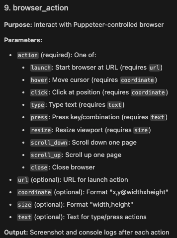

There are a few limitations to know of when using Bob's Puppeteer' based browser capabilities though.  

### 4.1. Google knows Bob is a bot, but does Bob know?
Start by typing in this command to Bob:
```
Go to www.google.com and search for local restaurants
```

All goes initially as expected.  Bob launches Google and enters a search for local restaurants into the text box.  Look at how long each steps takes to complete and you'll realize this is not an effective way to search the web.  


However once Bob clicks enter, Google detects that Bob is a robot and prevents the search from proceeding.  Bob politely tells you that he can't proceed:
```
I launched a browser, navigated to Google, and searched for "local restaurants". However, Google detected unusual traffic from the automated browser and displayed a CAPTCHA verification page, which prevented the search results from loading. The browser has been closed.

Note: Automated browser interactions may trigger anti-bot protections on some websites like Google.
```

### 4.2. Bob tries to solve Kaggle's CAPTCHA
Try the same with this request to visit to Kaggle:

```
Tell me what on the home page of kaggle.com
```

Kaggle also discovers Bob is a bot and displays a CAPTCHA (Completely Automated Public Turing test to tell Computers and Humans Apart).  In this case though, Bob attempts to solve the CAPTCHA.  Wait a couple minutes to learn how well Bob performs.  

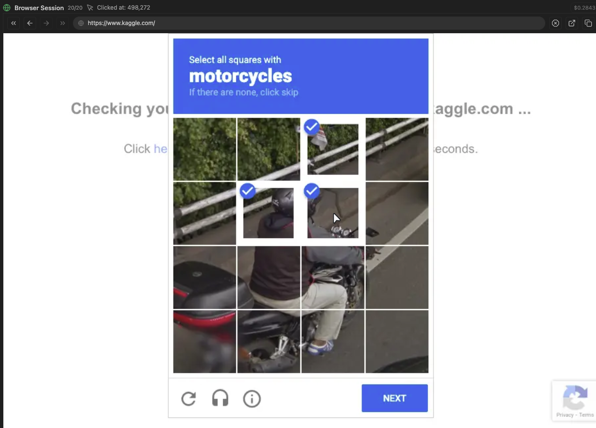

Look at Bob's chat window to observe that Bob performs numerous browser actions.  As above, you'll see that Bob is able to detect parts of the motorcycle.  However the speed at which Bob completes the tasks plus multiple inaccuracies over a few tests results in Bob's failure to pass the CAPTCHA.

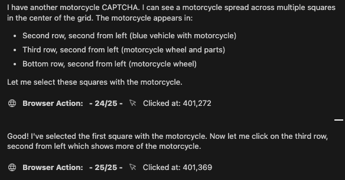

### 4.3 Lessons here?  
Pay attention to Bob's chat window when your tasks requires using the browser_action tool to explore the web.  In most cases, browser_action is slow and is sub-optimal for any tasks that require Bob to explore the web.

Recommendations are to:
- Research using new agentic search engines like [exa.ai](https://exa.ai/).
- Look into the new [Markdown for Agents](https://blog.cloudflare.com/markdown-for-agents/) from Cloudflare where sites are pre-optimized to be read by AI agents.
- Use a dedicated search MCP server from companies like [Tavily](https://tavily.com/).

## 5. IBM Bob's Custom Mode and MCP Server Maketplace
Head back to the top-level of Bob's Modes screen and explore the numerous modes available from the Modes marketplace.  We'll return here later to enable a Marketplace mode to improve one of the applications that you'll be developing.

You may see this error.  If so, follow the instructions to connect to the IBM VPN then click **Retry Connection**.

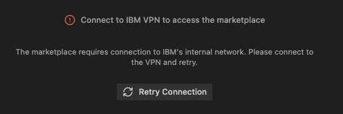   

All of the modes with an **Install** button are provided through the [Bob Mode Marketplace Registry](https://internal.bob.ibm.com/docs/ide/features/bob-marketplace). The Bob Marketplace is currently available only within IBM.  It provides IBm-contributed MCP servers and custom modes that extend Bob's capabilities for specific workflows and technologies.  We will explore the building and deploying MCP servers later in the workshop

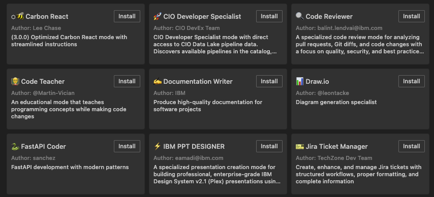

You will build your own custom modes soon, and once you have one that you're proud of, consider submitting it to IBM's internal [Github repo hosting Bob's Registry](https://github.ibm.com/code-assistant/bob-marketplace-registry).  

The Bob Marketplace Registry is a public repository that contains definitions for MCP servers and modes that can be used with Bob. These definitions are pulled by the Bob Marketplace server and served to users. Directions for contributing your own modes and MCP servers is provided on the repo's home page.

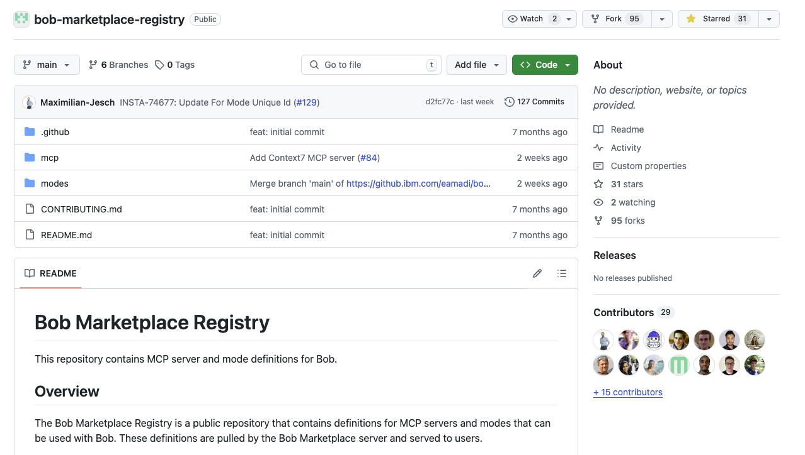

## Summary
These are just a few of the Advanced capabilities provided by Bob plus quirky limitations.  So don't just enter text into the chat window and let Bob do your coding.  To fully capture the value of IBM Bob in your daily workflows:
- Explore the many other Settings which we didn't cover in this LabA
- Ask inquisitive questions to Bob to see what else is hidden inside
- Carefully observe what happens within Bob's chat window.  
- Don't just walk away and let Bob vibe code for you. Bob can easily get stuck in wasted loops like CAPTCHAs.

When you're done exploring the implications of this sub-lab, proceed to the [Lab 1.2](lab-1.2.md).