# Lab 1.2: Peek under the hood of Bob's application development processes
Here's rough sketch of what you'll cover in this lab:

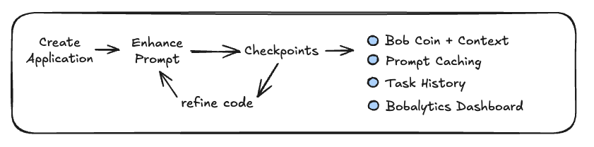

You'll explore these topics as you build expertise on application development using IBM Bob:
- Start with your creative application idea
- Automated prompt enhancement
- Checkpoints
- Bob Coins vs Tokens
- Prompt caching
- Analyzing IBM Bob's Task History built
- Your personal Bobalytics dashboard 

## 0. Team work and Knowledge Sharing
Please take your time to work through these labs.  These labs are about exploring and understanding these Bob, not about being the first to complete them.  The only thing that happens after you're done, is that you are back to Slacks and eMails.  

If you're doing this lab in a workshop with others, please take time to help those around you as well. If you have more expertise than other, help ensure everyone gets across the finish line.

## 1. Select an application for Bob to develop
Let's have a little fun by asking Bob to create a new application.  We'll then follow along with Bob during the creation process to identify a some of Bob's strengths and few of his weaknesses plus workarounds to them.

Choose one of these prompt options or create your own.  HOWEVER don't submit it for processing yet.  In the next section you'll learn how to auto-improve these already detailed prompts to make them even better before submitting to Bob:

### ☀️ Option A. Interactive Solar System
Always a crowd pleaser and educational for the whole family. Copy the text but don't submit yet!
```
Research and design how to build an interactive demo about our solar system with a top-down view of the solar system on the home screen.  Key criteria: 
- Planets orbit the sun in a semi-realistic manner. 
- Jupiter should orbit once every minute with other planets speeds adjusted to reflect their relative speeds. 
- Add moons which themselves orbit around the planets that have them
- Clicking sun/planets shows details about them.
- Add a timer with two times displayed: (1) Actual change in real time (in seconds) and (2) Relative Time (in days) taking into account actual orbital periods.  
- Test everything such that earth take 365 days to complete an orbit.
```

### 💡 Option B. Self-solving Rubik's Cube
This one can be tricky for Bob to implement but cool when it works properly.  Copy the text but don't submit yet!
```
Build a self-solving 3D Rubik's Cube app using a 3D javascript library like three.js.  There should be a button to mix the cube plus another button to solve it.  
```

### ✨ Option C. Fireworks
This is a fun option with great visuals and sounds.  Copy the text but don't submit yet!
```
Create an app that simulates fireworks exploding in the sky with different colors, shapes, and trajectories. Include controls to adjust the frequency, intensity, and duration of the fireworks display.  The fireworks should start from the bottom and arc up like a ballistic projectile where they slow down due to gravity before exploding.  Add sounds where the biggest fireworks have louder booming sounds.
```

### 🌋 Option D. Create 3D Volcanic Island from an image

Start by right-clicking and downloading this image to your laptop.  Use the **Add images to message** at the bottom-right of Bob's prompt input text field then add the following text.  Don't submit yet!

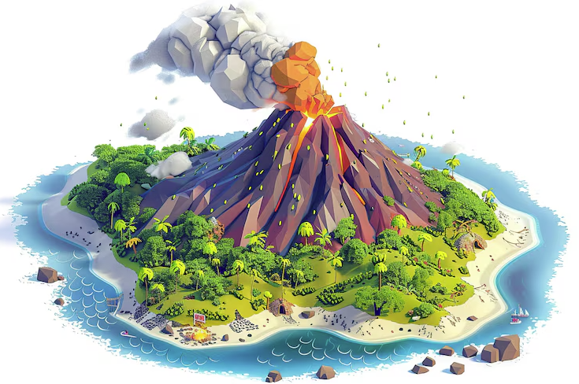

```
Use the this image of a volcanco as a reference, and using a 3D javascript library like three.js, create a 3D island surrounded by water with a sandy beach plus green trees and a volcano in the middle.  The island should slowly rotate clockwise.  The Volcano should spewing lava and smoke from the middle in a way that's somewhat like fireworks but more realistic so the smoke floats up while the lava rises then descends to the ground.
```

## 2. ✨ Enhance ✨ your prompt BEFORE submitting it
If you followed the earlier instructions, then you have not-yet-submitted your prompt to Bob.  Before you do, take a moment to enhance your prompt to make it better.  

How do you do that?

Click the **Enhance Prompt with additional content* icon located in the bottom-right of the input field (appears as a sparkle icon ✨).  Doing so will ask Bob to auto-improve your prompt for clarity, structure, and context before sending.

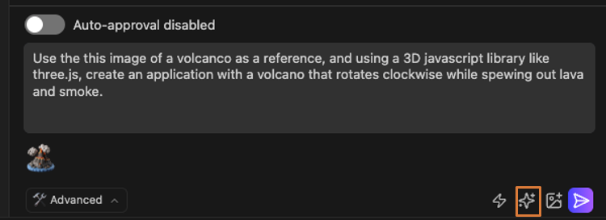

After 5-10 seconds, Bob will provide an updated prompt.  Read through the prompt and take note of how Bob has applied best practices when improving your prompt.

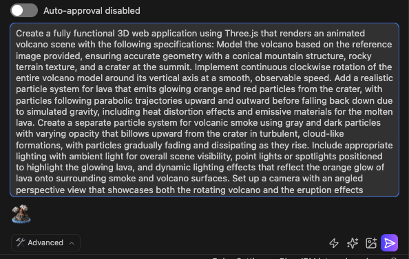

The quality of your prompts directly affects the quality of Bob's responses:
- Be specific and clear: Vague prompts lead to vague outputs. Detail what Bob should and should not do.
- Providing more context is nearly always better than less.  Context constrains Bob to your desired end goals.
- Provide examples when possible, including examples of the desired output format and style.
- Even if you have a good prompt, using the Enhance Prompt feature almost always improves it
- Always review Enhance Prompt edits before sending it as the enhancement process might make changes that don't align with your intentions

Learn more about the Enhance Prompt feature in the Enhance prompt documentation.

Before moving forward, review the prompt, edit anything that you don't like BUT DON'T SUBMIT IT YET!!! Proceed to the next section before submitting!

## 3. OK! 😲 Did you pass the instructions test and not submit your application to Bob yet?
If you made it here without submitting your application to Bob, then clap your hands loud enough for everyone to hear.  Seriously!  You deserve credit for following instructions, and we'd love to hear which ones of you succeeded!

If you did hit submit, then don't feel bad.  It's easy to get excited and jump ahead.  But you don't get to clap your hands.  Instead, click to cancel your submission and start over.  

### 3.1: Is your auto-approval disabled?
Disable auto-approval for now.  Take the time provided by this lab to observe exactly what Bob is doing during each step.  At least for a few minutes.  You can click auto-approve later.

Once your auto-approval is disabled, submit your prompt to Bob and you'll quickly see a request from Bob like below.

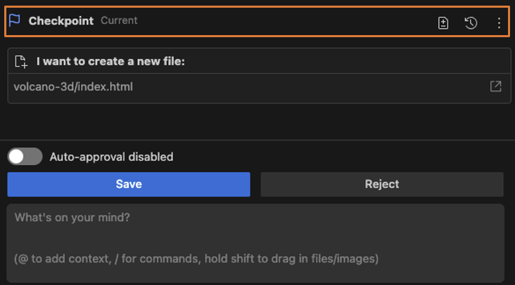

## 4. First draft of your application ✅ 
OK, click **Save** multiple times or whatever to let Bob finish your task.  Keep going until Bob has completed building your application.  Once you've approved Bob's multiple requests, you'll see a summary like the one below after your application has been built.  When Bob is finished, you'll see the Task Completed panel with a summary of the many actions that Bob executed.  

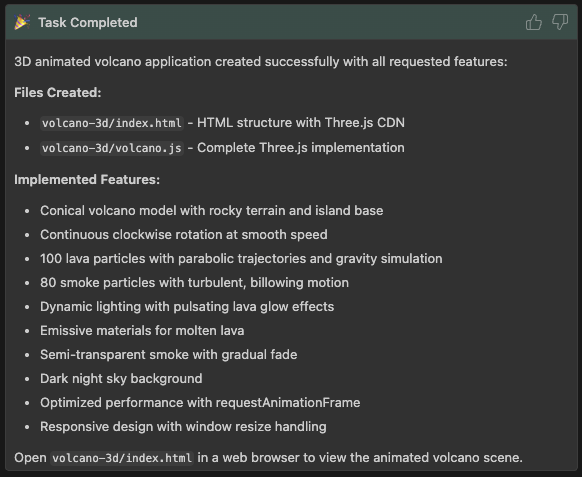

This is the result of Bob calling the **attempt_completion** tool that you saw earlier when listing Bob's "hidden" tools. Here is that tool's signature again:

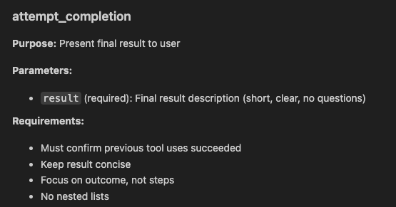

## 5. Checkpoints ☑️ 
Look at the top of the image above to see the Checkpoint that was made.  Bob's checkpointing feature creates automatic snapshots of your project before applying changes, providing a safety net for your development process. This powerful feature lets you experiment confidently with AI-suggested modifications, knowing you can easily revert to a previous state if needed.

### 5.1 Why use checkpointing?
- Safety net: Experiment with code changes without fear of breaking your project
- Easy rollback: Restore your project to a previous state with a single command
- Conversation preservation: Return to the exact conversation context when a change was made
- Non-intrusive: Works alongside your existing Git workflow without interference

After each major step, Bob will create additional checkpoints.  Once you start building more complex applications and experimenting, these checkpoints become valuable as you can easily rollback to a prior functional checkpoint.

### 5.2 Tip from the IBM Bob team 🔆
If Bob starts producing subpar work, you can use the "Restore Files & Task" checkpoint option to roll back to a previous state. This is more effective than trying to correct flawed output with new instructions.

How do you restore a previous state?
1. Scroll up in your chat interface to locate a checkpoint you want to restore from.
2. Click the "Restore Checkpoint" button.
3. Click "Restore Files and Task".
4. Click "Confirm".

In the next section, you'll use Checkpoints as you improve on Bob's initial implementation.  You can learn more in [Bob's Checkpoints Documentation](https://bob.ibm.com/docs/shell/features/checkpointing).

## 6. How does your application look?
Go ahead and launch your application.  How does it look?  Would it help to add more controls buttons or update the colors?  Before you start making edits yourself, let's reinforce a key lesson about how to best use Bob.  

### 6.1 Don't just treat Bob as a junior engineer.  
Instead treat Bob as a fellow senior engineer.  By explicitely asking Bob for advice and suggestions rather then simply telling Bob what to do, you can unlock far more of Bob's potential as an expert colleague. 

So enter this into the chat window. 

```
Can you recommend additions or improvements to this application that would enhance it's utility.  Don't implement them yet but just provided a details list of ideas.
```

Review Bob's recommendations and edit anything you don't like.  Before submitting, don't forget to click the Enhance Prompt button!

Here's an the example of [code for the volcano application](lab-1-code-example.zip). Download, unzip then double-click the index.html to execute.  


### 6.2 Take 5-10 mins to enhance your app and explore using Checkpoints
As you continue refining your application, Bob will often make mistakes. Or maybe you want to try a new approach and see what happens.  No problem!  If you don't like what you see then simply roll back to a prior checkpoint.

Try doing using Checkpoints now.  Here are a few enhancements to consider:  

#### ☀️ Interactive Solar System
- Validate that the orbital period of the earth matches the time counter at top: 1 orbit = 365 days then add control to speed up the orbits.
- When the application starts, each planet's circular orbit should be light gray.  When the mouse rolls over an orbit, it should change to white.  When clicked on, the planets information should display and the orbit should be a light blue.
- Add moons around each planet where clicking a moon shows details about that moon.

#### 💡 Self-solving Rubik's Cube
- Ensure the faces of the cube do not occlude each other when rotating.
- Divide the Rubik's cube into 4 sections instead of 3 sections. Each side of the cube would then have 16 cubelet faces instead of 9 cubelet faces.

#### ✨ Fireworks
- Create a circular flower-like firework that explodes in rainbow colors with each arm of the firework being a different color.
- Add button to launch a drone show.  E.g. 64 drones fly up from center and create a cube that rotates. Or maybe a butterfly flapping it's wings?

#### 🌋 Create 3D Volcanic Island from an image
- Add daytime and nighttime views with sun during day and moon at night with stars.  Add shooting stars.
- Add people that run around the island and jump into the water.  Add button to keep adding more people.
- Vary the types of plants on the island.  Can you make the trees sway like there's wind?

## 7. 💰 Bob Coin and Context Window Consumption 💰
Scroll to the top of your chat history window.  On the right-hand side, you'll see the tokens currently used by your context window plus the # of Bob Coins consumed to build this application as shown below.

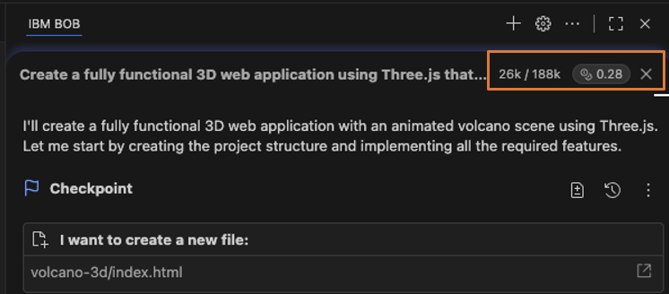

In this case, building the initial volcano application cost **0.28 Bob Coins** and consumed **26K tokens of context**.  Click on the the Bob Coin consumption indicator on your screen to expand for more details as below:

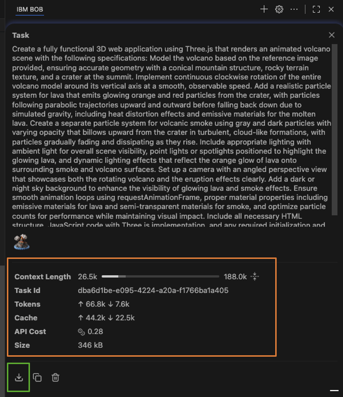

This more detailed breakdown shows my volcano application required 66.8k input tokens and 7.6k output tokens with an API cost of $0.28.  This last item is an interesting item as it helps us know how much 100 Bob Coins costs.

```
0.28 Bob Coins = $ 0.28
1.0  Bob Coin =  $ 1.00
100  Bob Coins = $100.00
```

How much did it cost for IBM Bob to build your application?

### 7.1 Bobcoins vs. tokens
While Bobcoins measure your usage budget, the underlying AI models consume tokens—the fundamental units of text processing used by language models. Here's how they relate:

**Tokens:** The raw units of model usage. Tokens represent pieces of text (words, characters) that the AI model processes. Every request to the model consumes input tokens (your prompt and context) and output tokens (Bob's response).

**Bobcoins:** Bob's usage metric that abstracts token usage into a predictable budget system. One Bobcoin represents a standardized amount of computational resources, which includes token usage across different models and operations.

### 7.2 Increasing your Bobcoin budget
Your Bobcoin budget determines how much you can use IBM Bob each month. You can permanently increase your monthly allocation by providing feedback about your experience.

#### When can you submit feedback?
IBM Bob prompts you to submit feedback when your remaining budget drops below 3%. You cannot trigger the survey early, you must wait for the prompt to appear. To submit, hover your cursor over the budget gauge in the top-right corner of the Bob panel.  Click the Provide feedback button that appears.

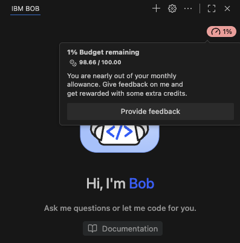

If you drop below 3% of your budget but do not see the Provide feedback button when hovering over the budget gauge:
- Ensure you are running v1.0.0 or greater
- Try restarting IBM Bob.

Learn more [about Bob Coins in Bob's documentation](https://bob.ibm.com/docs/ide/account/bobcoins)

## 8. Prompt Caching = reduced cost + reduced latency ⏰ 
The screenshot above also shows how building the volcano application was optimized using [Claude's Prompt Caching capability](https://claude.com/blog/prompt-caching).  There were Prompt Cache writes of 44.2K tokens and Prompt Cache reads of 22.5K tokens.  

Prompt caching enables IBM Bob's developers to cache frequently used context between API calls. With prompt caching, Claude is provided with more background knowledge and example outputs—all while reducing costs by up to 90% and latency by up to 85% for long prompts. Prompt caching is highly effective in situations where you want to send a large amount of prompt context once and then refer to that information repeatedly in subsequent requests.  Conversational agents like IBM Bob benefit from reduced cost and latency for extended conversations, especially those with long instructions or uploaded documents.

This image from [Claude's blog on its Prompt Cache](https://claude.com/blog/prompt-caching) provides useful statistics on the value of caching:

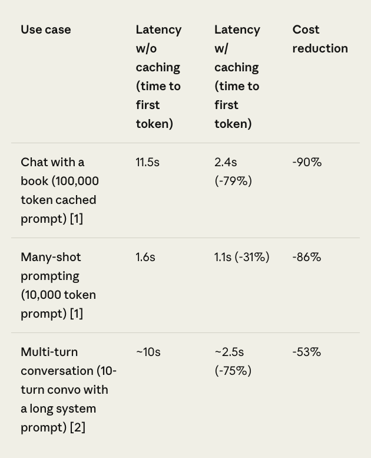

IBM Bob uses Claude's frontier model so any pricing gains from Prompt Caching ultimately help lower costs for IBM customers. So let's look at how Claude prices their cached prompts to see how caching could impact Bob's costs too.  Cached prompts are priced based on the number of input tokens cached and how frequently that cached content is accessed. Writing to the cache costs 25% more than Claude's base input token price for any given model, while using cached content is significantly cheaper, costing only 10% of the base input token price.

For example from Claude's Promp Cache documentation:

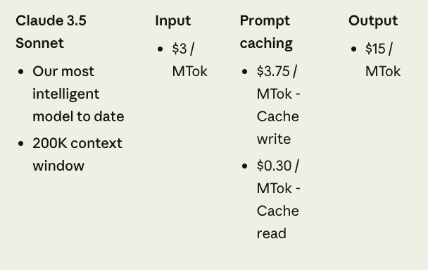

## 9. Analyzing Bob's Task History 
Scroll back up to the screenshot showing the summary of Bob's token, coin and cache consumption (surrounded in an orange box).  Below that section is an **Export Task History** button in a green box.  Click that button to export Bob's Task History from building your application.

You can consider this markdown file to be a summary of IBM Bob's stream of consciousness or memory.  It contains multiple sections so let's explore a few of them.  

1. Search for "<environment_details>" which occurs multiple times through the Task History as a snapshot of Bob's state at each instance including open tabs, files to exclude during its reasoning plus reminders like "You have not created a todo list yet. Create one with `update_todo_list` if your task is complicated or involves multiple steps."
2. Search for the first instance of "<write_to_file>" to learn what Bob was doing and thinking up-to-the-point that it asked you for permission to create its first file in your project.  The contents of that XML object are what was passed to the **write_to_file** tool including the name of the file to write into.
3. Note that there are "Assistant:" and "user" sections which you should be familiar with from the old days of prompt engineering.
4. At the end, you'll see the call to the **attempt_completion** tool.
5. What other tool calls or sections can you find in your own Task History?

## 10. Your personal Bobalytics dashboard 📊 
Did you know that everyone has their own [Bobalytics dashboard](https://bob-admin-prod.ibm-bob-staging.cloud.ibm.com)?  Click that link to view yours, but if you ever need to access this from within IBM Bob, click on the Settings gear icon then click **View Bobalytics** on the General tab.

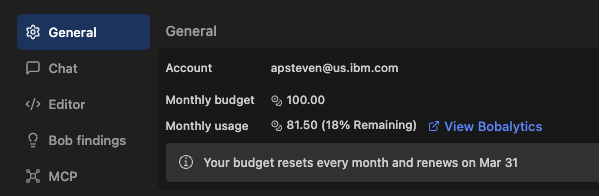

While not necessarily useful to you, it is likely used by the IBM Bob team to determine how useful you are to them.  Specifically they are likely eager to see high values for your Bob Factor and Number of Commits and your Bob Repository Commits.

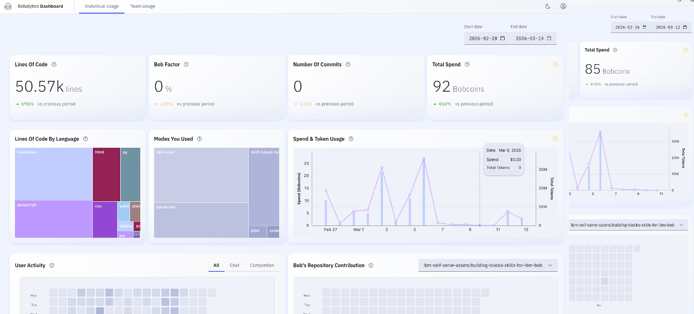

## 11. Done before the time limit?
If you get here with time to spare, then spend the remaining time continuing to improve on your application.  Once you are happy with your work, share your results with others.  Specifically share your application with the workshop leads as they'll be excited to learn what you've created.