# Lab 2.1: Setting up IBM Bob to build a data analytics website 📊 
During labs 2.1 and 2.2, you will build a data analytics website in IBM Carbon. Before building the website though, you'll follow instructions in lab 2.1 to peform multiple configuration steps. 

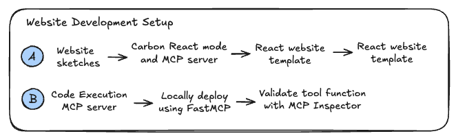

You'll work through these topics and more during this setup process:
- IBM's Carbon React mode and MCP server
- Convert website sketches into React-based templates
- watsonx Orchestrate ADK MCP servers
- Allow Bob and agents to execute arbitrary (but safe) code inside watsonx Orchestrate
- Deploy MCP servers into watsonx Orchestrate using Bob

At the end of Lab 2.2, you'll have created a website similar to the one below.  Actually 3 different websites with data analysis by IBM Bob executing Pandas code in your locally deployed MCP server:

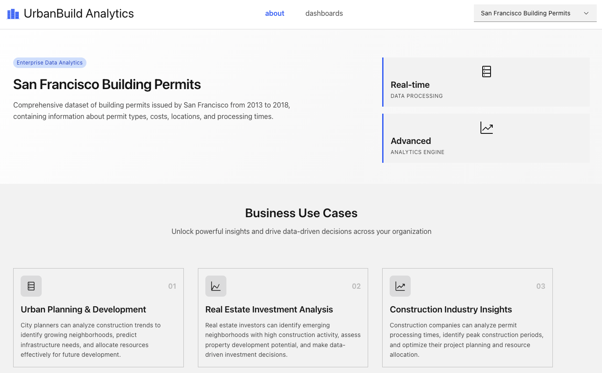
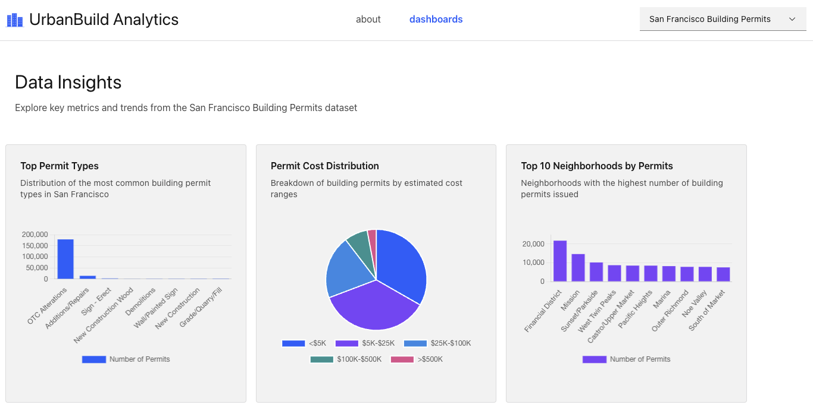

## 1. Setup the Carbon React mode and MCP server
You likely know how to install Modes and MCP servers from Bob's Marketplace so we'll skip providing step-by-step instructions.  If you have questions, ask a colleague for assistance.

Select installation scope as **Project** when asked:

1. Install the **Carbon** MCP server
   - NOTE: Because this MCP server is only available via internal preview access, you'll need to generate an Authorization Token and Session ID by going through the [Carbon MCP server onboarding process](https://carbondesignsystem.com/developing/carbon-mcp/onboarding-and-setup/)
2. Install the **Carbon React** Mode

Read more about the [Carbon React mode in Bob's docs](https://internal.bob.ibm.com/docs/ide/features/carbon-modes/carbon-react-walkthrough).

## 2. Convert wireframe sketches into a React website template
Yes, you could interactively describe your website design to Bob in the Chat interface, but an image is worth a thousand words.  By quickly sketching a few website screens then supplementing with a textual description, Bob can rapidly create a website template in React for you.  Your website vision could be sketched on a napkin or a whiteboard.  

For this lab, we chose to design the [website template in Powerpoint](v1-wireframes/website-wireframes.pptx) deck then create images from each slide:

1. [home page - about](v1-wireframes/1-home-page-about.png)
   - Home page describing the dataset plus description of use cases generated by Bob
2. [dashboard page](v1-wireframes/2-dashboard-page.png)
   - Charts and tables to-be-generated by Bob using the Pandas code execution MCP server

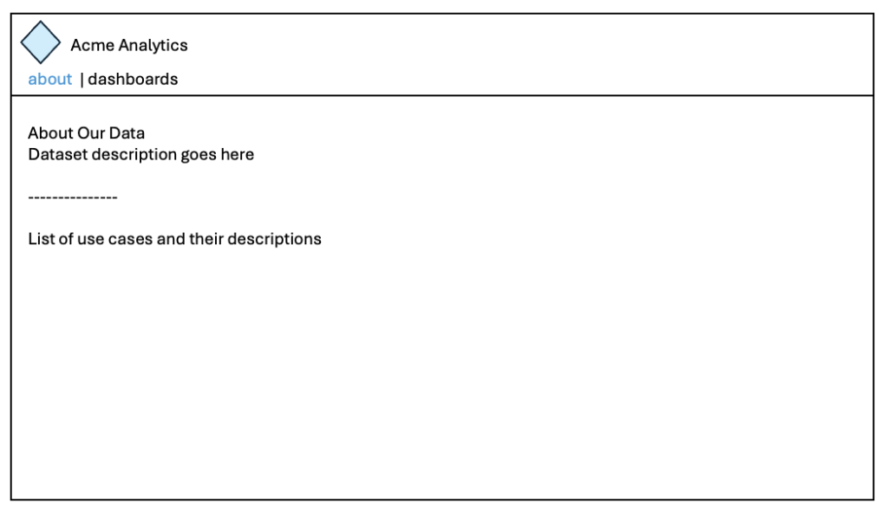
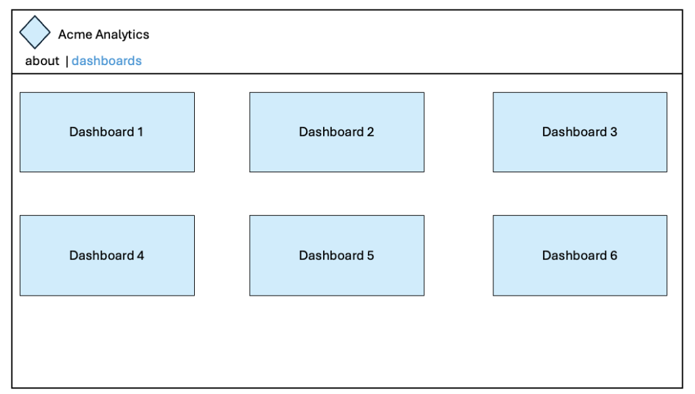

### 2.1. Use the Carbon React mode to convert images into React
Select the **Carbon React** mode in the Bob's chat window.

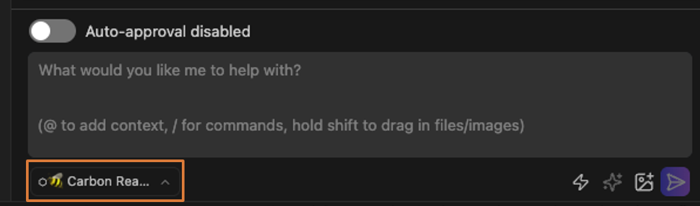

Enter this prompt into Bob's Chat interface:

```
I have two images in @/lab-2-dataset-powered-website/v1-wireframes/ which show the website that I want to build.  Use these to create a website template.  Create the site using Carbon and React but don't add anything beyond what's in the template images.
```

Bob may ask you a few questions like:
- What size the website should be? Keep at width = 1024 pixels.
- Single or multi-page app?  Go ahead and select single page if asked.

Overall, keep Bob on task to only create the website template. Once Bob has all the info required to get started, Bob will call the **update-todo-list** tool which creates as a list of to-do's like below:

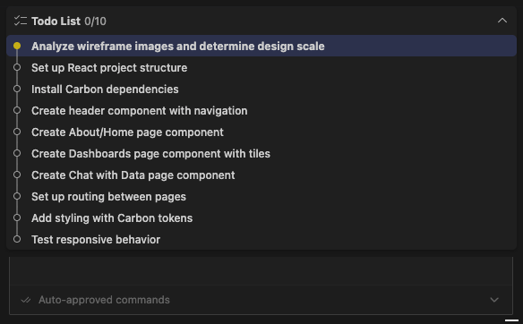

Here's the signature for the **update-todo-list** tool, as we found in Lab 1.1. when asking Bob to list all available tools:

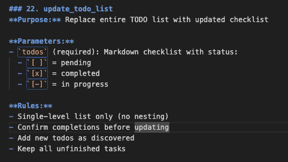

Take time to monitor each step that Bob executes to follow along with Bob's development process. If Bob asks to launch a server to validate the website's look and feel, go ahead and review the website template.  However don't let Bob do anything else.

The template won't look exactly like the wireframe images, but that's not an issue.  We'll improve on the final look and feel later.  Here's an example of what the template could look like when converted to Carbon React.

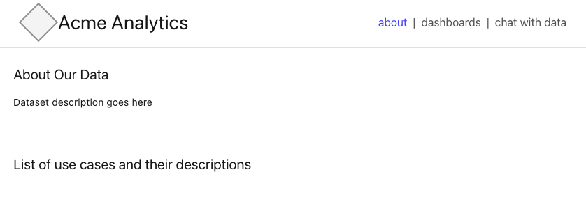

Once you're finished reviewing the website, tell Bob to shutdown the webserver to reduce resource usage: 

```
Shutdown the webserver
```

## 5. 🤯 Execute arbitrary but secure code in an MCP Server
Let's give Bob a superpower now.  

There are times when Bob needs to perform a task that requires complex logic.  Like determining if a certain number is a prime, or in the current case of our data analytics website, performing complex analysis of a dataset for which the question and thus code doesn't exist at design time.  

For these and many other tasks, we can:

1. Ask Bob to write code to solve our complex mathematic or other analytic problem
2. Send that code to a code execution MCP server (running in watsonx Orchestrate)
3. Securely execute that code within an isolated container hosting that MCP serverR
4. Return the answer back to Bob.

This raises an intriguing question.  If Bob can write arbitrary code and execute it, then do we really need **text-to-sql** anymore? 😲 

Seldom can you solve a complex problem by converting its description into a single SQL query. Most would require chaining multiple **text-to-sql** queries then performing data processing separately.  With an Pandas code execution MCP server, Bob can write combine any queries plus all data analysis into a single python file for execution.  Much faster and easier to scale.

### 5.1 Read through the MCP server code 
In the [pandas-mcp-server](pandas-mcp-server) folder, you'll find an MCP server that allows Bob to do exactly that.  We've written the MCP server for Pandas code pre-validation and execution plus provided tools to inspect different datasets.  However you could easily rewrite the MCP server to validate then execute any code written by Bob.

Take a few minutes to review the code.  Specifically look at:

[server.py](pandas-mcp-server/server.py)
- get_datasets()
- get_file_paths_for_dataset()
- run_pandas_code()

[server.py](pandas-mcp-server/execution.py)
- execute_pandas_code()
- get_forbidden_reason()

### 6. Validate tool functionality prior to deployment 🛠️
A common complaint about watsonx Orchestrate is that it sometimes fails to call the correct tool.  In many cases however, Orchestrate is not the problem. Instead, the MCP server code was not fully tested.

Let's follow best practices and test the MCP server logic prior to deployment into watsonx Orchestrate.  We will use [MCP Inspector](https://modelcontextprotocol.io/docs/tools/inspector) which is an easy-to-use browser-based tool built by the MCP community.

#### 6.1 Launch the MCP server locally:
```bash
# During the pre-requisite setup of your laptop environment, you created
# a virtual python environment = wxo-eval-lab.  You will now activate it here.
# Replace {path-to-wxo-eval-lab-venv} with the path to your venv.
source {path-to-wxo-eval-lab-venv}/bin/activate
# For windows: {path-to-wxo-eval-lab-venv}\Scripts\activate.bat

cd pandas-mcp-server
pip install -r requirements.txt
python3 server-https.py
```

You should see something like this.  

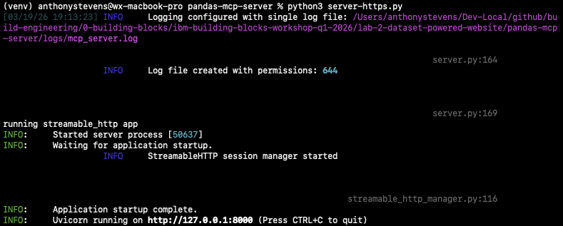

Your MCP server is now running at [http://127.0.0.1:8000/mcp](http://127.0.0.1:8000/mcp).  Visit that page and you'll see this error because your browser doesn't accept text/event-stream responses.  

```
{"jsonrpc":"2.0","id":"server-error","error":{"code":-32600,"message":"Not Acceptable: Client must accept text/event-stream"}}
```

To handle the event stream returned by this URL, you need threaded streaming logic.  Hopefully we have time to explore how to do that in Lab 3.  For now, we'll use MCP Inspector.

#### 6.2 Launch MCP Inspector
To launch MCP Inspector, you'll use the [npx command (Node Package eXecute)](https://dev.to/orlikova/understanding-npx-1m4) which is a command-line tool that let's us execute Node.js packages directly from the npm registry without needing to install the packages permanently on your system. 

If you don't have npm or if you get an error, install the latest version of npm. npx is automatically bundled with npm version 5.2.0 and higher,

Leave the MCP server running in the current window.  Open a new window then execute this command:
```bash
npx @modelcontextprotocol/inspector
```

You should see something like this.  

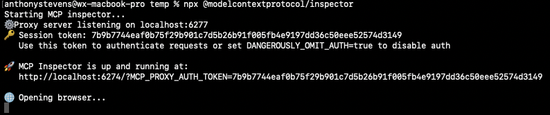


### 7. Use MCP Inspector to validate tool calling
View MCP Inspector by visitiing [http://localhost:6274/](http://localhost:6274/). Ensure that **Transport Type** is set to **Streamable HTTP**.  The other default settings should be fine.

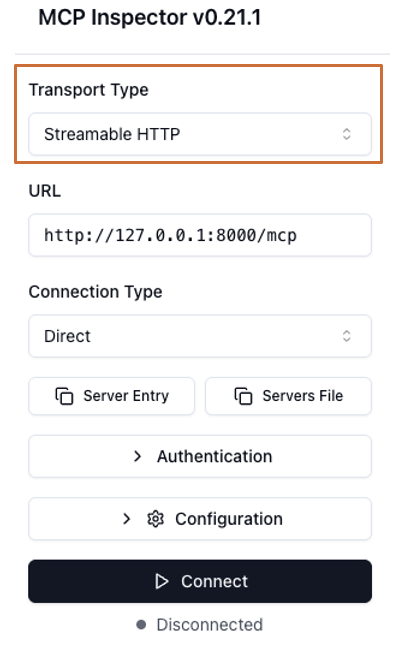

### 7.1. Connect
Click **Connect** and you should see **🟢 Connected** at bottom-left plus the middle section will load with options for interacting with the MCP Inspector.  

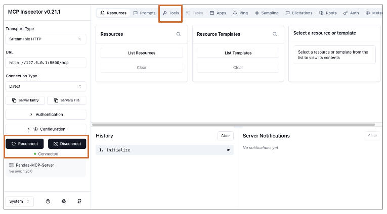

Click the **Tools** tab at top-middle then click List **Tools**.

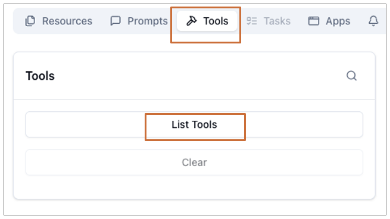

### 7.2 Test get_datasets tool
You will see a list of tools available in the MCP server.  Select the **get_datasets** tool to view what Bob sees when being told how this tool functions.

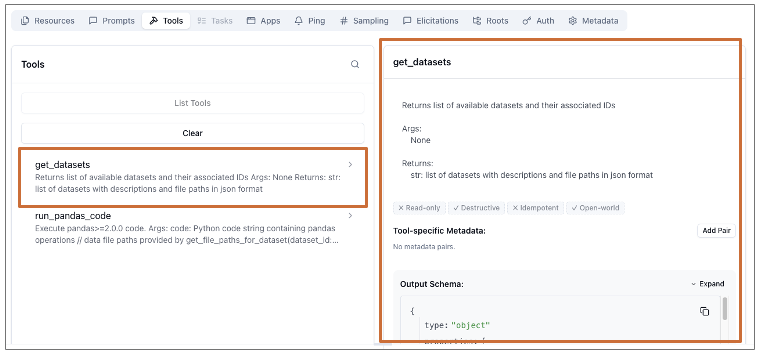

Scroll down and click **Run Tool**. The section below **Run Tool** will update to show the tool was successfully called plus the ouput that Bob would see when executing this tool.

### 7.3 Test run_pandas_code tool
Scroll back and select the **run_pandas_code** tool. 

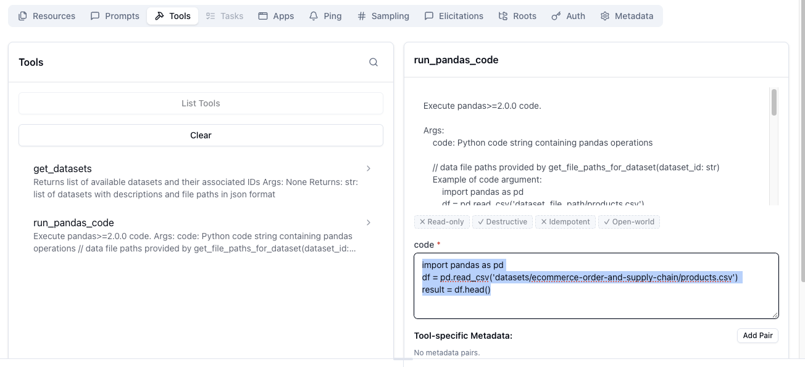

In the **Code** text area, enter this 
```python
import pandas as pd
df = pd.read_csv('datasets/ecommerce-order-and-supply-chain/products.csv') 
result = df.head()
```

Scroll down and click **Run Tool**. The section below **Run Tool** will update to show the code successfully executed and returned the first fives lines from [pandas-mcp-server/datasets/ecommerce-order-and-supply-chain/products.csv](pandas-mcp-server/datasets/ecommerce-order-and-supply-chain/products.csv)

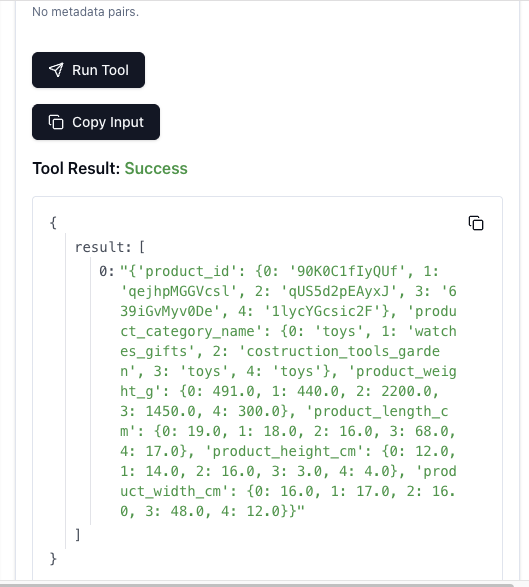

Take a few minutes to explore MCP Inspector.  Write a different version of the Pandas code and try executing it.

### 8 Add the local MCP server to Bob
In the next lab, 2.2, Bob will use the MCP server to build a data analytics website for you. Open **Settings > MCP** and click the **Open** button for your **Project MCPs**.

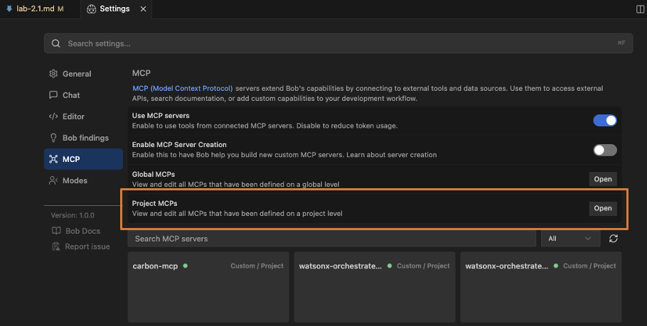

Configuration details for the three MCP servers that you previously added to your project are shown.  You will need to carefully add the connection details for the local MCP server now.

```json
"pandas-dataset-code-execution": {
      "type": "streamable-http",
      "url": "http://127.0.0.1:8000/mcp"
    }
```

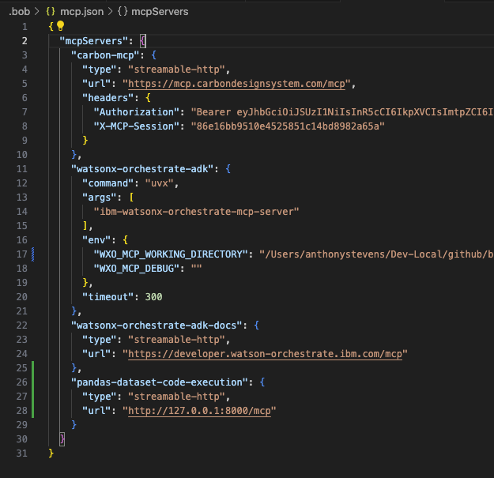

Save your edtis then return to the **Settings > MCP** screen to validate that all your MCP servers show green 🟢 circles.  If any are red, then you'll need to debug why before proceeding.  

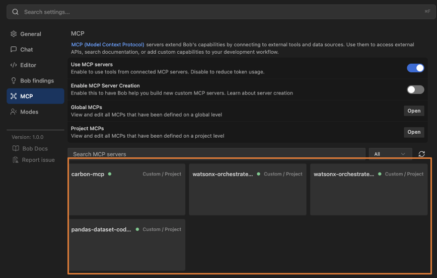

### 9. Next steps?  Provide Bob enough context to build our website for us.
Proceed to [Lab 2.2](lab-2.2.md) where you'll write a Custom Mode which configures Bob to build data analytics websites hosted in watsonx Orchestrate.