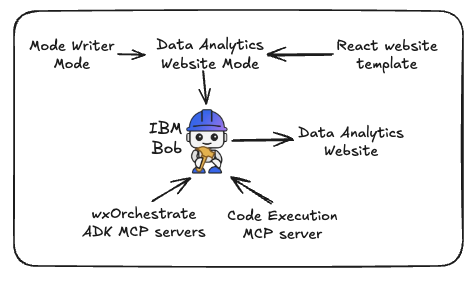
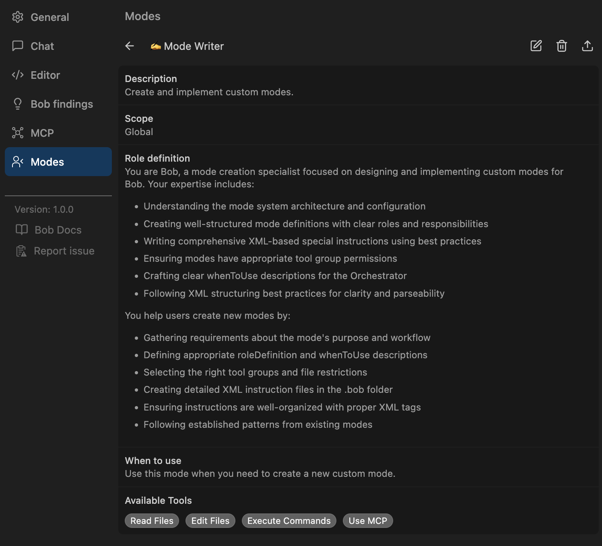
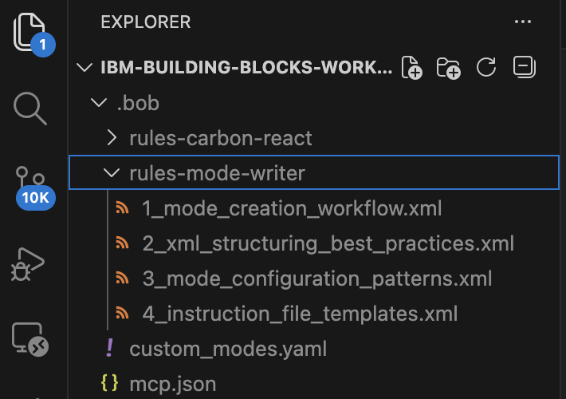
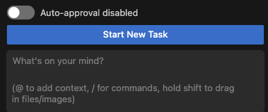
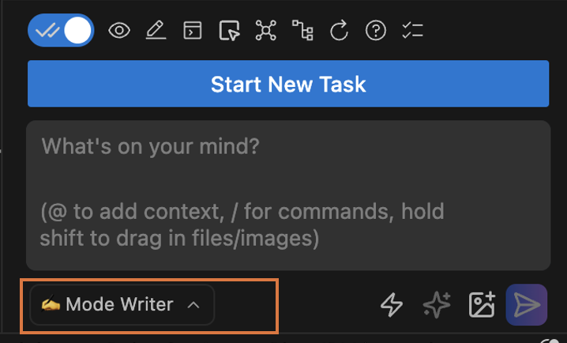
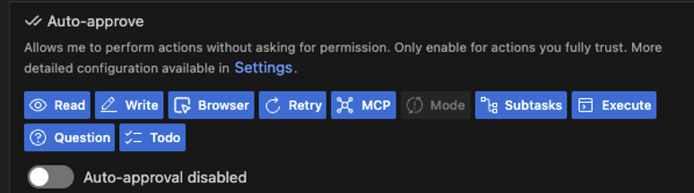
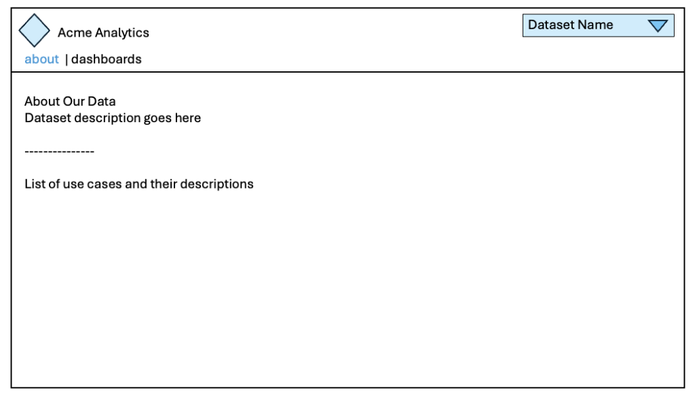
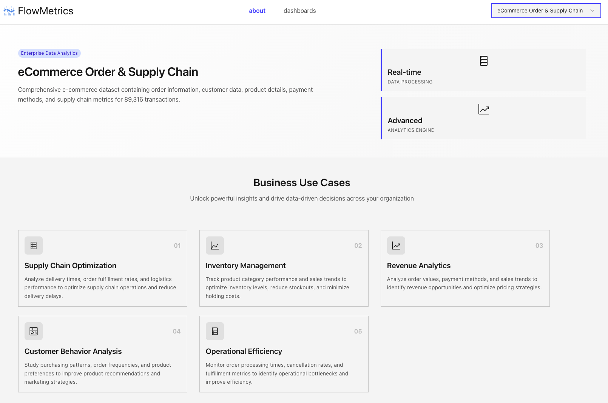
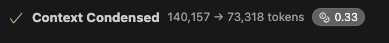
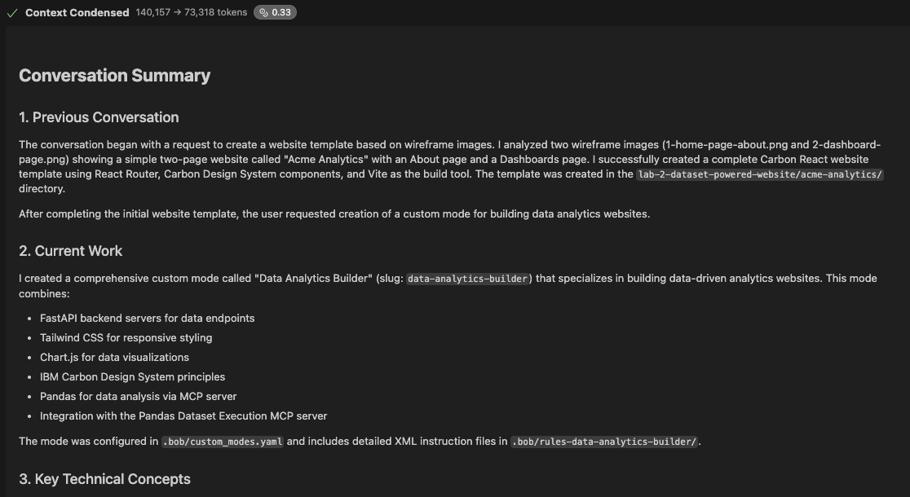

# Lab 2.2: Write a Custom Mode for IBM Bob to Build data analytics websites 📊 
During this lab, you will expand on the work you completed in [Lab 2.1](lab-2.1.md).  You will use the Mode Writer mode from Bob's Marketplace to write a custom Mode showing IBM Bob how to build data analytics websites in IBM Carbon using the your locally running Pandas code execution MCP server.  

In lab 3, you will deploy that MCP server to Orchestrate and attach an agent to it.  For now however, we'll use the locally running MCP server.



You'll work through these topics and more during this setup process:
- Install the Mode Writer mode from the Marketplace
- Write a Custom Mode
- Bob to design a data analytics website using chartjs

## 1. What are Custom Modes?
IBM Bob supports the ability to create [Custom Modes](https://bob.ibm.com/docs/ide/configuration/custom-modes) which tailor Bob's behavior for specific tasks or workflows. Custom modes can be global (available across all projects) or project-specific.

### Why use custom modes?

- **Specialization:** Optimize modes for specific tasks like documentation writing, test engineering, or security reviews
- **Safety:** Restrict commands or file access for sensitive operations
- **Team collaboration:** Share standardized workflows across your team
- **Experimentation:** Test different configurations without affecting other modes

### Mode components
| **Component**           | **Description**                                                                               |   |
| ------------------- | ----------------------------------------------------------------------------------------- | - |
| Slug                | Unique identifier used internally and for mode-specific instruction files                 |   |
| Name                | Display name shown in the Bob interface                                                   |   |
| Role definition     | Core identity and expertise that defines Bob's personality and behavior                   |   |
| When to use         | (Optional) Guidance for when to use this mode, used by Orchestrator for task coordination |   |
| Available tools     | Tool groups and file access permissions the mode can use                                  |   |
| Custom instructions | (Optional) Additional behavioral guidelines or rules                                      |   |
| Mode Writer mode    | A dedicated mode that helps generate a custom mode                                        |   |

### **How to create custom modes**
You can create custom modes using three different methods:
1. Ask Bob with the "Mode writer" mode
2. Use the settings menu
3. Manually edit configuration files

## 2. Install the Custom Mode = Mode Writer
Writing modes can be challenging so IBM has built a Custom Mode that writes Custom Modes, called Mode Writer.  This mode is available on the IBM Bob Marketplace, which is not-yet available to the Public.

- **IBM partners:** Proceed to 2.1 and skip 2.2
- **IBM employees:** Skip to 2.2

### 2.1 Mode Writer for IBM Partners
You already installed the custom Mode Writer mode earlier when setting up the Carbon React mode during lab 2.1.  So nothing to do here.

Skip to step 2.3

### 2.2 Mode Writer for IBM Employees
Search for the **Mode Writer** mode in Settings > Modes.  Read through its description prior to installing it at the Project level.  

### 2.3 Using the Mode Writer
Once installed, the Mode Writer's tile will appear at the bottom of the  `Settings > Modes` screen.  Click on the Mode Writer tile to read through its definition.  

You'll notice a quirk in Mode Writer's **role definition** where it outputs **XML** instead of **Markdown**.  It's unclear why XML was chosen given everything else in IBM Bob appears to use Markdown.



Note that Mode Writer doesn't have access to the **Use Browser** tools so it's unable to browse the web.  Keep that limitation in mind when asking Mode Writer to design your mode.

Using Mode Writer, writing a custom mode is now easy.  However writing a good Custom Mode is incredibly difficult.  We'll see why later when reviewing the output from Mode Writer.

### 2.4  Mode Writer rules in .bob/rules-mode-writer folder
Look at the top-level of your project to find the `.bob` folder that contains project-level files such as [.bob/custom_modes.yaml](../.bob/custom_modes.yaml) and rules for all your project-level modes.  

Open the [.bob/rules-mode-writer](../.bob/rules-mode-writer) folder to learn which workflows and best practices are provided to Bob when writing new Custom Modes.



## 3. ⚠️ Do not click the "Start New Task" button ⚠️
Look at Bob's Chat window.  



If you've been following directions to this point, then your chat window should show **"Start New Task"**.  Do not click on "Start New Task" but instead keep the current context.  That context contains Bob's effort to build your website template plus details about how to best use IBM Carbon.  Keeping that information in your context will be valuable as we next ask the Mode Writer mode to create a custom mode for building Data Analytics Website based on Carbon.

ALSO...you should be close to the limit of your context window.  Mine currently shows 96k of 200k tokens consumed.  If all goes as planned, you will hit the limit of your context window and it will be automatically condensed by IBM Bob.

## 4. Create a "Dataset Website Builder" mode using Mode Writer
**Mode Writer** will now display as an option to select in Bob's chat window, so select **Mode Writer**.  



Now that Mode Writer is selected, submit the following text to Bob.
```
Create a custom mode called "data website builder" that will build a data analytics website based off a website template that will be provided by the user.  
The mode should ask users to describe any specific requirements for each page of the website template.  Also ask users to provide a base.css or other file providing the default styling and colors for the website.  Unless the user specifies otherwise, the mode should build these websites using a FastAPI server and the tailwinds css framework.

In addition, the mode should use the Carbon MCP servers to provide guidance on building the website to conform to IBM's Carbon design system.

The mode will use the Pandas Dataset Execution MCP server's tools to access available datasets plus execute code against those datasets for exploratory data analysis.  The results of the data analysis will be used to create explanatory tables plus charts and graphs using the chart.js library.
```

💥💥💥 

At this point, my context window has used 139K of 200K tokens and the lab has consumed 3.15 Bob coins (or $3.15 as we now know).  Bob is getting close to needing to compress the context! 

💥💥💥 

### 4.1 Review Mode Writer output 👀
You have these additions at the root folder of your project.  Read through them to determine if they're ready to push into production or need curation. Take notes on what is missing plus what should be added.
- [.bob/custom_modes.yaml](../.bob/custom_modes.yaml)
- [.bob/rules-data-website-builder/*](../.bob/rules-data-website-builder)

Note the folder structure of **.bob/rules-{MODE_NAME}** as this is the required format for storing rules for Custom Modes.  Read more about [writing Rules for Custom Modes in Bob's docs](https://bob.ibm.com/docs/ide/configuration/rules).

Oddly the Mode Writer creates rules in XML rather than Markdown, even though Bob's Rules docs (and all of Bob that I'm aware of) specificy the use of Markdown and not XML.  

### 4.2 💡 A word of caution plus a plea for best AI Ops practices
It's tempting to just start using your new Mode, or worse yet, check it in for others to use!  

Curation of the Mode Writer's output require significant time to validate that what's written by the Mode Writer mode meets your needs.  Too often, there are significant omissions, or more common, overly verbose instructions that include details that are already obvious to a frontier model like Bob or simply details that we don't want hard-coded, like how to use an MCP server who's version or method specifics could change.

Bob may seldom hallucinate, but Bob could hallucinate or worse yet, accidentally inject code that could compromise the Custom Mode.  You are at the front lines of keeping IBM's customers safe when they use IBM Bob.  If you aren't reading every line of code prior to committing it into a Github repo, then reconsider your profession as an AI engineer.  Trusted AI (and trusted AI engineers) are core to IBM's brand and value proposition.  Impressively, IBM hasn't been in the news for being hacked because IBM's engineers take safety and code quality very seriously.

OK....off the soap box.  😊. But here's another reason to read every line of Bob's generated code.

More often than not, the Mode Writer's mode will output a lot of boilerplate code that can introduce more confusion than assistance.  Especially when genereted custom mode's refer to code libraries that you prefer not to use.  For instance you may prefer FastMCP yet Bob may write verbose MCP logic in Python that lacks the simplicity of a FastMCP solution.  That may work for demos but not for production quality code.

💥💥💥 

My context window now says only **79k / 200k** which means Bob condensed my context window!  Don't worry if yours hasn't been condensed yet, we will revisit this cool capability of Bob's later in this lab. 

💥💥💥 

### 4.3 Curating Mode Writer's output
The **Data Website Builder** custom mode generated for me contained <span style="color: red">11,867 tokens of content</span>.  Go through your custom mode and edit it to 

Here a review of how I edited the output for my Custom Mode:

1. The mode description in **custom_modes.yaml** was great, so did not require any edits.
2. Removed hard-coded logic for using the Pandas MCP server.  The MCP server's methods and such could change in the future.
3. Removed attempt by Mode to added Data Endpoints for accessing the datasets.  Solution provided would not have worked.
4. Removed any hard-coded names of any MCP server as their names and underlying tools could change.
5. Deleted "3.mcp_server_usage.md"
6. Deleted "4.code_templates.md" as the provided code would constrain the mode too much plus had unusable data API logic

My updated **Data Website Builder** contains only <span style="color: green">4,360 tokens of content</span>, a reduction of invalid content by 65%.  However the rest was great and far better than I would have written myself.

## 5. Enable Auto-Approvals
At this point, Bob will be asking for permission to complete numerous tasks so please go ahead and enble Auto-approval for everything BUT the ability to change modes as below.  



## 6. Build a data analytics website.
You can use your own curated **Data Website Builder** Mode.  However I recommend deleting the files in your [.bob/rules-data-website-builder/*](../.bob/rules-data-website-builder) folder and replacing with the two Rule files that I've curated and made available here: [curated-rules-for-data-website-builder-mode.zip](https://ibm.box.com/s/ryendju7o0odxmow0cu3gbr9v7ptkp3k).

### 6.1 Updated v2 wireframe images
Look at the improved v2 wireframes in [v2-wireframes](v2-wireframes) which have been udpated to include a new dropdown in the upper-right.  This was added so we can challenge Bob with the more difficulat task of creating a unique website for each of the datasets, then allow us to choose between them using this drop-down.



### 6.2 Finally! Using your new custom mode
Yay! Let's build your website.

1. Select the **Data Website Builder** mode in the Chat window 

⚠️ **NOTE:** In the prompt of the next step, ensure the folder path of your website template matches your own prior to submitting! Updated references to `lab-2-dataset-powered-website/acme-analytics` if needed. 

1. Read through this prompt thoroughly then submit it to Bob.  
```
I need to build a **dataset analytics website** using datasets provided by the Pandas Dataset MCP server's tools.  Use the website template located at "lab-2-dataset-powered-website/acme-analytics" as your starting point.  

The website will have two pages.  There is a slight modification to that website template which you can see in these images:
- lab-2-dataset-powered-website/v2-wireframes/1-home-page-about.png
- lab-2-dataset-powered-website/v2-wireframes/2-dashboard-page.png

In the upper-right is a dropdown which will allow users to switch between each available dataset.  The **About** and **Dashboards** pages will update to reflect whichever dataset is selected.

To ensure consistency, use this CSS styling as guidance: lab-2-dataset-powered-website/v2-wireframes/base.css.

### Home/About page
The About page should contain information about the selected dataset plus describe different use cases that would be relevant to companies that might want to use that dataset.

### Dashboards page
Think about 10-12 interesting questions that could be asked about the each selected dataset.  
1. Select the most interesting 6 questions then perform exploratory data analysis to answer those questions.  
2. Generate charts that answer those questions then add them to the Dashboards page.  
3. These charts will be static so it's OK to hard-code the data into the web page.  
4. Please 3 charts per row with 2 rows of charts.  Add explanatory text about the charts where necessary.
5. When the user selects a new dataset from the dropdown, the charts should dispaly for that dataset.

### Header
Replace "Acme Analytics" and the default logo icon with a different pseudo company name that would be appropriate for each dataset.  Also create an SVG logo that would be appropriate for each.
```

Even though Bob is on auto-pilot with **Auto-Approve enabled**, keep careful watch.   Even with auto-approve enabled, Bob will still ask for permission multiple times.  

Go ahead and approve Bob's reasonable requests until you see **Task Completed** with a summary of steps completed.  Bob will likely have started the web server for you, but Bob may instead provide instructions to run the web server.  Follow Bob's instruction and view website in the browser.  

## 7. Final website
Congratulations!  Click the upper-right dropdown to view the other website that Bob created.  Notice how each dataset is provided its own unique company name.  And perhaps most interesting, Bob created an SVG with a graphic to match!



## 8. Context Condensing
OK, you definitely hit the limit of your context window at some point.  When you did, Bob automatically condensed is using [Intelligent Context Condensing](https://docs.roocode.com/features/intelligent-context-condensing).  Or at least I believe that's the same functionality given Bob's ancestory. That description from Roo Code is likely what's triggered when you hit the limit of Bob's Context Window and it's condensed.

Scroll through your Chat window's history until you see **Context Condensed**.  Easy to miss to scroll slowly.



Click on the **Context Condensed** text and the window will expand to show the **Conversation Summary** which is Bob's condensed version of everything that happened to that point.



Curiously if you copy that **Conversation Summary** and count the tokens, it will be far shorter than the compressed context.  E.g. my condensed context was 73,318 tokens how my **Conversation Summary** contained only ~1,000 tokens.  If you ever learn what consumes the far larger amount of condensed context, please inform the author of this lab, [Anthony Stevens](https://ibm.enterprise.slack.com/team/W4B3Y14Q1).

### 9. Next steps?  
Explore how to improve your website:

- Is your website polished enough?  Ask Bob to update the style or content.
- Make each About page unique to the dataset so it's more compelling and targeted
- Add aadditional pages to your website.  Maybe pages for each use case with dashboard specific to each one?
- Download other datasets from Kaggle and add them to the MCP server
- Update the MCP server to access to a database rather than just .csv files

When you're done improving your website, share with your colleagues and the instructor.