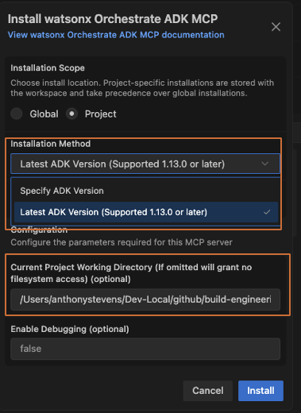
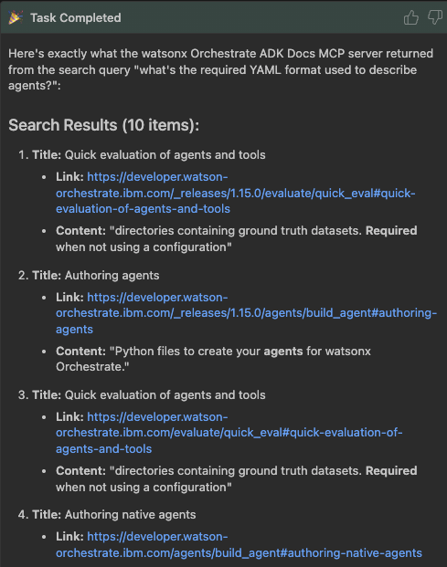
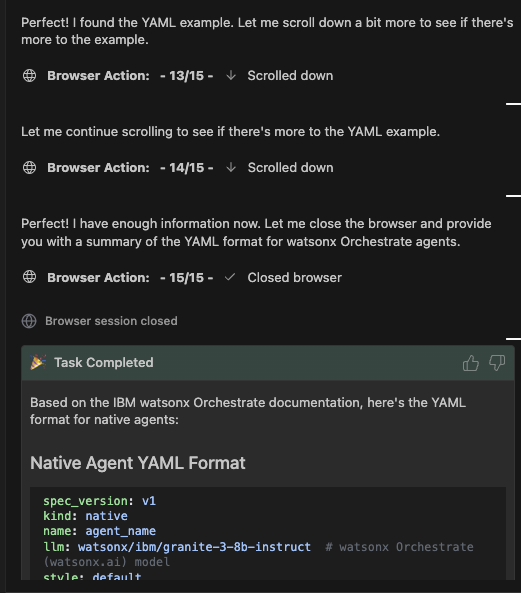
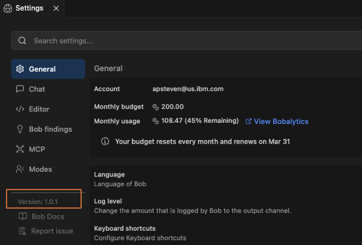
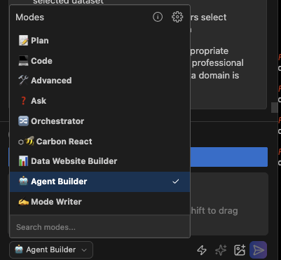

# Lab 3.1: Add agentic Data Q&A to Data Analytics Website
In this lab, you'll get early access using the new [Agent Builder Skill from the IBM Building Blocks](https://ibm.box.com/shared/static/z5pgty70flx3vv86ohwik2d146cij1xf.zip) to further configure your development environment as we continue enhancing the Data Analytics Website.


You'll work through these topics and more during this setup process:
- Orchestrate ADK MCP servers
- IBM Bob Skills
- Agent Builder Skill
- Deploy MCP server to Orchestrate using Bob
- Build Data Analytics Agent using Agent Builder Skill
- Deploy agent to Orchestrate using Bob
- Connect agent to new **Q & A** screen in your Data Analytics website

## 1. Enable watsonx Orchestrate's MCP servers 
Open Bob's Settings panel, search for "Orchestrate" under the MCP server section.  Install both MCP servers provided by the watsonx Orchestrate team. We recommend keeping both servers at the **Project** level.

1. watsonx Orchestrate ADK
2. watsonx Orchestrate ADK Docs

You will need to update two fields when adding the MCP server for watsonx Orchestrate ADK

- ADK Version (select to use the latest version)
- Project directory
   


The MCP server for watsonx Orchestrate ADK requires a project directory. Set the path to the location of this lab's folder. 

For example:
```
/Users/anthonystevens/github/ibm-building-blocks-workshop-q1-2026/lab-3-agent-builder-custom-mode
```

You could add Orchestrate's MCP Servers to Global scope then update the project directory path everytime you switch projects, but it's easy to forget. So keep both MCP servers at Project scope and just re-add each time so you don't forget.

If you get an error when installing Orchestrate ADK's MCP server, the issue is likley that your project directory is incorrectly set.  

## 2. Orchestrate ADK Docs MCP Server
The Orchestrate ADK Docs MCP Server was recently updated to a format that is poorly designed for agents.  

Enter this text into the Chat window and just send.  **Don't optimize this prompt!**

```
Search Orchestrate ADK Docs MCP Server for "what's the required YAML format used to describe agents?"  I don't care if what's returned seems correct or not.  Just show me exactly what's returned by the MCP server's tool.
```
Instead of providing agent-readable answers, the current implementation returns a Google-style list of links.  



Bob will typically ignore these links and keep trying new searches.  That's a good thing as Bob's web browsing capability would take screenshots of the web page, then scroll down to the bottom taking screenshots all along the way.

💰 That's a rapid and inefficient way to blast through your Bob coins!  💰 

Go ahead and ask Bob to search one of those links:
```
This link seems to have the info we need about the correct yaml format for orchesrate agents, read it and tell me what the format is:
https://developer.watson-orchestrate.ibm.com/agents/build_agent#authoring-native-agents 
```

Bob will open a web browser, and in my case, took 1 minute and 15 page scrolls while consuming 0.6 tokens.  Most document searches like this require reading multiple pages, so this is highly inefficient.



## 2.1. 😲 And now uninstall the Orchestrate ADK Docs MCP Server 🔥
For now then, go to **Settings > MCP** then select the Orchestrate ADK Docs MCP Server and click **uninstall**.  Do not uninstall the Orchestrate ADK MCP Server (one without "Docs" in its name).  

The ADK Docs MCP server is provided by [Mintlify](https://www.mintlify.com/) which provides document hosting for the watsonxOrchestrate team. We are working with them to update their functionality plus submitted a [request for the Orchestrate team to provide a more agentic solution](https://github.ibm.com/WatsonOrchestrate/wxo-internal-support/issues/1714).  

Ideally the ADK Docs MCP server returns links to documents in markdown format, which is the most agent friendly approach.  Companies like Cloud Flare are already embedding "web pages as markdown" into the internet with capabilities like [Markdown for Agents](https://blog.cloudflare.com/markdown-for-agents/).

Once you're done **uninstalling** the ADK Docs MCP Server, proceed to the next section.

## 3. IBM Bob Skills
During the next few sections, we will explore a new **Skills** capability that just launched in Bob's v1.0.1 version on March 24th, 2026.  The concept of Skills was introduced by Anthropic when they launched [Skills for Claude](https://claude.com/blog/skills) last year so great to see this capability coming to IBM Bob too.

Skills are reusable instruction sets (described in markdown .md files) that teach Bob new workflows and specialized tasks. Skills act as recipes that guide Bob through specific types of work in a consistent, repeatable manner.  

Read about [how skills work plus how to create new skills](https://bob.ibm.com/docs/ide/features/skills) in Bob documentation.  Note that a key element of skills are both how they are defined in markdown files plus how they are consistently packaged in a common file structure for easy re-use by Bob.


The primary description and functionality of each Skill is stored in a SKILL.md file, with additional supporting files included in the same skills folder. The first few lines each SKILL.md file start with [YAML front matter](https://docs.github.com/en/contributing/writing-for-github-docs/using-yaml-frontmatter) which supports adding YAML comments within markdown files.

This can be seen in the example below where the YAML-style comment provides the name and description of the Skill.  When Bob is initialized, all Skill names and descriptions are provided so Bob can choose which Skills to read in more detail when executing tasks for the user.


### 3.1. Skills are available in IBM Bob v1.0.1
To ensure you have access to the Skills functionality, open Settings and validate that you are running version 1.0.1.  If not, quit IBM Bob and restart.



## 4. Agent Builder Skill for the IBM Building Blocks
The [IBM Building Blocks](https://ibm-self-serve-assets.github.io/building-blocks-docs/) contains a range of capabilities across IBM's AI and Automation portfolio of products. Each of the Building Blocks has an associated Skill for IBM Bob that you can use to accelerate using Bob with that Building Block.  In the Day 2 labs, you'll learn to use the Custom Modes and Skills for the Automation Building Blocks.  

### 4.1. Install Agent Builder Skill
For today's lab, you will download a temporary [Agent Builder Skill](https://ibm.box.com/shared/static/z5pgty70flx3vv86ohwik2d146cij1xf.zip) from Box rather than the currently-released Agent Builder skill in the [Building Block's repo](https://ibm-self-serve-assets.github.io/building-blocks-docs).  The published skill relies on the now functionally-challenged ADK Docs MCP server.  We are actively working with the Orchestrate team to fix this, but discovered the buggy ADK Docs update a couple days prior to this workshop.  So for now, we'll use this temporary version of the Agent Builder Skills. 

Double-click on `agent-builder-skill.zip` to open it then take a minute to click around the various files contained within it.


The next step is a little complicated as you must merge these files into the `.bob` folder at the root of your project's folder structure:
1. Look at your projects, .bob folder where you most likely do not have an existing skills folder.
2. Create a `skills` folder in your root project's `.bob` directory. 
3. Move the `agent-builder` folder to the `.bob/skills` folder at the root of your project.

Your project's `.bob` folder will look similar to this.


### 4.2 Inspect supporting in .bob/skills/agent-builder
As we design, build and deploy agents and MCP tools during the following labs, Bob will rely on the guidance from the files in `.bob/skills/agent-builder` so let's take a quick look at them.

If all your files were properly moved into `.bob/skills/agent-builder`, then the following links should work for you:

- [SKILL.md](/.bob/skills/agent-builder/SKILL.md)
- [agent_rest_api.md](/.bob/skills/agent-builder/agent_rest_api.md)
- [agent-use-case-discovery.md](/.bob/skills/agent-builder/agent-use-case-discovery.md)
- [code_cli_syntax_examples.md](/.bob/skills/agent-builder/code_cli_syntax_examples.md)
- [deployment_best_practices.md](/.bob/skills/agent-builder/deployment_best_practices.md)
- [development_best_practices.md](/.bob/skills/agent-builder/development_best_practices.md)
- [workflow_patterns.md](/.bob/skills/agent-builder/workflow_patterns.md)
- 
Take a few mins to look through the other files then continue with the lab.

### 4.3 ⚠️ Important notes when using Skills ⚠️
 Keep these two items in mind when using Skills.
 
 1. Skills are only available if you have Advanced mode selected. This ensures Bob has access to all necessary tools to run skill-based workflows effectively.
 2. When selecting to **auto-approve Bob's actions**, there's a new option to auto-approve Bob's use of skills.  For now, leave that option unselected so that you can see when/if Bob is using the **Agent Builder** skill.


### 4.4 Validate Bob has access to agent-builder skill
Ensure you have Advanced mode selected and enter this into the Chat window:

```
What skills do you have available to you?
```

Bob should reply that the **agent-builder** skill is available for use.


## 5. Configure your .env for watsonx Orchestrate
Copy [env_template](env_template) to **.env**.  We'll populate these environment variables with info from the Tech Zone instance provided for this workshop.  

```
WO_DEVELOPER_EDITION_SOURCE=orchestrate
WO_ADK_ENVIRONMENT_NAME=india-workshop
PATH_TO_PYTHON_VENV_WITH_ORCHESTRATE_ADK=<FULL PATH HERE>
WO_INSTANCE=<URL HERE>
WO_API_KEY=<API KEY HERE>
```

#### PATH_TO_PYTHON_VENV_WITH_ORCHESTRATE_ADK
During the earlier environment setup, you created a virtual Python environment.  Add the full path to that venv to the .env for `PATH_TO_PYTHON_VENV_WITH_ORCHESTRATE_ADK`.

#### WO_INSTANCE
To find the value for `WO_INSTANCE`, go to [https://cloud.ibm.com/resources](https://cloud.ibm.com/resources).  Expand the `AI / Machine learning` section and click on the name of your watsonX Orchestrate instance.


You'll see both a URL and API section along with a link to launch your watsonx Orchestrate instance.  The URL in the green box contains the value for `WO_INSTANCE`.  However the API Key in the red box should be avoided as it often fails to provide the access credentials that you need. 


#### WO_API_KEY
You should obtain an API key by going to [https://cloud.ibm.com/resources](https://cloud.ibm.com/resources)

1. Select account with your Orchestrate instance in the top-left drop-down.
2. Go to Manage > Access (IAM) > API Keys
3. Click Create+

### 5.1 Launch watsonX Orchestrate
Click on **Launch watsonX Orchestrate** to launch it in your browser. In a few minutes, we'll return to the open browser tab to ensure your MCP server was properly deployed.  Also remember how to get to the **Launch watsonX Orchestrate** button as you'll need to re-launch watsonX Orchestrate multiple times during these labs.

## 6. Deploy Pandas MCP server using Agent Builder Skill
Once you're an expert at using the AKD, you could use the `orchestrate` CLI to manually deploy an MCP server.  However let's ask Bob to deploy for us.

### 6.1 Ask Bob to deploy the MCP server
Select the Agent Builder mode from Bob's chat window.



The Agent Builder mode provides Bob with extensive knowledge on building and deploying agents and MCP server tools into watsonx Orchestrate.  Combined with the watsonX Orchestrate ADK MCP servers, Bob is now ready to automate most of your agentic engineering tasks.  
```
Deploy the MCP server in the "lab-3-agent-builder-custom-mode/pandas-mcp-server" folder to watsonx Orchestrate.  
- Orchestrate should use **server.py** to start the server. 
- Ignore **server-https.py** as it was for local testing.

Activate any relevant Skills required to accomplish this task.
```

Answer any questions Bob asks, and once Bob is done, you'll likely be provided a deployment script.  You can execute this manually or ask Bob to deploy the MCP server for you.

### 6.2 Ask Bob to deploy the MCP server
Once deployed, go to your browser tab with watsonX Orchestrate.  Navigate to **Build** in the left-side navigation dropdown then select **All Tools**.  You should see your deployed MCP tools as below.


## 7 Updating your website to support agentic Q & A
For the following steps, you can use your own Data Analytics website created during the prior labs, or you can use the one provided at `/lab-3-agent-builder-custom-mode/acme-analytics`.  If you want to use the website code that you just built then update any reference to the website folder in the following commands as-needed.

We want to add the ability to interactively ask questions of the datasets.  To achieve this, we need to add a new Q & A page to our website. 


Let's ask Bob to implement these capabilities:

1. Create a list of relevant questions for each dataset
2. Create a new screen in the Data Analytics website to display the Q&A results
3. Create an agent that connects to the two tools in the Pandas toolkit
   -  pandas_mcp_server:get_datasets
   -  pandas_mcp_server:run_pandas_code
4. in watsonx Orchestrate to handle the Q&A functionality by 
5. Deploy the agent to watsonx Orchestrate

### 7.1 Add dropdown list of questions unique to each dataset
It's best to separate these items across multiple requests for Bob to implement.  So start by pasting this request into the Chat window:

```
Start with the website code located at `/lab-3-agent-builder-custom-mode/acme-analytics` and add the following functionality
1. Add a new "dataset Q&A screen" based off this mockup: /lab-3-agent-builder-custom-mode/v3-wireframes/dataset-q&a-with-agents.png.
2. Generate 6 interesting questions based on the selected dataset.
3. When the user clicks on the dropdown, display the list of questions
4. For now, do nothing when the user clicks Submit.
```

Bob may struggle to validate the website functionality as browsing websites is not Bob's greatest strength.  If Bob gets stuck in testing mode, feel free to click Terminate and get Bob back on track.  Don't feel shy about asking for help for a colleague or instructor.  This Lab is meant to be about "real life coding" and not a point-and-click copy/paste labs.  This is how real development proceeds, even though all the news media posts about "the end of developer jobs" implies otherwise.


Test to ensure Bob has created unique questions for each dataset by looking at the other dataset pages. Once you have a functional dropdown, proceed to the next section.

### 8 Creating a Q&A agent
For the Q&A functionality to work, clicking the **Submit** button should send the question to an Agent (in orchestrate) that can:

1. Query the Pandas Dataset MCP server to obtain information about the dataset
2. Compare the question to the dataset to generate code that answers the question
3. Submit the code to the Pandas server for execution
4. Review the Pandas response
5. Generate an answer in natural language
6. Generate graphs or charts in chartjs that visually answer the question too

Let's start by having Bob design, build and deploy such an agent to Orchestrate.  Then we will connect our website to that agent.

Enter this text into the Chat window:
```
A. Create an agent that uses the Pandas MCP toolkit hosted in Orchestrate to answer questions about dataset hosted by the Pandas Dataset MCP server.  The agent should:
1. Accept input as JSON with two items:
   - question: in natural language about a dataset
   - dataset_name: must match name supported by the MCP server
2. Query the dataset mcp server for information about the dataset
3. Compare the question to the dataset info then generate code to answer the question
3. Submit the code to the Pandas server for execution
4. Review the Pandas response
5. Return a JSON answer with two items:
   - answer: in natural language
   - html: graph/chart in chartjs that visually answers the question

B. Deploy the agent to Orchestrate.
C. Do not edit the website code, but use questions from the website's Q&A page to validate the agent's functionality for all three dataset.
D. Stop after that as we will integrate into the website's Q&A page later
```