# Lab 3.1: Add agentic Data Q&A to Data Analytics Website
In this lab, you'll get early access using the new [Agent Builder Skill from the IBM Building Blocks](https://ibm.box.com/shared/static/z5pgty70flx3vv86ohwik2d146cij1xf.zip) to further configure your development environment as we continue enhancing the Data Analytics Website.

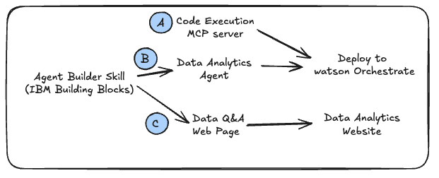

You'll work through these topics and more during this setup process:
- Orchestrate ADK MCP servers
- IBM Bob Skills
- Agent Builder Skill
- Deploy MCP server to Orchestrate using Bob
- Build Data Analytics Agent using Agent Builder Skill
- Deploy agent to Orchestrate using Bob
- Connect agent to new **Q&A** screen in your Data Analytics website

And here's what you'll build by the end of this lab.  Your website with have a Q&A capability where the website queries an agent in Orchestrate that uses the Pandas Dataset MCP server to generate HTML replies that contain natural language and chartjs answers to user queries.
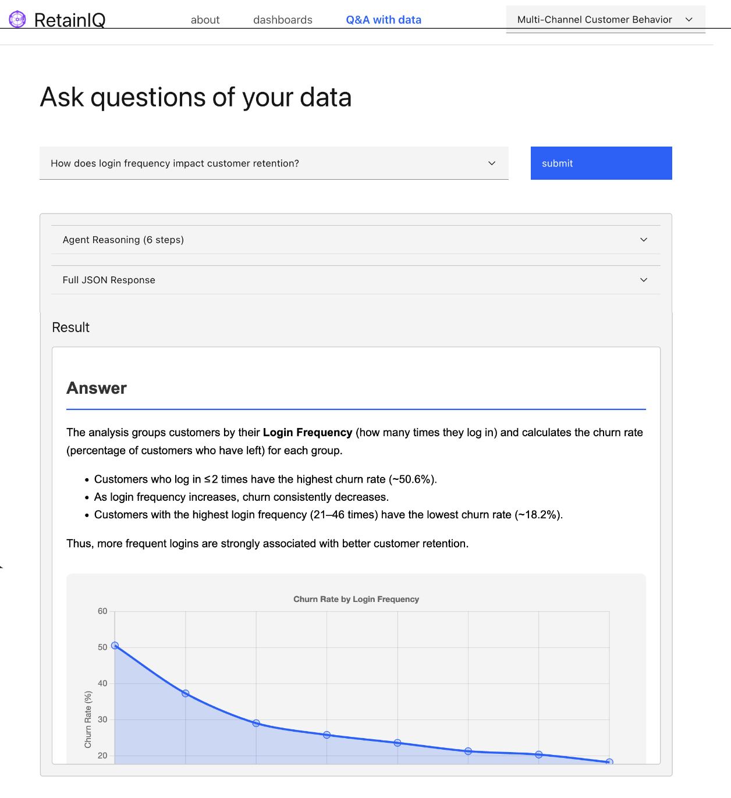

## 1. watsonx Orchestrate's MCP servers 
Open Bob's Settings panel, search for "Orchestrate" under the MCP server section.  You will find two MCP servers provided by the watsonx Orchestrate team. 

1. watsonx Orchestrate ADK
2. watsonx Orchestrate ADK Docs

At the moment, both of these servers have bugs which prevent using them during this workshop.  However take note that they are available, and hopefully soon, the bugs will be fixed

- The ADK Docs server returns a list of website URLs rather than more agent-friendly markdown.  
- IBM Bob's web browser:
  - Is not available in the GA release
  - Surfs web pages via screenshots rather than by reading the HTML.  Having Bob capture screenshots is slow and consumes high amounts of tokens/coins.
- The ADK server has had connectivity issues lately.

For these reason, we will rely on the Agent Builder Skill to provide Bob the knowledge required to use watsonX Orchestrate.

## 2. Delete your local Pandas Dataset MCP Server from Bob
In the next sections, you will deploy the Pandas Dataset MCP Server to watsonX Orchestrate, so you will no longer need the locally running version.  

- Close the terminal window that was running the Pandas MCP server
- Go to Bob's **Settings > MCP**, select the Pandas Dataset MCP server tile and click **Delete**.

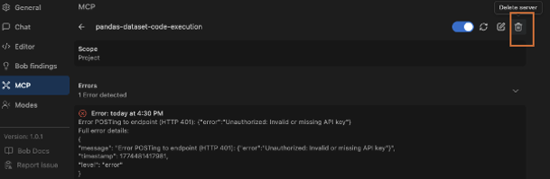

## 3. IBM Bob Skills
During the next few sections, we will explore a new **Skills** capability that just launched in Bob's v1.0.1 version on March 24th, 2026.  The concept of Skills was introduced by Anthropic when they launched [Skills for Claude](https://claude.com/blog/skills) last year so great to see this capability coming to IBM Bob too.

Skills are reusable instruction sets (described in markdown .md files) that teach Bob new workflows and specialized tasks. Skills act as recipes that guide Bob through specific types of work in a consistent, repeatable manner.  

Read about [how skills work plus how to create new skills](https://bob.ibm.com/docs/ide/features/skills) in Bob documentation.  Note that a key element of skills are both how they are defined in markdown files plus how they are consistently packaged in a common file structure for easy re-use by Bob.

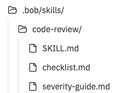

The primary description and functionality of each Skill is stored in a SKILL.md file, with additional supporting files included in the same skills folder. The first few lines each SKILL.md file start with [YAML front matter](https://docs.github.com/en/contributing/writing-for-github-docs/using-yaml-frontmatter) which supports adding YAML comments within markdown files.

This can be seen in the example below where the YAML-style comment provides the name and description of the Skill.  When Bob is initialized, all Skill names and descriptions are provided so Bob can choose which Skills to read in more detail when executing tasks for the user.

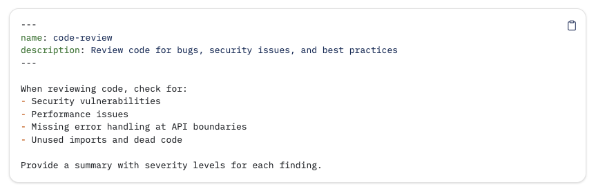

## 4. Agent Builder Skill for the IBM Building Blocks
The [IBM Building Blocks](https://ibm-self-serve-assets.github.io/building-blocks-docs/) contains a range of capabilities across IBM's AI and Automation portfolio of products. Each of the Building Blocks has an associated Skill for IBM Bob that you can use to accelerate using Bob with that Building Block.  In the Day 2 labs, you'll learn to use the Custom Modes and Skills for the Automation Building Blocks.  

### 4.1. Install Agent Builder Skill
For today's lab, you will download a temporary [Agent Builder Skill](https://ibm.box.com/shared/static/z5pgty70flx3vv86ohwik2d146cij1xf.zip) from Box rather than the currently-released Agent Builder skill in the [Building Block's repo](https://ibm-self-serve-assets.github.io/building-blocks-docs).  The published skill relies on the now functionally-challenged ADK Docs MCP server.  We are actively working with the Orchestrate team to fix this, but discovered the buggy ADK Docs update a couple days prior to this workshop.  So for now, we'll use this temporary version of the Agent Builder Skills. 

Double-click on `agent-builder-skill.zip` to open it then take a minute to click around the various files contained within it.

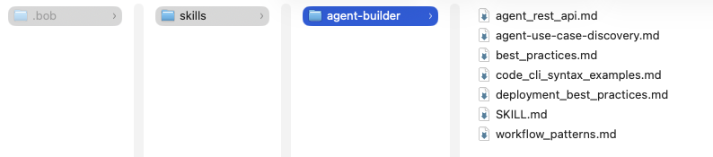

The next step is a little complicated as you must merge these files into the `.bob` folder at the root of your project's folder structure:
1. Look at your projects, .bob folder where you most likely do not have an existing skills folder.
2. Create a `skills` folder in your root project's `.bob` directory. 
3. Move the `agent-builder` folder to the `.bob/skills` folder at the root of your project.

Your project's `.bob` folder will look similar to this.

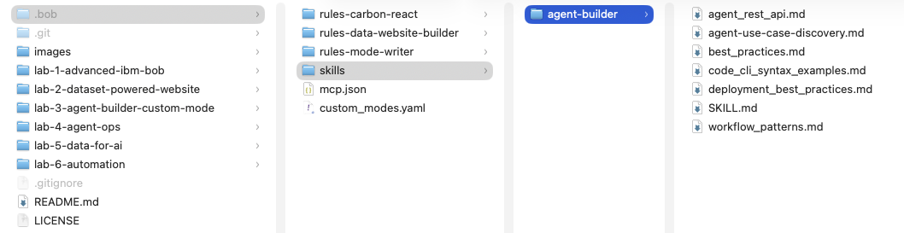

### 4.2 Inspect supporting files in .bob/skills/agent-builder
As we design, build and deploy agents and MCP tools during the following labs, Bob will rely on the guidance from the files in `.bob/skills/agent-builder` so let's take a quick look at them.

If all your files were properly moved into `.bob/skills/agent-builder`, then the following links should work for you:

- [SKILL.md](/.bob/skills/agent-builder/SKILL.md)
- [agent_rest_api.md](/.bob/skills/agent-builder/agent_rest_api.md)
- [agent-use-case-discovery.md](/.bob/skills/agent-builder/agent-use-case-discovery.md)
- [code_cli_syntax_examples.md](/.bob/skills/agent-builder/code_cli_syntax_examples.md)
- [deployment_best_practices.md](/.bob/skills/agent-builder/deployment_best_practices.md)
- [development_best_practices.md](/.bob/skills/agent-builder/development_best_practices.md)
- [workflow_patterns.md](/.bob/skills/agent-builder/workflow_patterns.md)
- 
Take a few mins to look through the other files then continue with the lab.

### 4.3 ⚠️ Important notes when using Skills ⚠️
 Keep these two items in mind when using Skills.
 
 1. Ensure you have Advanced mode selected as some modes do not support using Skills.
 2. When selecting to **auto-approve Bob's actions**, there's a new option to auto-approve Bob's use of skills.  For now, leave that option unselected so that you can see when/if Bob is using the **Agent Builder** skill.

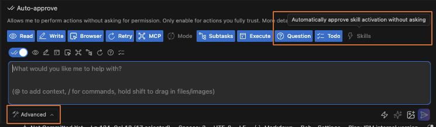

### 4.4 Validate Bob has access to agent-builder skill
Ensure you have selected **Advanced**  mode selected in Bob's chat window then submit this to Bob:

```
What skills do you have available to you?
```

Bob should reply that the **agent-builder** skill is available for use.

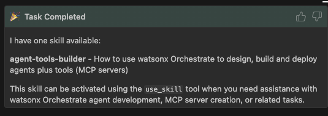

## 5. Accept your invitation to an instance of watsonx Orchestrate
Check your email inbox for an invitation to join a TechZone instance.  The email might be in your Junk/Spam folder so look there too.  It will look like this:

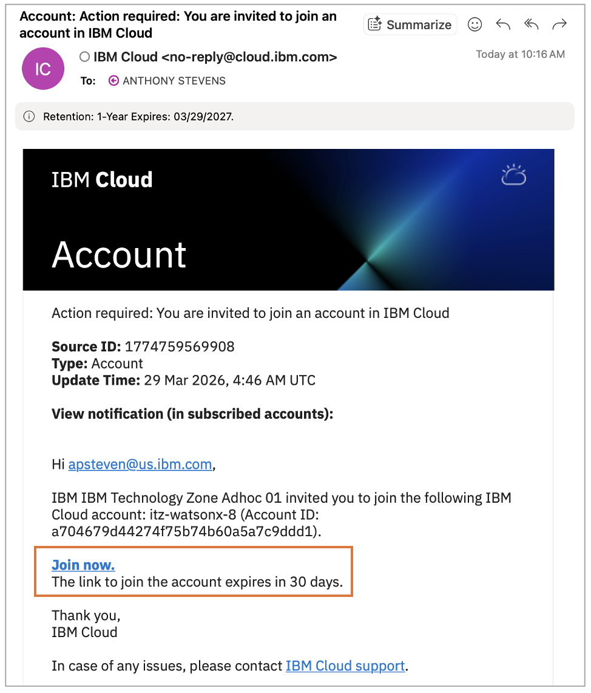

Click the "Join Now" link near the bottom of the email and follow instructions to accept the invitation.  Take note of which account you've been invited to, for instance `itz-watsonx-8` or `itz-watsonx-16`.

## 6. Configure your .env for watsonx Orchestrate
Copy [env_template](env_template) to **.env**.  We'll populate these environment variables with info from the Tech Zone instance provided for this workshop.  

```
WO_DEVELOPER_EDITION_SOURCE=orchestrate
WO_ADK_ENVIRONMENT_NAME=india-workshop
PATH_TO_PYTHON_VENV_WITH_ORCHESTRATE_ADK=<FULL PATH HERE>
WO_INSTANCE=<URL HERE>
WO_API_KEY=<API KEY HERE>
```

#### PATH_TO_PYTHON_VENV_WITH_ORCHESTRATE_ADK
During the earlier environment setup, you created a virtual Python environment.  Add the full path to that venv to the .env for `PATH_TO_PYTHON_VENV_WITH_ORCHESTRATE_ADK`.

#### WO_INSTANCE
To find the value for `WO_INSTANCE`, go to [https://cloud.ibm.com/resources](https://cloud.ibm.com/resources).  Expand the `AI / Machine learning` section and click on the name of your watsonX Orchestrate instance.

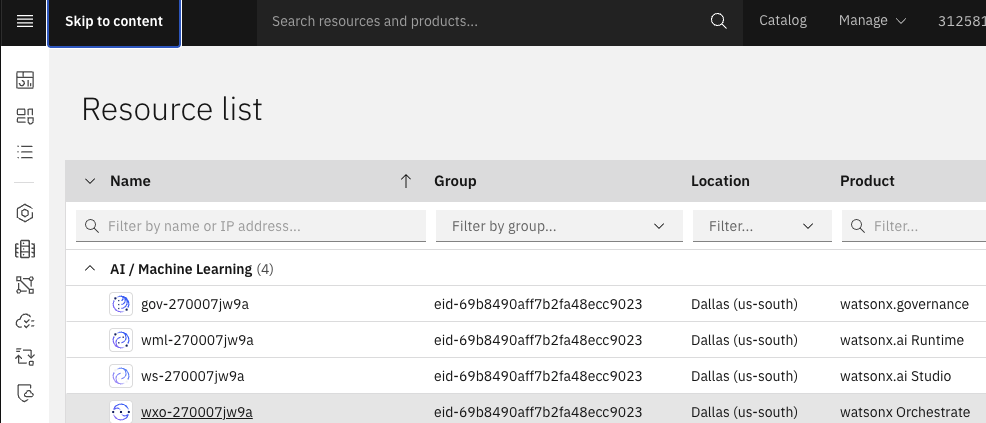

You'll see both a URL and API section along with a link to launch your watsonx Orchestrate instance.  The URL in the green box contains the value for `WO_INSTANCE`.  However the API Key in the red box should be avoided as it often fails to provide the access credentials that you need. 

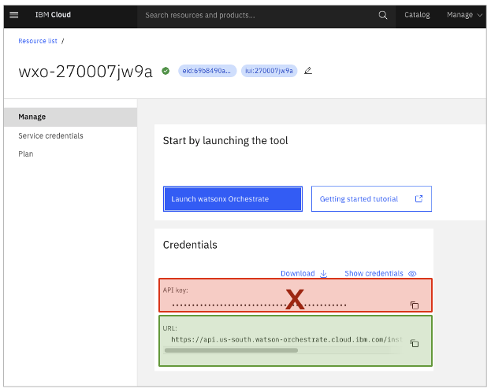

#### WO_API_KEY
You should obtain an API key by going to [https://cloud.ibm.com/resources](https://cloud.ibm.com/resources)

1. Select account with your Orchestrate instance in the top-left drop-down.
2. Go to the **Manage** menu at the top-of-the-screen and select **Access (IAM)** then choose **API Keys** from the left-side.
   - NOTE: There is also a **Manage** menu at the left-side but use the **Manage** menu at top.
3. Click **Create+** and copy the API key.

### 6.1 Launch watsonX Orchestrate
Click on **Launch watsonX Orchestrate** to launch it in your browser. In a few minutes, we'll return to the open browser tab to ensure your MCP server was properly deployed.  Also remember how to get to the **Launch watsonX Orchestrate** button as you'll need to re-launch watsonX Orchestrate multiple times during these labs.

## 7. Deploy Pandas MCP server using Agent Builder Skill
Once you're an expert at using the Orchestrate ADK, you could use the `orchestrate` CLI to manually deploy an MCP server.  However let's ask Bob to deploy for us.

### 7.1 watsonX Orchestrate ADK
During the following steps, Bob will make extensive use of [watsonX Orchestrate's Agent Development Kit (ADK)](https://developer.watson-orchestrate.ibm.com/).  Specifically Bob will attempt to use the ADK's CLI.  If you are not familiar with the ADK CLI, read through this [Getting started with the ADK](https://developer.watson-orchestrate.ibm.com/getting_started/installing) guide as it introduces the basic CLI commands that Bob will be using.

Watch how Bob makes mistakes, explores how to use the CLI (often using `orchestrate --help`) and through trial and error, eventually determines how to deploy the MCP server using the ADK.

The Agent Builder Skill that you installed earlier provides specifics about using the ADK.  However due the goal in Skill writing is to hard-code as little as possible to avoid giving Bob information that could be outdated or wrong if the a new version of the ADK is released.  

### 7.2 Ask Bob to deploy the MCP server
The Agent Builder Skill provides Bob with extensive knowledge on building and deploying agents and MCP server tools into watsonx Orchestrate.  Combined with the watsonX Orchestrate ADK MCP servers, Bob is now ready to automate most of your agentic engineering tasks.  
```
Deploy the MCP server in the "lab-3-agent-builder-custom-mode/pandas-mcp-server" folder to watsonx Orchestrate.  
- Orchestrate should use **server.py** to start the server. 
- Ignore **server-https.py** as it was for local testing.

Activate any relevant Skills required to accomplish this task.
```

One of Bob's first actions should be to activate the Agent Builder Skill as shown below.  If Bob starts doing work without this happening, ask your instructor for help.

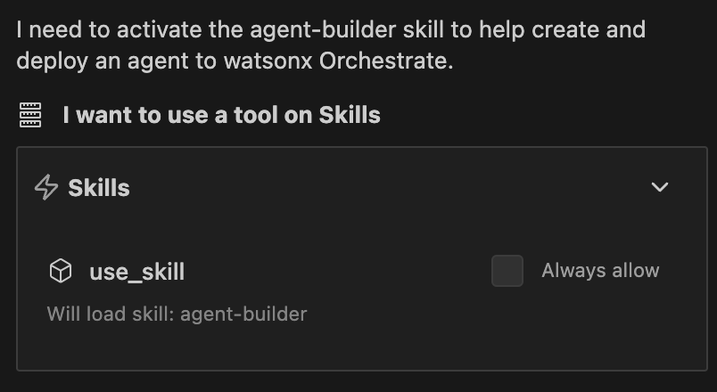

Answer any questions Bob asks, and once Bob is done, you'll likely be provided a deployment script.  You can execute this manually or ask Bob to deploy the MCP server for you.

### 7.3 Validate deployment of the MCP server
Once deployed, go to your browser tab with watsonX Orchestrate.  Navigate to **Build** in the left-side navigation dropdown then select **All Tools**.  You should see your deployed MCP tools as below.

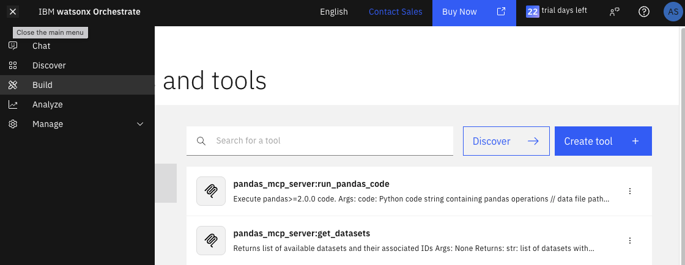

## 8. Updating your website to support agentic Q & A
For the following steps, you can use your own Data Analytics website created during the prior labs, or you can use the one provided at `/lab-3-agent-builder-custom-mode/acme-analytics`.  If you want to use the website code that you just built then update any reference to the website folder in the following commands as-needed.

We want to add the ability to interactively ask questions of the datasets.  To achieve this, we need to add a new Q & A page to our website. 

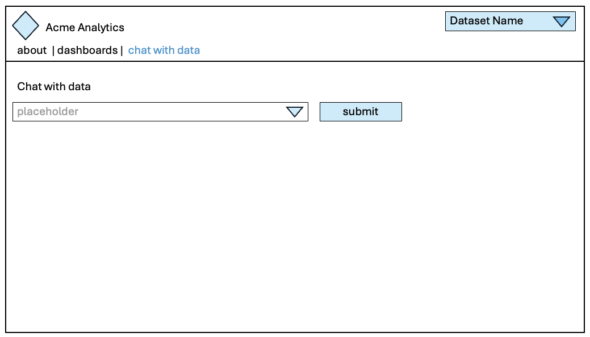

Let's ask Bob to implement these capabilities:

1. Create a list of relevant questions for each dataset
2. Create a new screen in the Data Analytics website to display the Q&A results
3. Create an agent that connects to the two tools in the Pandas toolkit
   -  pandas_mcp_server:get_datasets
   -  pandas_mcp_server:run_pandas_code
4. in watsonx Orchestrate to handle the Q&A functionality by 
5. Deploy the agent to watsonx Orchestrate

### 8.1 Add dropdown list of questions unique to each dataset
It's best to separate these items across multiple requests for Bob to implement.  So start by pasting this request into the Chat window:

```
Start with the website code located at `/lab-3-agent-builder-custom-mode/acme-analytics` and add the following functionality
1. Add a new "dataset Q&A screen" based off this mockup: /lab-3-agent-builder-custom-mode/v3-wireframes/dataset-q&a-with-agents.png.
2. Generate 6 interesting questions based on the selected dataset.
3. When the user clicks on the dropdown, display the list of questions
4. For now, do nothing when the user clicks Submit.
```

Bob may struggle to validate the website functionality as browsing websites is not Bob's greatest strength.  If Bob gets stuck in testing mode, feel free to click Terminate and get Bob back on track.  Don't feel shy about asking for help for a colleague or instructor.  This Lab is meant to be about "real life coding" and not a point-and-click copy/paste labs.  This is how real development proceeds, even though all the news media posts about "the end of developer jobs" implies otherwise.

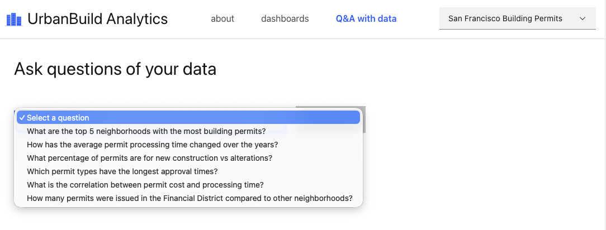

Test to ensure Bob has created unique questions for each dataset by looking at the other dataset pages. Once you have a functional dropdown, proceed to the next section.

## 9 Building agents using watsonX Orchestrate
This workshop was built for engineers with basic-to-intermediate experience with watsonX Orchestrate.  However if you are new to building agents using watsonX Orchestrate, then pause further work on this Lab for a few minutes.  Read through Orchestrate's tutorial on [Creating your first agent with the Agent builder](https://developer.watson-orchestrate.ibm.com/tutorials/tutorial_1_hello_world).  The tutorial will take about 5 mins to read through.  

In the following sections, we will also be asking Bob to connect our agents with tools.  If you are unfamiliar with using tools in Orchestrate, this [tutorial on creating a Service Now agent with tools](https://developer.watson-orchestrate.ibm.com/tutorials/tutorial_2_arrows_internal_employees) is a good start but slightly more advanced as it builds a multi-agent system.

Take time to ensure you fully understand how to build and deploy agents and tools with watsonx Orchestrate though.  That will allow you to better follow through Bob's steps in the next sections.

Ensure you have experience with these important topics:

- [Basics of agent yaml structure](https://developer.watson-orchestrate.ibm.com/agents/build_agent)
- [Agent tools](https://developer.watson-orchestrate.ibm.com/tools/overview)
- [Python tools](https://developer.watson-orchestrate.ibm.com/tools/create_tool)
- [How toolkits are different from tools](https://developer.watson-orchestrate.ibm.com/tools/toolkits/overview)
- [Python toolkits](https://developer.watson-orchestrate.ibm.com/tools/toolkits/local_mcp_toolkits#local-python)

## 10. Deploying a draft Q&A agent into watsonX Orchestrate
Next you will ask Bob to design then deploy a Q&A agent that can answer questions about the datasets in the MCP server. 

## 10.1 Design your Q&A agent
For the Q&A functionality to work, clicking the **Submit** button should send the question to an Agent (in orchestrate) that can.  The agent should be able to follow these steps:

1. Query the Pandas Dataset MCP server to obtain information about the dataset
2. Compare the question to the dataset to generate code that answers the question
3. Submit the code to the Pandas server for execution
4. Review the Pandas response
5. Generate an answer in natural language
6. Generate graphs or charts in chartjs that visually answer the question too

Let's start by having Bob design, build and deploy such an agent to Orchestrate.  Then we will connect our website to that agent.

Thoroughly read through the following prompt then enter the text into the Chat window.  
```
A. Create an agent that uses the Pandas MCP toolkit hosted in Orchestrate to answer questions about dataset hosted by the Pandas Dataset MCP server.  The agent should:
  1. Accept input a question in natural language about a dataset supported by the Pandas Dataset MCP server.
  2. Query the dataset mcp server for information about the dataset
  3. Compare the question to the dataset info then generate code that will obtain an answer the question
  4. Submit the code to the Pandas server for execution
  5. Review the Pandas response
  6. Reply in formatted HTML that includes (1) an answer in natural language followed by (2) a graph/chart written in chart.js or plotly.js that visually represents the answer.  
  7. Ensure that the returned html includes <script> tags with any required imports and such.  

B. Import the agent to Orchestrate.
C. Do not test the agent.  Testing the agent must be done via the Orchestrate UI so I will do that manually.
D. Do not edit the website code, but use questions from the website's Q&A page to validate the agent's functionality for all three dataset.
E. Stop after that as we will integrate into the website's Q&A page later

Activate any relevant Skills required to accomplish this task.
```

After submitting to Bob, pay attention to how it solves problems and works around challenges.  This is a rough outline of the process that you'll see Bob work through.

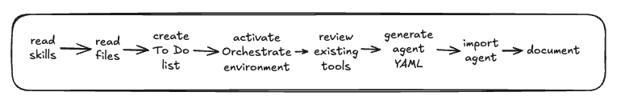

### 10.2 Reviewing your Q&A agent's YAML
When Bob is done, an agent file should have been added to your project.  Check for a file in `lab-3-agent-builder-custom-mode/agents`.  Double click to open the agent's .yaml.  The start of the file will look something like this:

```
spec_version: v1
kind: native
name: pandas_dataset_qa_agent
llm: groq/openai/gpt-oss-120b
style: react
description: |
  Expert data analyst agent that answers natural language questions about datasets 
  using pandas analysis and generates Chart.js visualizations. Accepts JSON input 
  with question and dataset_name, returns JSON with natural language answer and 
  HTML visualization code.

instructions: |
  You are an expert data analyst specializing in pandas data analysis and visualization.
  Your role is to answer questions about datasets by generating and executing pandas code,
  then providing clear answers with visual representations.
```

Review your agent .yaml file.  Take note of how Bob converted the prompt above into the description and instructions for the agent.

Answer these questions:
1. What LLM does this agent use?
2. What style agent was selected?
3. Which tools does the agent have?
4. What workflow will agent follow when answering questions?
5. What example code and HTML is provided?
6. Are there any instructions you'd want to add/remove?

### 10.3 Was your agent deployed by Bob?
Bob should deploy a Draft version of the Q&A agent for you.  If not, Bob would have created a deployment script for you.  If your agent wasn't deployed, either ask Bob to run the deployment for you or look for the deployment script then manually execute it yourself.

If you get stuck, ask an instructor for help or tap a colleague for advice.

### 10.4 Testing the Q&A agent
OK, your agent's deployed so let's test it.  There are two ways to test an agent once imported into Orchestrate:
1. Via the Orchestrate UI
2. Via REST APIs or CURL commands

You will test using the Orchestrate UI by navigating via the left-side navigation menu to Build then selecting your agent called "pandas_dataset_qa_agent" or similar.  

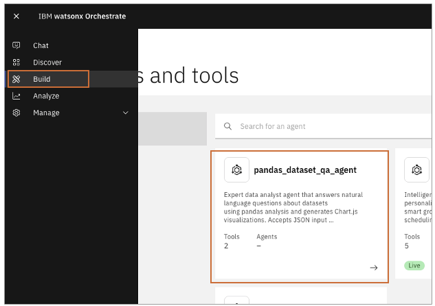

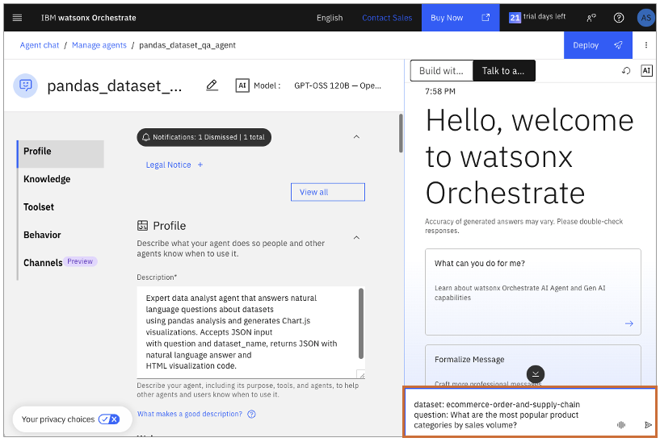

In the chat window at the bottom-right of your agent window, enter one or all of the examples below:

```
What are the most popular product categories by sales volume according to the ecommerce order and supply chain dataset?
```

```
Which top 5 neighborhoods with in San Francisco have the most building permits?
```

```
What factors contribute most to customer churn according to multi-channel customer behavior?
```

Notice how the qustions don't explicitely mention the dataset.  The Q&A agent will follow the instructions defined in its .yaml file, like getting dataset info then executing code on the MCP server to answer your question. 

After a short time, the agent should reply with a formatted HTML response.  We need the reply in HTML format as this will be easier to render later as you improve your website design.  

### 10.5 Where's the HTML and charts?
Orchestrate's chat UI doesn't understand how to display the full HTML response.  So you'll likely only see the natural language portion.  To view the full response, click on the copy button (next to the up/down thumbs) then paste the text into a text editor

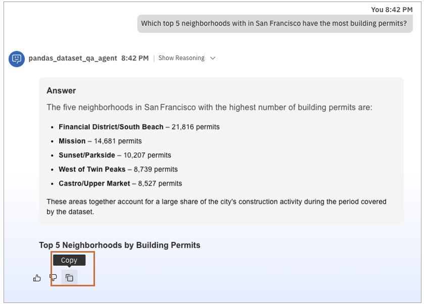

Now that the full text is visible in your Text Editor, you should see something like this, only part of which was visible in Orchestrate's Chat:
```
<script src="https://cdn.jsdelivr.net/npm/chart.js"></script>
<div style="padding: 20px; font-family: Arial, sans-serif;">
  <div style="margin-bottom: 30px; padding: 15px; background-color: #f5f5f5; border-radius: 8px;">
    <h3 style="color: #333; margin-top: 0;">Answer</h3><p style="font-size: 16px; line-height: 1.6; color: #555;">The five neighborhoods in San Francisco with the highest number of building permits are:<ul>
      <li><strong>Financial District/South Beach</strong> – 21,816 permits</li>
      <li><strong>Mission</strong> – 14,681 permits</li>
      <li><strong>Sunset/Parkside</strong> – 10,207 permits</li>
      <li><strong>West of Twin Peaks</strong> – 8,739 permits</li>
      <li><strong>Castro/Upper Market</strong> – 8,527 permits</li>
      </ul>These areas together account for a large share of the city's construction activity during the period covered by the dataset.</p></div>
  
  <div style="margin-top: 30px;"><h3 style="color: #333;">Top 5 Neighborhoods by Building Permits</h3>
  <canvas id="neighborhoodChart" style="max-width: 800px; max-height: 400px;"></canvas></div></div>

<script> const ctx = document.getElementById('neighborhoodChart').getContext('2d'); const data = { labels: ['Financial District/South Beach', 'Mission', 'Sunset/Parkside', 'West of Twin Peaks', 'Castro/Upper Market'],
    datasets: [{label: 'Number of Permits',data: [21816, 14681, 10207, 8739, 8527],backgroundColor: 'rgba(75, 192, 192, 0.5)',borderColor: 'rgba(75, 192, 192, 1)',borderWidth: 1}]
  };
  const config = {type: 'bar',data: data,options: {responsive: true,plugins: {title: {display: true,text: 'Top 5 San Francisco Neighborhoods by Building Permits'},legend: { display: false }},scales: {y: {beginAtZero: true,title: { display: true, text: 'Permit Count' }},x: {title: { display: true, text: 'Neighborhood' }}}}};new Chart(ctx, config);
</script>
```

If you don't see this then let the instructor know.

## 11. Deploy Q&A agent from Draft to Live access
Agents in watsonx Orchestrate operate in one of two states: draft or live.
- A draft agent is actively being developed or modified by a builder. You can access draft agents from the Manage Agents page in the UI.
- A live agent is available to end users through the Web chat UI on the Orchestrate landing page.

### 11.1 Deploy to live access
Bob has deployed your in draft mode so that you could test it prior to deployment for live access.  Now you will ask Bob to deploy your Agent for live access.

Submit this to Bob:
```
Deploy the Q&A agent from Draft to Live access.
```

### 11.2 Test live agent
Open Orchestrate and select **Chat** from the left-side menu then select your agent from the drop-down menu.

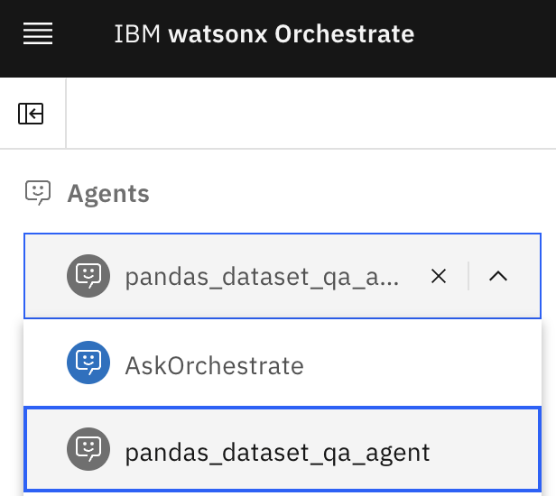

Enter this text into the Orchestrate chat to ensure the live agent is functioning properly:
```
How many permits are issued in San Francisco each year?
```

## 12. Connecting your agent to the Q&A dropdown 
Now you need to connect the Q&A dropdown's submit button to your Q&A agent then capture the output of the Q&A agent and display it on your Q&A web page.  To achieve this, Bob needs to know about Orchestrate's REST API plus how to handle authentication with Orchestrate's token based security.  Fortunatley, the Agent Builder skill added earlier will provide Bob with those details.

Review this prompt then submit to Bob through the Chat window:
```
Update the `acme-analytics` website so that the dropdown submit button on the `Q&A with Data` page passes these two items to the Q&A agent in orchestrate:
1. user's question
2. Name of the dataset
Now extracts HTML from response.result.data.message.content[0].text

### Response Formatting
1. In the iframe, only display the final result at: htmlResponse["result"]["data"]["message"]["content"][0]["text]
2. Above the iframe, display the "Step History" in an expandable/closeable <div> that contains htmlResponse["result"]["data"]["message"]["step_history"], which is an array.
3. Between the step history and the iframe, display the full json htmlResponse in an expandable/closeable <div>. 

### Additional Requirements
- This is a single-turn Question and Answer not a back-and-forth chat conversation.  
- The agent should not ask follow-up questions but instead always respond in HTML format, even if the response is an error or recommendation on how to better ask the question.
- Use Orchestrate's REST API and token based security.
- The agent will take up-to a minute to respond:
   - Poll the server until the conversation is complete.
   - Provide visual feedback that the Agent is think and, when the agent has sent a final response.
```

You'll notice the prompt has some highly technical details such as the json location for the agent's final response.  We've also added details like tool calling and the full JSON response from the agent.  These are useful during development for debugging purposes. 

### 12.1 Review your updated Q&A page
If all goes well, Bob will have connected your Q&A page to the Agent in Orchestrate.  You should now be able to select a question then click submit.  The screen should update showing that it's waiting for the agent's response.

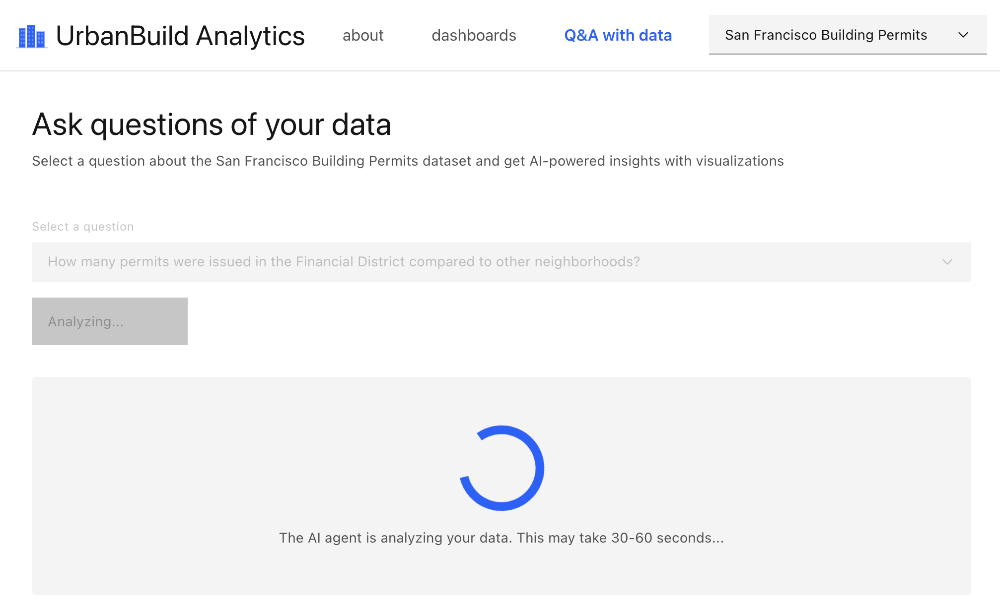

If you don't see a screen similar to above when clicking submit, ask a colleage or the instructor for assistance.

### 12.2 Debugging your results
Handling agent responses can be tricky as noted in the `Response Formatting` section of the promp above.  When debugging HTML, the best solution is to use the **Developer Tools capability** in **Chrome**.  

You can access Developer Tools by going to the `View` menu at top and selecting `Developer > Developer Tools`.  This will open the Developer Tools panel on the right side of your Chrome browser. 

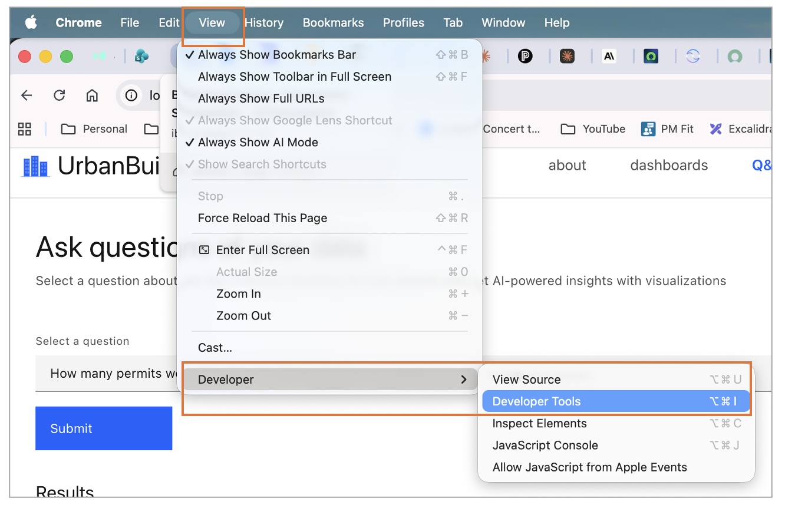

At the top of the Developer Tools, click on the Element Inspection tool then move your mouse to hover over the various HTML elements in the browser page.  This will show the related <html> element in the Developer Tools panel which is a quick way to debug what's being rendered in your browser.

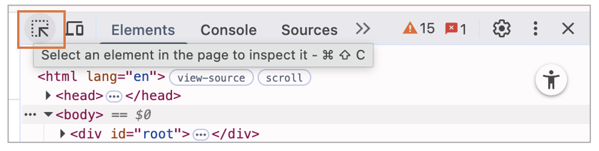

Hover over the section of the the Q&A page showing your agent's response and you'll see the full <html> response from the agent, similar to below.

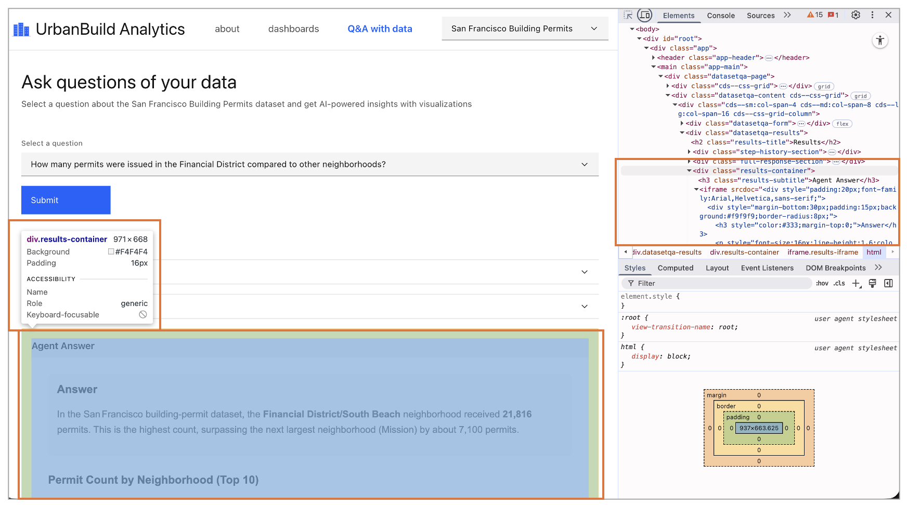

### 12.3 OK, now try to break the agent!
Always test your agentic solutions with the intent to break it.  If you don't know in which ways your agents system will fail, then you shouldn't be releasing it into production.  You should always devise increasingly hard challenges until it only fails in ways that you don't expect your end users to experience.  

What are the limits of this agent?  Within reason, ask different question to determine where the agent fails to understand and answer the question.  

Once you find a bug or missing feature, ask Bob to fix it. Keep iterating until Bob passes most of your tests.

### 12.4 More improvements?
Once you have successfully connected your agent to the Q&A page, consider other features you could add.  Try adding different capabilities like these:

- Instead of showing the tool calls as JSON, ask Bob to create an intuitive UI showing each tool call individually.  More like Orchestrate does in it's UI.
- Likewise for the full JSON response.  Are there other useful elements to extract and show to the user?


### 13. Improving Bob through better Skills
What was the reason for Bob not functioning as expected"
- Should the prompt have been rewritten?
- What knowledge was Bob missing?
- Would it help if Bob had more information in the Agent Builder skill?

### 13.1 Ask Bob to fix itself
Once you have improved on the website and found limitations of the Agent Builder Skill, there's an easy way to improve the Skill.

Type this into the Chat window and see what Bob recommends:
```
Don't make any edits to code unless I tell you to do so.  

Review the problems that you've encounted when executing the past set of Tasks.  Consider where you made mistakes and how you solved them.  

Now look at the Agent Builder Skill files located in `./bob/skills/agent-builder/*`.  What improvements could you make to these files so that similar mistakes could be avoided in the future?  Only consider the minimal edits required to prevent the same mistakes.
```

Here's where checkpoints come in handy.  You can ask Bob to edit the Agent Builder Skill's file then rollback to a checkpoint prior to where Bob made mistakes.  Ask Bob to reload the Agent Builder Skill and have Bob try again from that checkpoint.  If your Skill updates worked, then Bob shoudl no longer make the same mistake.

 Once you've identified defects in the Agent Builder Skill and found a solution that improves it, submit a pull request to share your updates with everyone else.

### 13.2 It takes a village to build an Agent Builder Skill
Each of the Building Block Skills is a community-driven effort. We need everyone on the Build Engineering team to help improve these skills.  If you encounter problems with a Skill in the future, identiy who on the Build Engineering team is supporting each skill and work with them to improve it.

- Agents: [Dheeraj Arremsetty](https://ibm.enterprise.slack.com/team/WDRKP9Z41)
- Trusted AI: [Shima Rahimi-Moghaddam](https://ibm.enterprise.slack.com/team/U063DSGFECW)
- Data: [Himangshu Mech](https://ibm.enterprise.slack.com/team/W54H7JSKV)
- Automation: [Sunil Gajula](https://ibm.enterprise.slack.com/team/WSYFC8E48) and [Yasser Sherriff](https://ibm.enterprise.slack.com/team/W52CC6YJJ)

## 14 Ready for your next challenge?
When you're ready for the next team-oriented challenge, proceed to the next lab.
