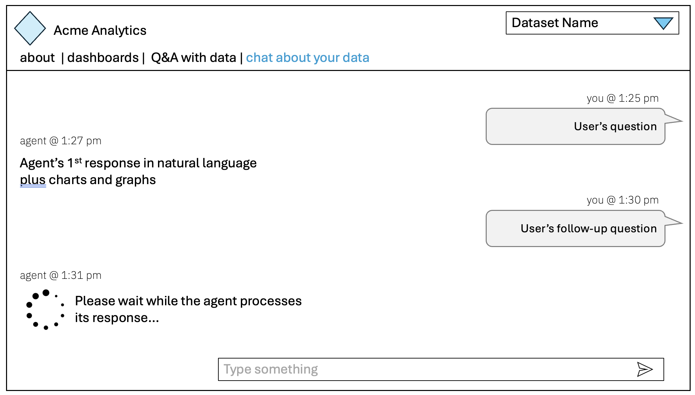
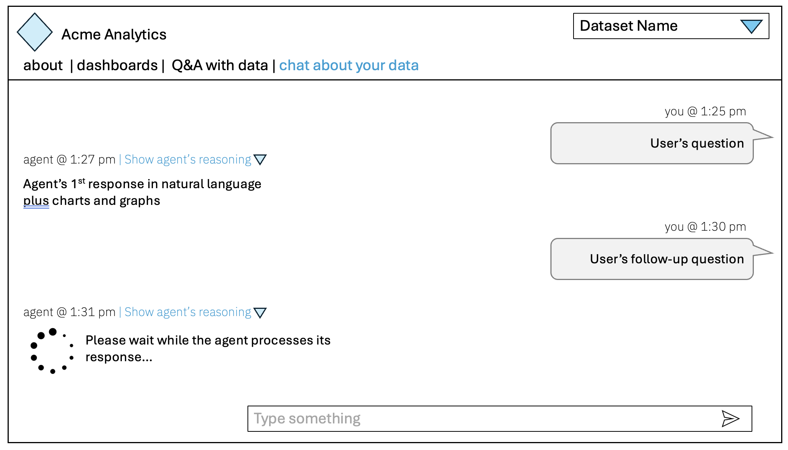
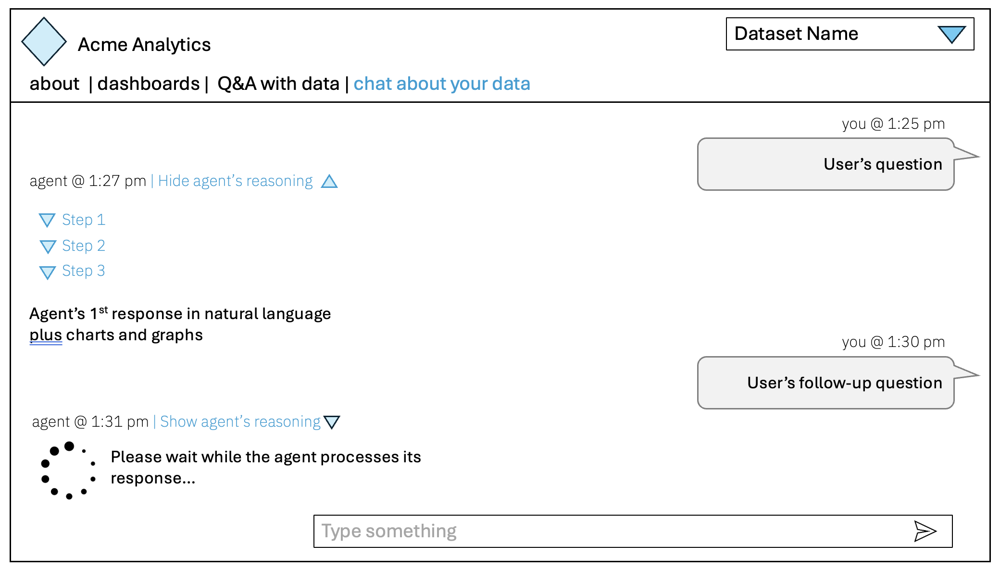

# Lab 3.2: Multi-turn agentic EDA (exploratory datset analysis)
Now combine everything you've learned and compete against the other teams to be first to build a REST-based chat UI where the agent interactively answers questions about your data in a multi-turn conversation.  Feel free to ask the instructor for assistance.

**Minimum functionality:**
- User questions on right with agent response on left
- UI should support interactive multi-turn chat
- Show "Agent is thinking..." indicator
- UI should support showing/hiding the agent's reasoning process
- The agent's response should at least as expressive as before, with the agent replying with charts and graphs.

**Additions to consider:**
- UI should support showing/hiding the agent's step-by-step reasoning processas indicated in the two wireframes below.
- Use the wireframe PPT in [v4-wireframes](v4-wireframes) to add more functionality.  

