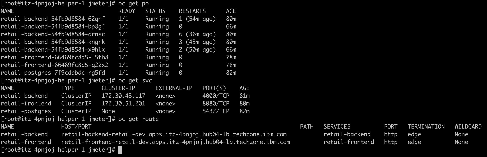

# Deploying Retail Application with Ansible

## Overview

This guide walks you through deploying the Retail Application on OpenShift using Ansible playbooks developed with IBM Bob. The deployment automates the entire application setup, including container image management, OpenShift resource creation, and configuration management.

---

## Table of Contents

- [Prerequisites](#prerequisites)
- [Setup Docker Hub Account](#setup-docker-hub-account)
- [Install Ansible](#install-ansible)
- [Download Ansible Playbooks](#download-ansible-playbooks)
- [Configure Environment](#configure-environment)
- [Deploy the Application](#deploy-the-application)
- [Verify Deployment](#verify-deployment)
- [Performance Testing with JMeter](#performance-testing-with-jmeter)
- [Troubleshooting](#troubleshooting)
- [Additional Resources](#additional-resources)

---

## Prerequisites

Before starting the deployment, ensure you have:

- ✅ OpenShift cluster provisioned and accessible (see [TechZone Setup](techzone-setup.md))
- ✅ Bastion host access with SSH
- ✅ OpenShift CLI (`oc`) installed and configured
- ✅ Valid OpenShift access token
- ✅ Internet connectivity from bastion host
- ✅ Root or sudo access on bastion host

---

## Setup Docker Hub Account

The Retail Application uses container images that need to be pulled from Docker Hub. You'll need a Docker Hub account for authentication.

### Create a Docker Hub Account

1. **Visit Docker Hub**
   
   Navigate to [https://hub.docker.com/](https://hub.docker.com/)

2. **Sign Up or Sign In**
   
   - **New Users**: Click **Sign Up** and create a free account
   - **Existing Users**: Click **Sign In** and log in with your credentials

3. **Save Your Credentials**
   
   Once logged in, save the following information in a secure notepad:
   - **Docker Username**: Your Docker Hub username
   - **Docker Password**: Your Docker Hub password or access token

   > **Security Tip**: Consider creating a Docker Hub access token instead of using your password. Go to **Account Settings** → **Security** → **New Access Token**.

### Example Credentials Format

```
Docker Username: myusername
Docker Password: mypassword123
```

> **Important**: Keep these credentials secure. They will be used in the deployment configuration.

---

## Install Ansible

Ansible is required to execute the deployment playbooks. Install it on the bastion host.

### Installation Steps

1. **Connect to Bastion Host**
   
   If not already connected, SSH to your bastion host:
   ```bash
   ssh root@bastion.cluster-xyz.techzone.ibm.com
   ```

2. **Install Ansible Core**
   
   Run the following command to install Ansible:
   ```bash
   sudo dnf install -y ansible-core
   ```

3. **Verify Installation**
   
   Check that Ansible is installed correctly:
   ```bash
   ansible --version
   ```
   
   **Expected Output:**
   ```
   ansible [core 2.14.x]
     config file = /etc/ansible/ansible.cfg
     configured module search path = ['/root/.ansible/plugins/modules', '/usr/share/ansible/plugins/modules']
     ansible python module location = /usr/lib/python3.9/site-packages/ansible
     ansible collection location = /root/.ansible/collections:/usr/share/ansible/collections
     executable location = /usr/bin/ansible
     python version = 3.9.x
   ```

---

## Download Ansible Playbooks

The Ansible playbooks for deploying the Retail Application are available in the IBM Building Blocks repository.

### Download Steps

1. **Download the Repository**
   
   ```bash
   wget https://github.com/ibm-self-serve-assets/building-blocks/archive/refs/heads/main.zip
   ```

2. **Extract the Archive**
   
   ```bash
   unzip main.zip
   ```

3. **Navigate to Deployment Directory**
   
   ```bash
   cd building-blocks-main/build-and-deploy/Iaas/assets/deploy-bob-anisble/
   ```

4. **Verify Directory Contents**
   
   ```bash
   ls -la
   ```
   
   **Expected Structure:**
   ```
   .
   ├── ansible.cfg
   ├── group_vars/
   │   └── development.yml
   ├── inventory/
   │   └── hosts
   ├── playbooks/
   │   └── deploy-development.yml
   ├── roles/
   └── README.md
   ```

---

## Configure Environment

Before deploying, you need to configure environment variables and update the Ansible configuration.

### Step 1: Set Environment Variables

Follow the steps below to retrieve the OpenShift token. The OpenShift credentials and API URL are available in the TechZone portal.

```bash
oc login https://api.xxx-xxxxx.xxxxxxxx-lb.xxxxxxxx.ibm.com:6443 -u kubeadmin -p xxxxxxxxxxxxx
oc whoami -t
```

Set the required environment variables with your actual values:

```bash
# OpenShift access token (from earlier setup)
export OC_TOKEN="sha256~AbCdEfGhIjKlMnOpQrStUvWxYz1234567890"
export OC_URL="https://api.cluster-xyz.techzone.ibm.com:6443"
# Docker Hub credentials
export DOCKER_USERNAME="myusername"
export DOCKER_PASSWORD="mypassword123"
```


> **Replace the placeholder values** with your actual credentials collected earlier.

### Step 2: Verify Environment Variables

Confirm the variables are set correctly:

```bash
echo "OC_TOKEN: $OC_TOKEN"
echo "DOCKER_USERNAME: $DOCKER_USERNAME"
echo "DOCKER_PASSWORD: [HIDDEN]"
echo "OC_URL: $OC_URL"
```

### Step 3: Update Ansible Configuration

1. **Get Storage Class Name**
   
   First, check available storage classes in your OpenShift cluster:
   ```bash
   oc get storageclass
   ```
   
   **Example Output:**
   ```
   NAME                          PROVISIONER                    RECLAIMPOLICY   VOLUMEBINDINGMODE
   ocs-external-storagecluster-ceph-rbd (default)   openshift-storage.rbd.csi.ceph.com      Delete          Immediate           true                   5h
   ocs-external-storagecluster-cephfs               openshift-storage.cephfs.csi.ceph.com   Delete          Immediate           true                   5h
   openshift-storage.noobaa.io                      openshift-storage.noobaa.io/obc         Delete          Immediate           false                  4h58m
   ```
   
   Note the storage class name you want to use (typically the default one).
   
   

2. **Edit Configuration File**
   
   Open the development configuration file:
   ```bash
   vi group_vars/development.yml
   ```

3. **Update Storage Class Value**
   
   Locate the `storage_class` parameter and update it with your storage class name:
   
   ```yaml
   # Example configuration
   storage_class: "ocs-storagecluster-ceph-rbd"
   ```

4. **Review Other Configuration**
   
   While editing, review other configuration parameters:
   - Application namespace
   - Resource limits
   - Replica counts
   - Image repositories

5. **Save and Exit**
   
   - Press `Esc`
   - Type `:wq` and press `Enter`

---

### Step 4: Edit Configuration File

Before deploying the application, you need to configure the workshop environment variables.

1. **Open the Configuration File**
   
   ```bash
   vi roles/workshop_env/defaults/main.yml
   ```

2. **Update the Following Values**
   
   Locate and update these parameters with your actual values:
   
   - `workshop_watsonx_url`: Your watsonx API endpoint URL
   - `workshop_watsonx_api_key`: Your watsonx API key
   - `workshop_watsonx_project_id`: Your watsonx project ID
   - `workshop_milvus_host`: Milvus database host address
   - `workshop_milvus_port`: Milvus database port
   - `workshop_milvus_user`: Milvus database username
   - `workshop_milvus_password`: Milvus database password
   - `workshop_milvus_collection`: Milvus collection name

3. **Save the File**
   
   - Press `Esc`
   - Type `:wq` and press `Enter`

---

## Deploy the Application

Now you're ready to deploy the Retail Application using Ansible.

### Deployment Steps

1. **Ensure You're in the Correct Directory**
   
   ```bash
   pwd
   ```
   
   Should show: `/root/building-blocks-main/build-and-deploy/Iaas/assets/deploy-bob-anisble/`

2. **Run the Deployment Playbook**
   
   Execute the Ansible playbook:
   ```bash
   ansible-playbook playbooks/deploy-development.yml
   ```

3. **Monitor Deployment Progress**
   
   The playbook will execute multiple tasks. You'll see output similar to:
   
   ```
   PLAY [Deploy Retail Application to OpenShift] **********************************

   TASK [Gathering Facts] *********************************************************
   ok: [localhost]

   TASK [Login to OpenShift] ******************************************************
   changed: [localhost]

   TASK [Create namespace] ********************************************************
   changed: [localhost]

   TASK [Create Docker registry secret] *******************************************
   changed: [localhost]

   TASK [Deploy database] *********************************************************
   changed: [localhost]

   TASK [Deploy backend services] *************************************************
   changed: [localhost]

   TASK [Deploy frontend] *********************************************************
   changed: [localhost]

   TASK [Create routes] ***********************************************************
   changed: [localhost]

   PLAY RECAP *********************************************************************
   localhost                  : ok=8    changed=7    unreachable=0    failed=0
   ```

4. **Wait for Completion**
   
   The deployment typically takes 5-10 minutes depending on:
   - Image pull times
   - Resource availability
   - Network speed

### What the Playbook Does

The Ansible playbook automates the following tasks:

1. **Authentication**: Logs into OpenShift using your token
2. **Namespace Creation**: Creates a dedicated namespace for the application
3. **Secret Management**: Creates Docker registry secrets for image pulls
4. **Database Deployment**: Deploys PostgreSQL database with persistent storage
5. **Backend Services**: Deploys microservices (inventory, orders, users, etc.)
6. **Frontend Deployment**: Deploys the web UI
7. **Networking**: Creates routes for external access
8. **Configuration**: Applies all necessary ConfigMaps and environment variables

---

## Verify Deployment

After the playbook completes, verify that the application is running correctly.

### Step 1: Check Namespace

```bash
# List all namespaces
oc get namespaces

# Switch to the retail app namespace
oc project retail-app
```

### Step 2: Check Pods

```bash
# List all pods
oc get pods

# Check pod status
oc get pods -w
```

**Expected Output:**
```
NAME                          READY   STATUS    RESTARTS   AGE
retail-db-1-xxxxx             1/1     Running   0          5m
retail-backend-1-xxxxx        1/1     Running   0          4m
retail-frontend-1-xxxxx       1/1     Running   0          3m
retail-inventory-1-xxxxx      1/1     Running   0          4m
retail-orders-1-xxxxx         1/1     Running   0          4m
```

> **Note**: All pods should show `Running` status and `1/1` ready state.

### Step 3: Check Services

```bash
# List all services
oc get svc
```

**Expected Output:**
```
NAME                TYPE        CLUSTER-IP       EXTERNAL-IP   PORT(S)    AGE
retail-db           ClusterIP   172.30.xxx.xxx   <none>        5432/TCP   5m
retail-backend      ClusterIP   172.30.xxx.xxx   <none>        8080/TCP   4m
retail-frontend     ClusterIP   172.30.xxx.xxx   <none>        80/TCP     3m
```

### Step 4: Check Routes

```bash
# List all routes
oc get routes
```

**Expected Output:**
```
NAME              HOST/PORT                                          PATH   SERVICES          PORT   TERMINATION
retail-frontend   retail-frontend-retail-app.apps.cluster-xyz...           retail-frontend   8080   edge
```


### Step 5: Access the Application

1. **Get the Application URL**
   
   ```bash
   oc get route retail-frontend -o jsonpath='{.spec.host}'
   ```

2. **Open in Browser**
   
   Copy the URL and open it in your web browser:
   ```
   https://retail-frontend-retail-app.apps.cluster-xyz.techzone.ibm.com
   ```

3. **Verify Application Loads**
   
   You should see the Retail Application homepage with:
   - Product catalog
   - Shopping cart functionality
   - User authentication

### Step 6: Check Logs (Optional)

If you encounter issues, check the logs:

```bash
# Check frontend logs
oc logs -f deployment/retail-frontend

# Check backend logs
oc logs -f deployment/retail-backend

# Check database logs
oc logs -f deployment/retail-db
```

---

## Performance Testing with JMeter

### Overview

Apache JMeter is integrated to test the Retail Application's performance under real-world traffic conditions. JMeter simulates concurrent users (browsing products, adding to cart, checkout) to evaluate application behavior under load and identify performance bottlenecks.

**Prerequisites:**
- ✅ Application deployed and running
- ✅ All pods in `Running` state
- ✅ SSH access to bastion host
- ✅ JMeter scripts in `/tmp/retailapp/jmeter`

---

### Running JMeter Spike Test

#### Step 1: Get Application Routes

First, retrieve the retail backend route URL:

```bash
# Get all routes
oc get route

# Get specific backend route
oc get route retail-backend -o jsonpath='{.spec.host}'
```

**Example Output:**
```
retail-backend-retail-app.apps.cluster-xyz.techzone.ibm.com
```

Copy this route URL - you'll need it for the JMeter test.

#### Step 2: Navigate to JMeter Directory

```bash
USER=$(whoami) && sudo sh -c "cp -r /root/retailapp /home/$USER && chown -R $USER:$USER /home/$USER/retailapp"
cd ~/retailapp/jmeter
```

#### Step 3: Verify JMeter Scripts

List the available test scripts:

```bash
ls -la
```

**Expected Files:**
```
-rwxr-xr-x  1 root root  run_spike.sh
-rw-r--r--  1 root root  spike_test.jmx
-rw-r--r--  1 root root  load_test.jmx
-rw-r--r--  1 root root  stress_test.jmx
```

To retrive Retail application route
```
oc get route -n retail-dev
NAME              HOST/PORT                                                              PATH   SERVICES          PORT   TERMINATION   WILDCARD
retail-backend    retail-backend-retail-dev.apps.itz-bxpw9m.hub01-lb.techzone.ibm.com           retail-backend    http   edge          None
retail-frontend   retail-frontend-retail-dev.apps.itz-bxpw9m.hub01-lb.techzone.ibm.com          retail-frontend   http   edge          None
```

#### Step 4: Run the Spike Test

Execute the spike test script with the backend route (output from previous command):

```bash
./run_spike.sh retail-backend-retail-app.apps.cluster-xyz.techzone.ibm.com
```

> **Note**: Replace the URL with your actual retail-backend route obtained in Step 1.

#### Step 5: Monitor Test Execution

The spike test will run for approximately **20-30 minutes**. During execution, you'll see:

**Console Output:**
```
Creating summariser <summary>
Created the tree successfully using ./retail_spike.jmx
Starting standalone test @ 2026 Mar 16 15:51:47 UTC (1773676307927)
Waiting for possible Shutdown/StopTestNow/HeapDump/ThreadDump message on port 4445
Warning: Nashorn engine is planned to be removed from a future JDK release
summary +     58 in 00:00:12 =    4.9/s Avg:   167 Min:     4 Max:   665 Err:     0 (0.00%) Active: 20 Started: 20 Finished: 0
summary +    102 in 00:00:15 =    7.0/s Avg:    11 Min:     4 Max:   323 Err:     0 (0.00%) Active: 0 Started: 20 Finished: 20
summary =    160 in 00:00:26 =    6.1/s Avg:    68 Min:     4 Max:   665 Err:     0 (0.00%)
Tidying up ...    @ 2026 Mar 16 15:52:14 UTC (1773676334729)
...
```

---

### Monitoring During Test

Monitor application behavior in a separate terminal:

```bash
# Watch pod status
watch oc get pods

# Check resource usage
oc adm top pods

# Stream logs
oc logs -f deployment/retail-backend

# Check node resources
oc adm top nodes
```

---


### Troubleshooting JMeter

```bash
# Script not found
ls -la /tmp/retailapp/jmeter/
find / -name "run_spike.sh" 2>/dev/null

# Permission denied
chmod +x /tmp/retailapp/jmeter/run_spike.sh

# Connection errors
curl -I https://<retail-backend-route>
oc get pods -l app=retail-backend

# High error rate
oc logs deployment/retail-backend
oc adm top pods
```

---

## Troubleshooting

### Common Issues and Solutions

#### Issue: Pods Not Starting

**Symptoms:**
- Pods stuck in `Pending` or `ImagePullBackOff` state
- Pods showing `CrashLoopBackOff`

**Solutions:**

1. **Check Pod Events**
   ```bash
   oc describe pod <pod-name>
   ```

2. **Verify Docker Credentials**
   ```bash
   oc get secret -n retail-app
   oc describe secret docker-registry-secret
   ```

3. **Check Storage Class**
   ```bash
   oc get pvc
   oc describe pvc <pvc-name>
   ```

#### Issue: Image Pull Errors

**Symptoms:**
- Error: `Failed to pull image`
- Error: `unauthorized: authentication required`

**Solutions:**

1. **Verify Docker Hub Credentials**
   ```bash
   echo $DOCKER_USERNAME
   echo $DOCKER_PASSWORD
   ```

2. **Recreate Docker Secret**
   ```bash
   oc delete secret docker-registry-secret -n retail-app
   ansible-playbook playbooks/deploy-development.yml --tags secrets
   ```

#### Issue: Database Connection Failures

**Symptoms:**
- Backend services can't connect to database
- Error: `Connection refused` in logs

**Solutions:**

1. **Check Database Pod**
   ```bash
   oc get pods -l app=retail-db
   oc logs -f deployment/retail-db
   ```

2. **Verify Database Service**
   ```bash
   oc get svc retail-db
   oc describe svc retail-db
   ```

3. **Check Environment Variables**
   ```bash
   oc set env deployment/retail-backend --list
   ```

#### Issue: Route Not Accessible

**Symptoms:**
- Cannot access application URL
- 404 or 503 errors

**Solutions:**

1. **Verify Route Configuration**
   ```bash
   oc get route retail-frontend
   oc describe route retail-frontend
   ```

2. **Check Service Endpoints**
   ```bash
   oc get endpoints retail-frontend
   ```

3. **Test Internal Connectivity**
   ```bash
   oc rsh deployment/retail-frontend
   curl http://localhost:8080
   ```

#### Issue: Playbook Execution Fails

**Symptoms:**
- Ansible playbook fails with errors
- Tasks show `failed` status

**Solutions:**

1. **Check OpenShift Login**
   ```bash
   oc whoami
   oc cluster-info
   ```

2. **Verify Environment Variables**
   ```bash
   env | grep -E "OC_TOKEN|DOCKER|OC_URL"
   ```

3. **Run Playbook in Verbose Mode**
   ```bash
   ansible-playbook playbooks/deploy-development.yml -vvv
   ```

4. **Check Ansible Configuration**
   ```bash
   ansible-config dump
   ```

---

## Cleanup (Optional)

If you need to remove the application:

### Delete Application Resources

```bash
# Delete all resources in the namespace
oc delete all --all -n retail-app

# Delete the namespace
oc delete namespace retail-app

# Delete secrets
oc delete secret docker-registry-secret -n retail-app
```

### Redeploy

To redeploy after cleanup:

```bash
ansible-playbook playbooks/deploy-development.yml
```

---

## Additional Resources

### Documentation

- **Ansible Playbooks Repository**: [GitHub - Building Blocks](https://github.com/ibm-self-serve-assets/building-blocks/tree/main/build-and-deploy/Iaas/assets/deploy-bob-anisble)
- **Retail Application Source**: [GitHub - Retail App](https://github.com/SunilManika/retailapp)
- **OpenShift Documentation**: [docs.openshift.com](https://docs.openshift.com)
- **Ansible Documentation**: [docs.ansible.com](https://docs.ansible.com)

### Related Guides

- [Introduction to Infrastructure as Code](introduction.md)
- [TechZone Environment Setup](techzone-setup.md)
- [Main Workshop Guide](../README.md)

### Support

- **Workshop Instructor**: Available during workshop sessions
- **Slack Channel**: `#build-academy-workshop`
- **GitHub Issues**: Report issues in the respective repositories

---

## Understanding the Ansible Playbooks

### Playbook Structure

The deployment uses a modular Ansible structure:

```
deploy-bob-anisble/
├── ansible.cfg              # Ansible configuration
├── group_vars/
│   └── development.yml      # Environment-specific variables
├── inventory/
│   └── hosts               # Inventory file
├── playbooks/
│   └── deploy-development.yml  # Main deployment playbook
└── roles/
    ├── openshift-login/    # OpenShift authentication
    ├── namespace/          # Namespace creation
    ├── secrets/            # Secret management
    ├── database/           # Database deployment
    ├── backend/            # Backend services
    └── frontend/           # Frontend deployment
```

### Key Ansible Concepts Used

1. **Roles**: Modular, reusable components for each deployment task
2. **Variables**: Environment-specific configuration in `group_vars/`
3. **Templates**: Jinja2 templates for OpenShift manifests
4. **Handlers**: Actions triggered by task changes
5. **Tags**: Selective execution of specific tasks

### IBM Bob's Contribution

The Ansible playbooks were developed with assistance from IBM Bob, which helped:

- Generate idempotent task definitions
- Create proper error handling
- Implement best practices for OpenShift deployments
- Structure roles for maintainability
- Add comprehensive documentation

---

## Next Steps

After successfully deploying the Retail Application:

1. **Explore the Application**
   - Test all features and functionality
   - Review the architecture
   - Understand the microservices design

2. **Review the Ansible Code**
   - Examine the playbook structure
   - Understand role organization
   - Learn Ansible best practices

3. **Experiment with Modifications**
   - Adjust resource limits
   - Scale deployments
   - Modify configurations

4. **Apply to Your Projects**
   - Use the playbooks as templates
   - Adapt for your applications
   - Implement IaC in your workflows

---

[← Back to TechZone Setup](techzone-setup.md) | [Back to Main](../README.md)

---

*Last Updated: March 2026*  
*Maintained by: IBM Build Academy Team*
