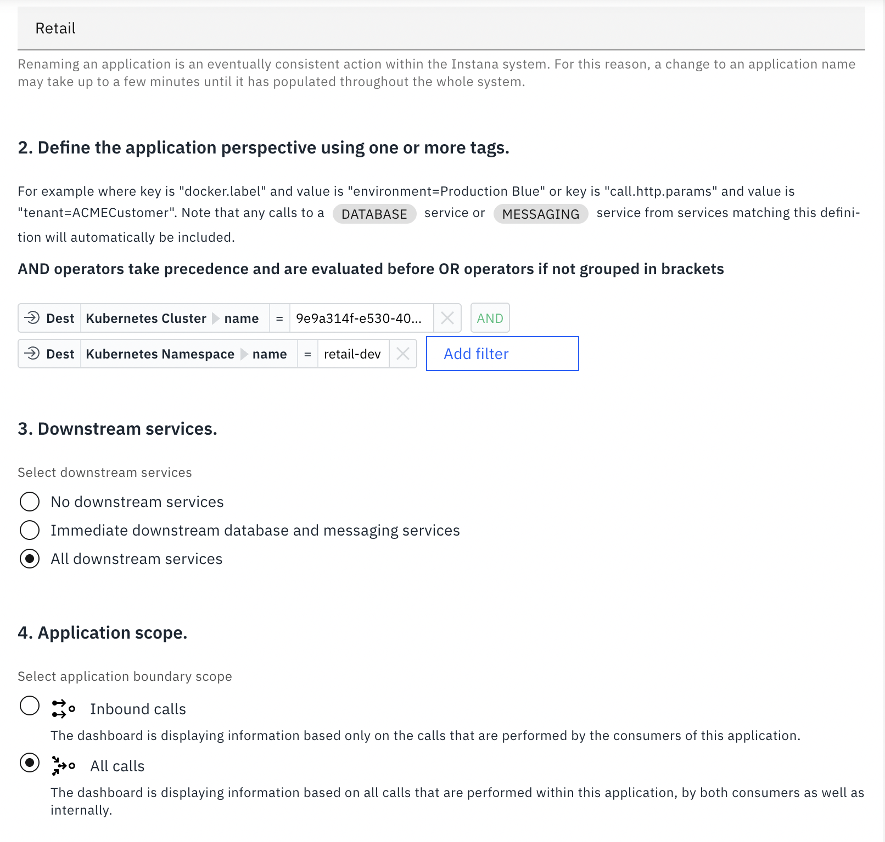

# Build End-to-End Application Observability with IBM Bob and Instana

## Table of Contents

- [Overview](#overview)
- [What is Application Observability?](#what-is-application-observability)
- [IBM Instana Overview](#ibm-instana-overview)
- [Prerequisites](#prerequisites)
- [Step 1: Provision IBM Instana](#step-1-provision-ibm-instana)
- [Step 2: Access IBM Instana](#step-2-access-ibm-instana)
- [Step 3: Install Instana Agent](#step-3-install-instana-agent)
- [Step 4: Deploy and Monitor Your Application](#step-4-deploy-and-monitor-your-application)
- [Step 5: Configure Application Monitoring](#step-5-configure-application-monitoring)
- [Step 6: Leverage IBM Bob for Observability Insights](#step-6-leverage-ibm-bob-for-observability-insights)
- [Step 7: Explore Instana Features](#step-7-explore-instana-features)
- [Best Practices](#best-practices)
- [Troubleshooting](#troubleshooting)
- [Next Steps](#next-steps)

---

## Overview

This guide demonstrates how to implement comprehensive application observability using IBM Instana for monitoring and IBM Bob for intelligent analysis. You'll learn to set up Instana monitoring, integrate it with your applications, and leverage IBM Bob to gain actionable insights from observability data.

### 📺 Video Tutorial

Watch the complete walkthrough of this workshop:

**[Build End-to-End Application Observability with IBM Bob and Instana](https://youtu.be/8SZwr_RGhNc?si=D-qBE61rO8VCKCFO)**

This video demonstrates:
- Setting up IBM Instana
- Installing and configuring the Instana agent
- Deploying and monitoring applications
- Using IBM Bob for intelligent analysis
- Best practices for observability

---

## What is Application Observability?

**Application observability** goes beyond traditional monitoring by providing deep insights into application behavior, performance, and health. It enables you to:

- **Understand System Behavior**: Gain visibility into how your applications perform in production
- **Detect Issues Proactively**: Identify problems before they impact users
- **Accelerate Troubleshooting**: Quickly diagnose and resolve issues
- **Optimize Performance**: Make data-driven decisions to improve application efficiency
- **Ensure Reliability**: Maintain high availability and user satisfaction

### The Three Pillars of Observability

1. **Metrics**: Quantitative measurements of system performance (CPU, memory, response times)
2. **Logs**: Detailed records of events and transactions
3. **Traces**: End-to-end request flows across distributed systems

---

## IBM Instana Overview

**IBM Instana** is an enterprise-grade observability platform that provides:

- **Automatic Discovery**: Automatically detects and monitors applications and infrastructure
- **Real-time Monitoring**: Provides 1-second granularity for metrics and traces
- **AI-Powered Analytics**: Uses machine learning to detect anomalies and predict issues
- **Full-Stack Visibility**: Monitors from infrastructure to application code
- **Distributed Tracing**: Tracks requests across microservices architectures
- **Dynamic Graph**: Visualizes application dependencies and relationships

### Key Features

- **AutoTrace™**: Automatic distributed tracing without code changes
- **Unbounded Analytics**: Query and analyze unlimited observability data
- **Smart Alerts**: Context-aware alerting with root cause analysis
- **Service Maps**: Visual representation of application architecture
- **Infrastructure Monitoring**: Complete visibility into hosts, containers, and cloud services

---

## Prerequisites

Before you begin, ensure you have:

### Required

- ✅ **IBM Bob installed** - [Sign up for early access to IBM Bob](https://ibm.com/bob)
- ✅ **Python 3.12 installed** - Required for running automation scripts
- ✅ **IBM Instana instance** - Provision through one of these options:
  - [Free 14-day trial](https://lp2.email.ibm.com/instana-trial.html)
  - IBM Cloud deployment
  - On-premises installation
  - SaaS subscription

### Recommended

- Basic knowledge of IBM Instana and IBM Concert
- Understanding of observability concepts
- Familiarity with distributed systems and microservices
- OpenShift or Kubernetes cluster (for application deployment)

---

## Step 1: Provision IBM Instana

### Option A: Free Trial (Recommended for Workshop)

1. **Sign Up for Trial**
   
   Navigate to the Instana trial page:
   ```
   https://lp2.email.ibm.com/instana-trial.html
   ```

2. **Complete Registration**
   - Fill in your business email address
   - Provide company information
   - Select your region preference
   - Accept terms and conditions

3. **Wait for Provisioning**
   
   **Timeline**: 5-10 minutes
   
   You will receive an email from IBM containing:
   - Instana URL (e.g., `https://your-tenant.instana.io`)
   - Login credentials (username and password)
   - Getting started guide

4. **Save Your Credentials**
   
   Store the following information securely:
   ```
   Instana URL: https://your-tenant.instana.io
   Username: your-email@company.com
   Password: [provided in email]
   ```

---

## Step 2: Access IBM Instana

### Initial Login

1. **Open Instana URL**
   
   Navigate to the URL provided in your provisioning email:
   ```
   https://your-tenant.instana.io
   ```

2. **Enter Credentials**
   
   Use the credentials from your provisioning email:
   - **Email**: Your registered email address
   - **Password**: Provided password (change on first login)

3. **Complete First-Time Setup**
   
   Upon first login, you'll be prompted to:
   - Change your password
   - Configure notification preferences
   - Set up your profile
   - Review quick start guide

4. **Verify Access**
   
   You should see the Instana dashboard with:
   - Navigation menu on the left
   - Overview dashboard in the center
   - No agents detected (initially)

---

## Step 3: Install Instana Agent

The Instana agent automatically discovers and monitors your applications and infrastructure.

### Prerequisites for Agent Installation

- OpenShift or Kubernetes cluster (from TechZone setup)
- Cluster admin access
- `oc` or `kubectl` CLI configured

### Navigate to Agent Installation in Instana UI

**Access Agent Installation Page**

In Instana UI:
- Click on **Agents & collectors**
- In the **Install Agents** tab, click on **Instana agent**
- Select **OpenShift - Operator**

### Install Agent on OpenShift Using Operator

#### Step 1: Connect to Your Cluster

Ensure you're logged into your OpenShift cluster from the bastion node:

```bash
oc login --token=$OC_TOKEN --server=$OC_URL
```

#### Step 2: Install Instana Agent Operator

Install the operator manually using the following command:

```bash
oc apply -f https://github.com/instana/instana-agent-operator/releases/latest/download/instana-agent-operator.yaml
```

**Expected Output:**
```
namespace/instana-agent created
customresourcedefinition.apiextensions.k8s.io/agents.instana.io created
customresourcedefinition.apiextensions.k8s.io/agentsremote.instana.io created
serviceaccount/instana-agent-operator created
role.rbac.authorization.k8s.io/instana-agent-clusterrole created
clusterrole.rbac.authorization.k8s.io/instana-agent-clusterrole created
clusterrole.rbac.authorization.k8s.io/leader-election-role created
clusterrolebinding.rbac.authorization.k8s.io/instana-agent-clusterrolebinding created
clusterrolebinding.rbac.authorization.k8s.io/leader-election-rolebinding created
configmap/manager-config created
```

#### Step 3: Get Your Cluster ID

From the bastion node, run the following command to retrieve your cluster ID:

```bash
oc get clusterversion -o jsonpath='{.items[].spec.clusterID}{"\n"}'
```

**Example Output:**
```
a1b2c3d4-e5f6-7890-abcd-ef1234567890
```

**Important:** Copy this cluster ID - you'll need it for the next step.

#### Step 4: Configure Cluster Name and Zone

In the Instana UI:
- **Cluster name**: Enter your cluster ID (from Step 3)
- **Agent zone** (optional): Specify the zone name if you want to organize agents by zones

#### Step 5: Configure the Custom Resource YAML

1. **Copy Custom Resource YAML**
   
   In the Instana UI, copy the generated custom resource YAML configuration.

2. **Create Configuration File**
   
   On the bastion node, create a file with the custom resource configuration:
   
   ```bash
   vi instana-agent.customresource.yaml
   ```
   
   Paste the YAML content from Instana UI. The file should look similar to:
   
   ```yaml
   apiVersion: instana.io/v1
   kind: InstanaAgent
   metadata:
     name: instana-agent
     namespace: instana-agent
   spec:
     cluster:
       name: 'a1b2c3d4-e5f6-7890-abcd-ef1234567890'  # Your cluster ID
     zone:
       name: 'your-zone-name'  # Optional
     agent:
       key: 'YOUR_AGENT_KEY'
       endpointHost: 'your-tenant.instana.io'
       endpointPort: '443'
   ```
   
   Save and exit the file (`:wq` in vi).

#### Step 6: Deploy the Instana Agent

Run the following command to deploy the Instana agent with your configuration:

```bash
oc apply -f instana-agent.customresource.yaml
```

**Expected Output:**
```
instanaagent.instana.io/instana-agent created
```

#### Step 7: Verify Agent Deployment
   
   ```bash
   # Check agent pods
   oc get pods -n instana-agent
   
   # View agent logs
   oc logs -n instana-agent -l app.kubernetes.io/name=instana-agent
   ```

   **Expected Output:**
   ```
   oc get po -n instana-agent
   NAME                                                READY   STATUS    RESTARTS   AGE
   instana-agent-297n4                                 1/1     Running   0          11m
   instana-agent-6tcjj                                 1/1     Running   0          11m
   instana-agent-controller-manager-86f86cdb8c-stsw4   1/1     Running   0          11m
   instana-agent-k8sensor-5d785c5bdf-26vkq             1/1     Running   0          11m
   instana-agent-k8sensor-5d785c5bdf-m9r6t             1/1     Running   0          11m
   instana-agent-k8sensor-5d785c5bdf-zkr4s             1/1     Running   0          11m
   instana-agent-rd82v                                 1/1     Running   0          11m
   ```

#### Step 8: Confirm Agent Connection
   
   Return to Instana UI:
   - Navigate to **Infrastructure** → **Agents**
   - Verify agents appear with "Connected" status
   - Check that your cluster nodes are discovered

---

## Step 4: Deploy and Monitor Your Application

### Deploy the Retail Application

If you haven't already deployed the retail application from the workshop:

1. **Follow Ansible Deployment Guide**
   
   Complete the steps in [`ansible-deployment.md`](ansible-deployment.md) to deploy the retail application.

2. **Verify Application Deployment**
   
   ```bash
   # Check application pods
   oc get pods -n retail-app
   
   # Verify services
   oc get svc -n retail-app
   ```

### Automatic Application Discovery

Instana automatically discovers and monitors your application:

1. **Wait for Discovery** (5-7 minutes)
   
   Instana agents will automatically:
   - Detect running containers
   - Identify application frameworks
   - Instrument application code
   - Start collecting metrics and traces

2. **View Discovered Applications**
   
   In Instana UI:
   - Navigate to **Applications** → **All Applications**
   - Look for your retail application components
   - Click on any service to view details

3. **Explore Service Map**
   
   - Navigate to **Applications** → **Service Map**
   - View visual representation of your application architecture
   - See dependencies between services
   - Identify communication patterns

---

## Step 5: Configure Application Monitoring

### Create Application Perspective

Application Perspectives help organize and filter monitoring data:

1. **Navigate to Applications**
   
   In Instana UI: **Applications** → **All Applications**

2. **Create New Application**
   
   - Click **+ Add Application**
   - Name: `Retail Application`
   - Description: `Workshop retail application monitoring`

3. **Define Application Scope**
   
   Add filters to include your application:
   ```
   Filter Type: Kubernetes Namespace
   Operator: Equals
   Value: retail-app
   ```

4. **Configure Services**
   
   - Select services to include
   - Define service boundaries
   - Set up service-level objectives (SLOs)

5. **Save Application Perspective**

### Set Up Smart Alerts




## Step 6: Leverage IBM Bob for Observability Insights

### Step 1: Import Application Observability Custom Bob Mode

Before using IBM Bob with Instana, you need to import the Application Observability custom mode.

#### For New Projects

When setting up a new project and adding the Application Observability Bob mode for the first time, there are no existing custom modes to consider. In this case:

1. **Copy Mode Configuration Files**
   
   Simply copy the provided mode configuration and rules files directly into your project:
   ```
   .bob/
   ├── custom_modes.yaml
   └── rules/
       └── application-observability/
           └── [mode rules files]
   ```

2. **Start Using Bob**
   
   Once the files are in place, you can immediately start using the Application Observability mode in IBM Bob.

#### For Existing Projects

If your project already has a custom Bob mode defined in `custom_modes.yaml`, you must take care not to overwrite the existing configuration:

1. **Preserve Existing Configuration**
   
   Do not replace the existing `custom_modes.yaml` file.

2. **Append New Mode Configuration**
   
   Open your existing `.roo/custom_modes.yaml` file and append the Application Observability Bob mode configuration to it.
   
   **Example:**
   ```yaml
   # Existing custom modes
   - slug: existing-mode-1
     name: Existing Mode 1
     # ... existing configuration ...
   
   - slug: existing-mode-2
     name: Existing Mode 2
     # ... existing configuration ...
   
   # Add Application Observability mode
   - slug: application-observability
     name: Application Observability
     # ... new mode configuration ...
   ```

3. **Maintain Folder Structure**
   
   Add the Application Observability rules to the existing rules folder without modifying other rule files:
   ```
   .bob/
   ├── custom_modes.yaml (updated with new mode)
   └── rules/
       ├── existing-mode-1/
       │   └── [existing rules]
       ├── existing-mode-2/
       │   └── [existing rules]
       └── application-observability/
           └── [new mode rules]
   ```

4. **Verify Configuration**
   
   After updating the files, verify that:
   - All existing modes still work correctly
   - The new Application Observability mode is available
   - No syntax errors in the YAML configuration

5. **Adding Instana MCP Server

- Open  IBM Bob.
- Click the icon in the Bob pane top navigation.
- Click Edit Global MCP or Edit Project MCP.
- Update the below Instana MCP Server detials

```
   "Application Observability": {
      "command": "uvx",
      "args": [
        "mcp-proxy",
        "--transport",
        "streamablehttp",
        "https://mcp-instana.268gjj8oawf7.us-south.codeengine.appdomain.cloud/mcp"
      ],
      "description": "Base MCP Server for Application Observability Building Block",
      "disabled": false,
      "alwaysAllow": [
        "manage_instana_resources",
        "manage_custom_dashboards",
        "analyze_infrastructure_elicitation",
        "get_actions",
        "get_action_details",
        "get_action_types",
        "get_action_tags",
        "get_action_matches",
        "submit_automation_action",
        "get_action_instance_details",
        "list_action_instances",
        "delete_action_instance",
        "get_event",
        "get_kubernetes_info_events",
        "get_agent_monitoring_events",
        "get_issues",
        "get_incidents",
        "get_changes",
        "get_events_by_ids",
        "get_website_page_load",
        "get_website_catalog_metrics",
        "get_website_beacon_metrics_v2",
        "get_website_catalog_tags",
        "get_website_tag_catalog",
        "get_website_beacon_groups",
        "get_website_beacons",
        "get_websites",
        "create_website",
        "delete_website",
        "rename_website",
        "get_website_geo_location_configuration",
        "update_website_geo_location_configuration",
        "get_website_ip_masking_configuration",
        "update_website_ip_masking_configuration",
        "get_website_geo_mapping_rules",
        "set_website_geo_mapping_rules",
        "upload_source_map_file",
        "clear_source_map_upload_configuration"
      ]
    }
```

### Step 2: Connect IBM Bob to Instana

IBM Bob can analyze Instana observability data to provide intelligent insights:

1. **Configure IBM Bob to Access Instana API**
   
   Configure IBM Bob to access Instana API:
   ```python
   # Example configuration
   instana_config = {
       "base_url": "https://your-tenant.instana.io",
       "api_token": "YOUR_API_TOKEN",
       "tenant": "your-tenant"
   }
   ```

2. **Generate API Token**
   
   In Instana UI:
   - Navigate to **Settings** → **Team Settings** → **API Tokens**
   - Click **+ Add API Token**
   - Name: `IBM Bob Integration`
   - Permissions: Select required scopes
   - Copy generated token

### Example: Analyze Performance Issues with IBM Bob

Ask IBM Bob to analyze your application performance:

**Prompt to IBM Bob:**
```
Use the Application Observability custom mode Build a modular Python Dash application for Observability for the Retail application.

Requirements:
- Title: "Application Observability using IBM Instana"
- Subtitle: "With IBM Bob, Instana"
- Create 3 tabs for Service Overview, Trace Details, and Intelligent Analysis & Insights.
- Creae meaningful charts to showcase application performance in Service Overview sub tab.
- Provide a ver detailed Analysis & Insights in Intelligent Analysis & Insights sub tab.
- Use Dash Bootstrap Components for modern, responsive layout design, and Plotly charts
- Implement asynchronous data fetching where applicable to prevent UI blocking
- All config via .env file
- Follow modular architecture with separate python file for each tab.
- Follow Python best practices for the folders structure i.e. src, docs, scripts,..etc.

Project Structure (follow best practices):
- app.py: Main application and UI
- instana_integration.py: Instana API client and data processing (Using Bob Mode: Application Observability)
- requirements.txt, .env.example, setup scripts, documentation
```


---

## Step 7: Explore Instana Features

### Distributed Tracing

View end-to-end request flows:

1. **Navigate to Analytics**
   
   **Applications** → **Retail Application** → **Calls**

2. **Filter Traces**
   
   - Time range: Last 1 hour
   - Filter by: Error traces only
   - Sort by: Latency (descending)

3. **Analyze Trace Details**
   
   Click on any trace to view:
   - Complete request timeline
   - Service-to-service calls
   - Database queries
   - External API calls
   - Error details and stack traces

### Infrastructure Monitoring

Monitor underlying infrastructure:

1. **Navigate to Infrastructure**
   
   **Infrastructure** → **Kubernetes**

2. **View Cluster Health**
   
   - Node resource utilization
   - Pod status and health
   - Container metrics
   - Network traffic

3. **Drill Down to Details**
   
   - Click any node to view detailed metrics
   - Analyze resource consumption trends
   - Identify resource constraints

### Unbounded Analytics

Query observability data with powerful analytics:

1. **Navigate to Analytics**
   
   **Analytics** → **Unbounded Analytics**

2. **Create Custom Queries**
   
   Example queries:
   
   **Top 10 Slowest Endpoints:**
   ```
   entity.type:call
   AND call.http.status:200
   GROUP BY call.http.path
   ORDER BY latency DESC
   LIMIT 10
   ```
   
   **Error Rate by Service:**
   ```
   entity.type:call
   AND call.error:true
   GROUP BY service.name
   ```

3. **Visualize Results**
   
   - Create charts and graphs
   - Export data for reporting
   - Share dashboards with team

---

## Best Practices

### Observability Strategy

1. **Define Clear Objectives**
   - Identify key performance indicators (KPIs)
   - Set service-level objectives (SLOs)
   - Establish baseline metrics

2. **Implement Comprehensive Monitoring**
   - Monitor all application tiers
   - Include infrastructure metrics
   - Track business metrics

3. **Use Intelligent Alerting**
   - Avoid alert fatigue
   - Set meaningful thresholds
   - Include context in alerts

4. **Regular Review and Optimization**
   - Analyze trends weekly
   - Optimize based on insights
   - Update monitoring as application evolves

### IBM Bob Integration

1. **Automate Analysis**
   - Schedule regular performance reviews
   - Use IBM Bob for anomaly detection
   - Generate automated reports

2. **Leverage AI Insights**
   - Ask IBM Bob for optimization recommendations
   - Use for capacity planning
   - Accelerate troubleshooting

3. **Continuous Improvement**
   - Implement IBM Bob suggestions
   - Measure impact of changes
   - Iterate based on results

---

## Troubleshooting

### Common Issues

#### Issue: Agent Not Connecting

**Symptoms:**
- Agent pods running but not visible in Instana UI
- No data appearing in dashboards

**Solutions:**
```bash
# Check agent logs
oc logs -n instana-agent -l app.kubernetes.io/name=instana-agent

# Verify agent configuration
oc get configmap -n instana-agent instana-agent -o yaml

# Check network connectivity
oc exec -n instana-agent <agent-pod> -- curl -v https://your-tenant.instana.io
```

#### Issue: Missing Application Data

**Symptoms:**
- Infrastructure visible but no application traces
- Services not discovered

**Solutions:**
1. Verify application is running: `oc get pods -n retail-app`
2. Check agent has permissions to monitor namespace
3. Restart application pods to trigger discovery
4. Review agent logs for instrumentation errors

#### Issue: High Agent Resource Usage

**Symptoms:**
- Agent consuming excessive CPU/memory
- Node performance degradation

**Solutions:**
```yaml
# Adjust agent resource limits
apiVersion: v1
kind: ConfigMap
metadata:
  name: instana-agent
  namespace: instana-agent
data:
  configuration.yaml: |
    com.instana.plugin.generic.hardware:
      enabled: true
      availability-zone: 'MyZone'
    # Reduce collection frequency
    com.instana.plugin.host:
      pollRate: 10
```

---

## Next Steps

### Expand Your Observability

1. **Integrate Additional Services**
   - Add monitoring for databases
   - Monitor external APIs
   - Track message queues

2. **Implement Advanced Features**
   - Set up synthetic monitoring
   - Configure website monitoring
   - Enable mobile app monitoring

3. **Enhance with IBM Concert**
   - Integrate Instana with IBM Concert
   - Correlate observability with business metrics
   - Enable cross-platform insights

### Learn More

- [IBM Instana Documentation](https://www.ibm.com/docs/en/instana-observability)
- [Instana API Reference](https://www.ibm.com/docs/en/instana-observability/current?topic=apis-web-rest-api)
- [IBM Bob Documentation](https://ibm.com/bob/docs)
- [OpenTelemetry Integration](https://www.ibm.com/docs/en/instana-observability/current?topic=technologies-monitoring-opentelemetry)

---

[← Back to Ansible Deployment](ansible-deployment.md) | [Back to Main](../README.md)
