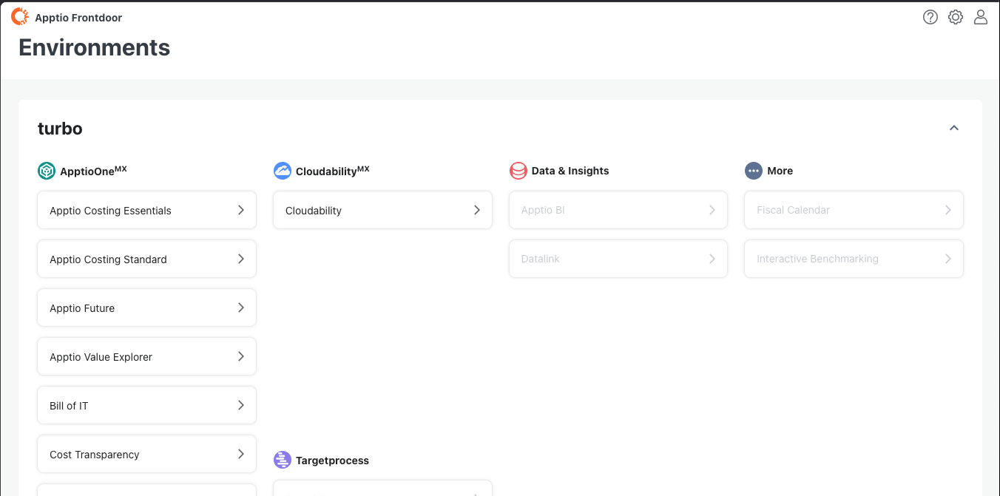
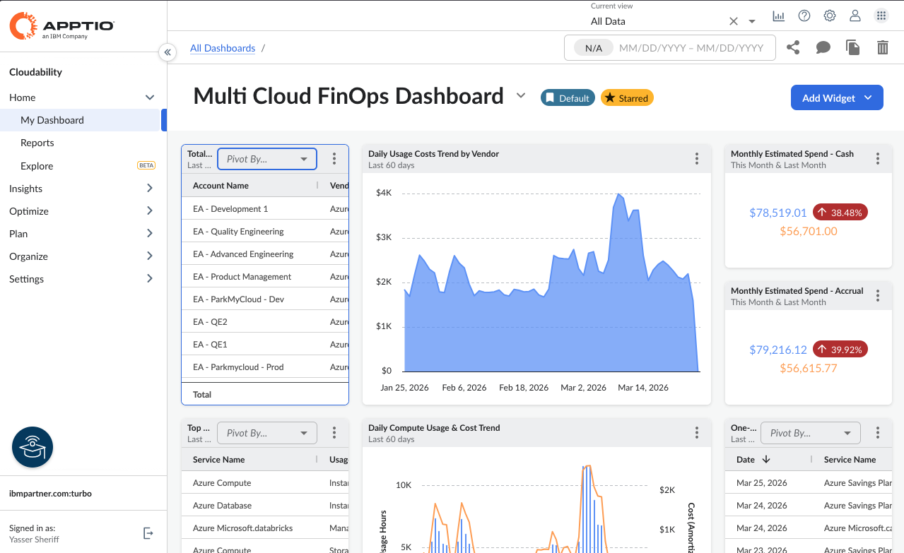
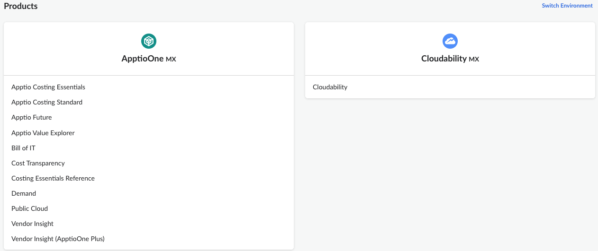
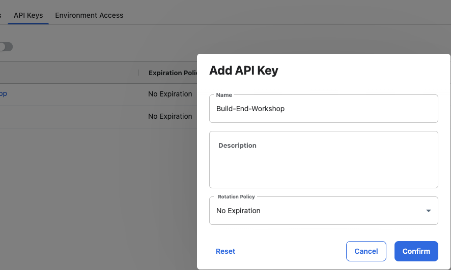
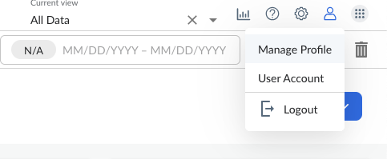
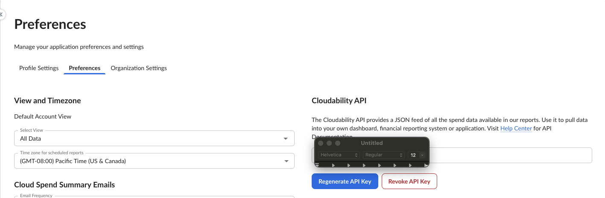
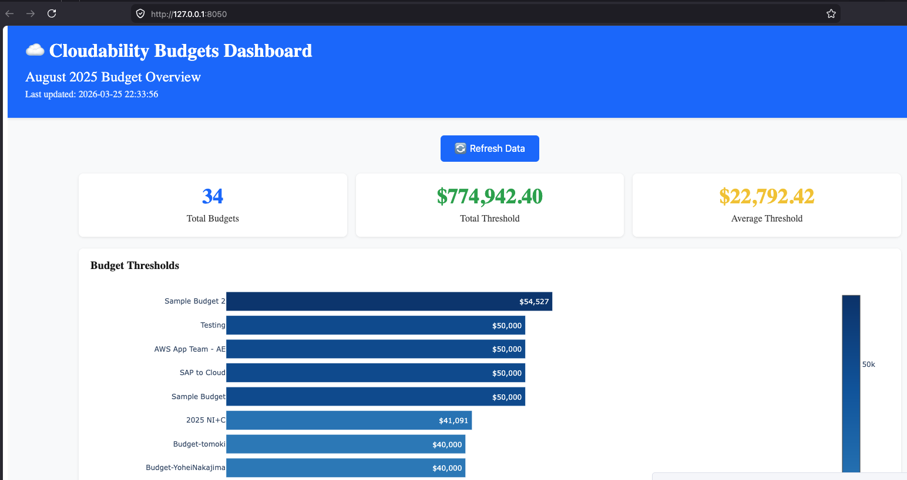

# Organize, Optimoze and Govern Cloud spend with IBM Bob and Cloudability

## Table of Contents

- [Overview](#overview)
- [Step 1: Key features of IBM Apptio Cloudability?](#step-1-key-features-of-cloudability)
- [Step 2: Provision a Cloudability Techzone instance](#step-2-provision-apptio-cloudability)
- [Step 3: Access and Explore Apptio Cloudability Demo Enviornment](#step-3-access-apptio-cloudability)
- [Step 4: Create a API Key](#step-4-create-api-key)
- [Step 5: Use Bob to build a dashboard for Budget Insights](#step-5-use-ibm-bob-for-budget-insights)
- [Next Steps](#next-steps)

---

## Overview

This lab guide demonstrates how to implement IBM Cloudability to provide visibility and actionable insights needed to maximize the return on your cloud investments

## Key features for Apptio Cloudability

**Multi-Cloud Cost Management**
- Unified visibility across AWS, Azure, Google Cloud Platform, and other cloud providers
- Consolidated billing and cost tracking across multiple cloud accounts and services
- Support for hybrid and multi-cloud environments

**Cost Optimization & Recommendations**
- Automated identification of cost-saving opportunities
- Right-sizing recommendations for over-provisioned resources
- Reserved Instance (RI) and Savings Plans analysis and recommendations
- Idle resource detection and elimination suggestions

**Container Cost Visibility**
- Kubernetes and container cost allocation
- Namespace, pod, and cluster-level cost tracking
- Container resource utilization monitoring
- Support for containerized workloads across different cloud platforms

**Advanced Analytics & Reporting**
- Customizable dashboards and reports
- Cost trend analysis and forecasting
- Anomaly detection for unusual spending patterns
- Chargeback and showback capabilities for internal cost allocation

**Budgeting & Governance**
- Budget creation and tracking with alerts
- Policy enforcement for cost controls
- Spending thresholds and notifications
- Cost allocation by teams, projects, or business units

**API Integration (v3)**
- RESTful API for programmatic access to cost data
- Integration capabilities with existing tools and workflows
- Automated data extraction and reporting
- Support for custom integrations and automation

**Tagging & Cost Allocation**
- Tag-based cost allocation and tracking
- Automated tag compliance monitoring
- Custom business mapping for cost attribution
- Hierarchical cost organization

**Real-time Monitoring**
- Near real-time cost and usage data
- Continuous monitoring of cloud spending
- Instant alerts for budget overruns or anomalies

**Optimization Workflows**
- Actionable insights with implementation guidance
- Automated remediation options
- Integration with cloud provider APIs for direct action

**Enterprise-Grade Security & Compliance**
- Role-based access control (RBAC)
- Audit trails and activity logging
- Compliance reporting capabilities
- Secure data handling and encryption

## Provision a Apptio Cloudability Techzone instance

[← Steps to create a Cloudabilit techzone instance](techzone-setup.md) 

> **Note for Build Academy Workshop Participants:** If you are part of the Build Academy workshop, the environment will be pre-provisioned in TechZone. You can ignore the provisioning steps and proceed directly to accessing your cloudability instance.

## Access and Explore Apptio Cloudability Demo Enviornment

1. Navigate to the Cloudability homepage and select Cloudability

   ```
   https://frontdoor.apptio.com/home?customer=
   
   ```
   You will be asked to use your IBM id to sign-in to the instance.

   

2. Review Dashbaord components

   


## Create a API Key

1. Select Cloudability from the launcher page link

   ```
   https://app.apptio.com/shell/launcher
   ```
   

2. Select the API Keys tab and Select the Create API Key button on the right.

   Enter a name and select the desired key rotation policy



3. Select Manage Profile from the top right corner dropdown



4. Select the preferences tab and generate a new API key



   Note down the API Key. 

5. Convert the key to base64

   ```
   echo <YOUR-API-KEY> | base64
   ```

6. Test the API using a curl command

   ```
   curl --request GET \
  --url https://api.cloudability.com/v3/views \
  --header 'Authorization: Basic <YOUR-BASE64-API-KEY>' \
  --header 'User-Agent: insomnia/12.3.0'
   ```
   The Cloudability Views allow customers to give each and every user a unique view or set of views of your cloud spend and usage. It also supports limiting the scope of what is visible to individual users. 

## Use Bob to for Budget Insights

- ✅ **IBM Bob installed** - [Sign up for early access to IBM Bob](https://ibm.com/bob)
- ✅ **Python 3.12 installed** - Required for running automation scripts
- ✅ **Apptio Cloudability instance**


### Import Cloudability Custom Bob Mode

Before using IBM Bob with Cloudability, you need to import the Cloudability custom mode.

#### For New Projects

When setting up a new project and adding the Application Observability Bob mode for the first time, there are no existing custom modes to consider. In this case:

1. Create Budget insights dashboard with IBM Bob
   
   Simply copy the provided mode configuration and rules files directly into your project:
   ```
   .bob/
   ├── custom_modes.yaml
   └── rules/
       └── cloudability/
           └── [mode rules files]
   ```

2. **Start Using Bob**
   
   Once the files are in place, you can start using the Cloudability mode in IBM Bob.

If your project already has a custom Bob mode defined in `custom_modes.yaml`, you must take care not to overwrite the existing configuration:

1. **Preserve Existing Configuration**
   
   Do not replace the existing `custom_modes.yaml` file.

2. **Maintain Folder Structure**
   
   Add the Application Observability rules to the existing rules folder without modifying other rule files:
   ```
   .bob/
   ├── custom_modes.yaml (updated with new mode)
   └── rules-cloudability-api/
       ├── 1_worflow.xml
       ├── 2_api_endpoints.xml
       ├── 3_best_practices.xml
       ├── 4_examples.xml
   ```

#### Open IBM Bob

1. **Launch IBM Bob**
   
   Open IBM Bob in your development environment (VS Code or preferred IDE).

2. **Select Custom Mode**
   
   From the mode selector, choose **Cloudability API** mode.

3. **Configure IBM Bob to Access Cloudability API**
   
   Configure IBM Bob to access Cloudability API:
   
   ```python
   # Example configuration to be sotred in .env file
   cloudability_config = {
    "base_url": "https://api.cloudability.com/v3",
    "api_token": "<YOUR-API-KEY>"
   }
   ```

4. Use the Sample Prompt to create the application

Copy and paste the following prompt into IBM Bob to generate the dashboard application:

```
Create a python dash application that shows the budgets for August 2025
```

5. Bob will create a pythion dash application. Use the output url to view the budgets dashboard


