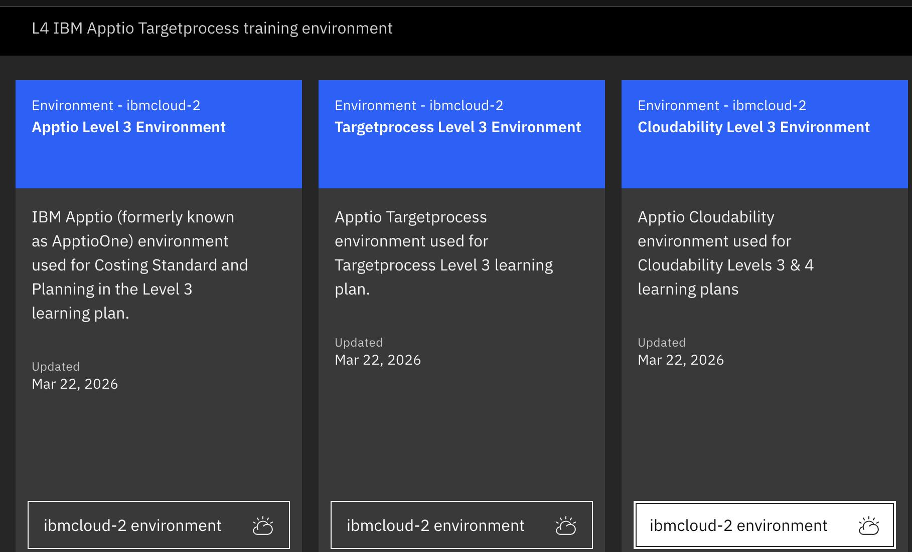

# TechZone Environment Setup

## Overview

This guide provides step-by-step instructions for provisioning a Cloudability environment on IBM TechZone.

---

## Prerequisites

Before you begin, ensure you have:

- An active IBM TechZone account
- Access to the TechZone reservation system
- Valid IBM credentials

---

## Access TechZone

Navigate to the TechZone reservation page:

```
https://techzone.ibm.com/collection/apptio-demo-environments/journey-level-3-environments
```

**Direct Link**: [TechZone Apptio Cloudability Level 3](https://techzone.ibm.com/my/reservations/create/65f0b8d9da124c001e6f5cf4)

---

## Environemnt provisioning steps

---


### Step 1: Navigate to TechZone

1. Open the [TechZone reservation link](https://techzone.ibm.com/my/reservations/create/66576e78d3aaab001ef9aa8d)
2. Log in with your IBM credentials if prompted
3. Verify you're on the Cloudability Level 3 Environment reservation page

### Step 2: Select Purpose

1. Locate the **Purpose** dropdown menu
2. Select `Education` from the available options
3. In the **Purpose Description** field, enter: `Build Academy Workshop`

> **Note**: The purpose description helps track workshop usage and may be required for approval.

### Step 3: Choose Region

1. Find the **Preferred Region Template** section
2. **Recommended**: Select a European region for optimal performance
3. **Alternative**: Choose any available region based on your location
4. Consider latency and data residency requirements

**Available Regions:**
- Europe (Frankfurt, London, Amsterdam)
- Americas (Dallas, Washington DC, Toronto)
- Asia Pacific (Tokyo, Sydney, Singapore)


### Step 5: Review and Submit

1. **Review Configuration**
   - Double-check all settings
   - Verify region selection
   - Confirm resource specifications

2. **Accept Terms**
   - Read the terms and conditions
   - Check the acceptance box

3. **Submit Reservation**
   - Click the **Submit** button
   - Note your reservation ID

### Step 6: Wait for Provisioning

**Provisioning Timeline:**
- **Typical Duration**: 30-60 minutes
- **Status Updates**: Available in TechZone dashboard
- **Email Notification**: Sent when environment is ready


**Monitoring Your Reservation:**
- Visit [TechZone My Reservations](https://techzone.ibm.com/my/reservations)
- Check status: `Provisioning` → `Ready`
- View estimated completion time


## Post-Provisioning Steps

### 1. Access Credentials

Once provisioning is complete, you'll receive an email notification. Follow these steps to access the cLoudability instance.
